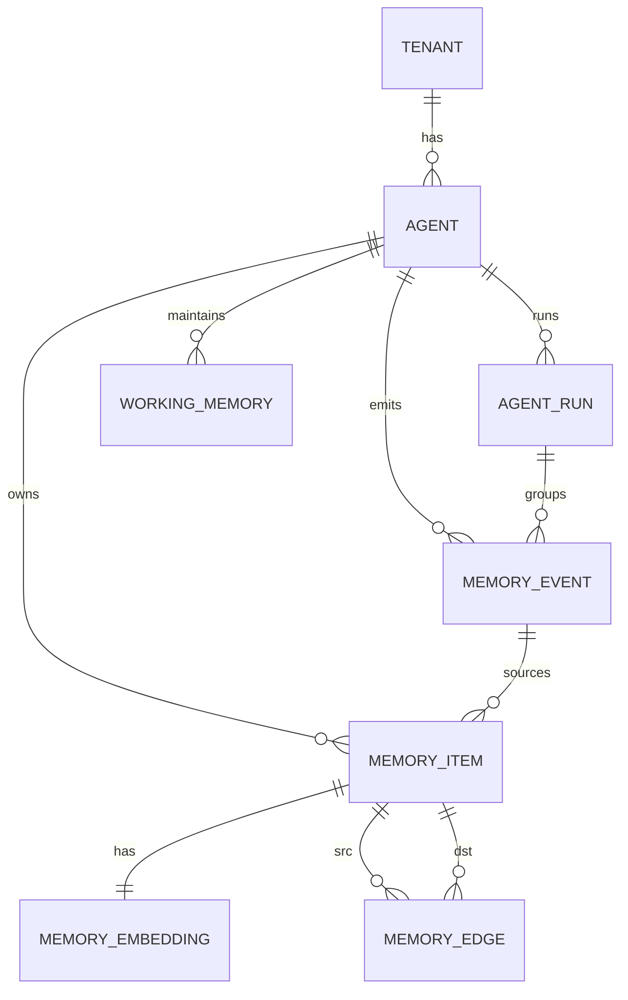
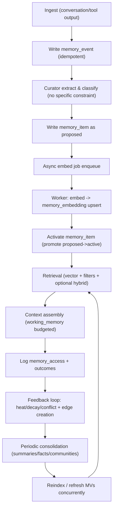

# Appropriateness of the PostgreSQL + pgvector Memory-Core Design for a Personal Agent

## Executive summary

The proposed “memory-core v2” design (append-only event log + typed durable memory items + separate embedding storage + explicit relationship/provenance edges + bounded working memory + progressive discovery pipeline) is an appropriate and research-aligned foundation for a **personal agent**, especially if your goal is *reliable long-horizon personalization with auditability and iterative improvement*. This aligns closely with 2024–2026 findings that (a) long conversations expose temporal/causal failure modes even with long-context models, (b) retrieval works best when memory is *curated and structured* rather than raw transcripts, and (c) hierarchical and graph-augmented memory improves global/relational queries. citeturn2search0turn12search0turn12search1turn14search0

The biggest practical risk for a personal agent is not “schema complexity” per se—it is **memory pollution and irreversible drift** when a curator writes directly into durable memory from day one. Research systems that perform best typically include some combination of consolidation, updating, forgetting, and compression loops (sometimes learned, sometimes heuristic), and they benefit from *explicit feedback signals* on whether retrieved memory actually helped. Your design has the right surfaces to support that, but it needs two concrete additions: (1) **a quarantine/verification state** for curator-produced memories (even if fully automated), and (2) **a retrieval/usage log** to drive heat/decay, dedupe, conflict detection, and reindex triggers. citeturn13search1turn15search0turn12search0

Operationally, PostgreSQL and pgvector already provide the core primitives you’re relying on—`FOR UPDATE SKIP LOCKED` for queue-like tables, advisory locks (prefer transaction-level) for coarse coordination, RLS for tenant isolation, and pgvector’s HNSW/IVFFlat indexing + post-0.8.0 **iterative scans** to mitigate filtered ANN “overfiltering.” Your endpoint/async patterns are directionally correct, but you should harden them with a few schema-level integrity constraints (to prevent tenant/agent ID skew across tables), plus explicit pgvector tuning defaults and migration mechanics for multi-model embeddings. citeturn4search7turn4search8turn4search2turn3search1turn19view2turn3search2

## Fit for a personal agent

A personal agent’s memory-core is judged less by “distributed scalability” and more by: **precision of personalization**, **temporal correctness**, **reversibility**, **privacy**, and **token/latency efficiency**.

**Why this design fits the best-performing 2024–2026 patterns**

Long-conversation evaluations (LoCoMo) show that LLMs struggle with very long dialogues, particularly long-range temporal and causal dynamics; long-context and RAG help but still lag human performance. That supports your choice to store *time-anchored episodic memory* and explicit relationships rather than relying on raw chat history. citeturn2search0

Mem0’s empirical framing (and similar 2025–2026 agent-memory work) supports your architecture’s core bet: **extract and consolidate salient memory** and retrieve selectively, rather than “stuff full history.” Mem0 reports large latency/token reductions versus full-context approaches and shows incremental improvements from graph-based memory representations—consistent with your `memory_edge` plan. citeturn12search0

Hierarchical and unified STM/LTM management (e.g., MemoryOS and AgeMem) maps well to your **`working_memory`** + durable memory split, and to your planned progressive discovery loops (summarize/compress/update/forget as explicit operations). citeturn12search1turn15search0

GraphRAG argues that “global” questions over a corpus are not solved well by naive chunk retrieval; precomputed, hierarchical graph summaries improve global sensemaking. Even if you don’t implement full GraphRAG, your explicit edge table enables the “GraphRAG-lite” pattern (vector seed → neighbor expansion → summarize). citeturn14search0turn0search7

**Where a personal agent changes the calculus**

A personal agent typically has:
- fewer concurrent writers than multi-tenant SaaS,
- a stronger privacy requirement,
- and a longer horizon for “slow refinement” (you can afford nightly consolidation).

So the design is appropriate, but you should bias toward:
- stronger reversibility (quarantine + tombstones),
- simpler graph usage (explicit edge table first; deeper property-graph tooling later),
- and conservative, measurable curator behavior (precision > recall until you have feedback loops). citeturn13search1turn2search0

## Data model review

### Mermaid ER diagram of the proposed core



### Append-only `memory_event`

**Strengths**

Append-only events are the cleanest foundation for “progressive discovery” and reprocessing: you can re-run extraction/consolidation when prompts/models/policies change without losing provenance. This matches the “memory operations” lens in 2025 surveys (consolidation, updating, indexing, forgetting, retrieval, compression) and aligns with systems like Mem0/A-MEM that evolve memories over time. citeturn13search1turn12search0turn12search7

**Weaknesses / risks**

1) **Event payload bloat**: if `payload` stores large transcript chunks or tool outputs, table growth becomes your main storage/backup cost (more than embeddings). This is manageable in PostgreSQL, but you should treat it explicitly with retention/partitioning policies (see later). citeturn8search1turn5search5

2) **Idempotency semantics**: a `UNIQUE(tenant_id, agent_id, idempotency_key)` protects retries only if `idempotency_key` is reliably populated. Postgres unique constraints treat `NULL` values as *not equal by default*, meaning multiple rows can exist with `idempotency_key IS NULL` unless you make it `NOT NULL` (or use `NULLS NOT DISTINCT`). citeturn9search8

**Concrete improvements (SQL)**

If curator writes must be idempotent, enforce it at the schema boundary:

```sql
ALTER TABLE memory_event
  ALTER COLUMN idempotency_key SET NOT NULL;

-- Optional: if you must allow nulls but want them treated as equal:
-- UNIQUE NULLS NOT DISTINCT is supported for unique constraints.
-- (Use only if you truly want at most one NULL per keyspace.)
```

Postgres documents the default NULL behavior and `NULLS NOT DISTINCT` option for uniqueness. citeturn9search8

### `memory_item` (typed durable memory)

**Strengths**

Your typed durable `memory_item` table is strongly aligned with 2025–2026 “structured memory” systems (Mem0 graph memory; MemoryOS tiering; MIRIX multi-type memory; grounded personal assistant memory with KG+vectors). This is the right abstraction for a personal agent because it supports *targeted retrieval policies* (e.g., always include top facts + top procedures) and type-specific decay/consolidation rules. citeturn12search0turn12search1turn12search2turn13search0

**Weaknesses / risks**

1) **State duplication**: you have both `kind='state'` and a separate `working_memory`. If “state” is truly short-lived, storing it as durable `memory_item` can silently expand retrieval space and pollute context. AgeMem frames STM control (filter/summary) as dynamic actions distinct from LTM storage; mapping “state” into durable LTM works only if you enforce TTL and retrieval exclusion by default. citeturn15search0

2) **Fact update and contradiction**: without a canonical “fact key” (or subject–predicate–object structure), updates become heuristic and contradictions are hard to detect. LoCoMo highlights long-range temporal/causal issues; Mem0/A-MEM emphasize consolidation and evolving memory, which implies you’ll routinely need “supersede” and “contradict” operations. citeturn2search0turn12search0turn12search7

**Concrete improvements (SQL)**

Add durability controls and canonicalization:

```sql
-- 1) Status for curator safety and reversibility
CREATE TYPE memory_status AS ENUM ('proposed', 'active', 'tombstoned', 'superseded');

ALTER TABLE memory_item
  ADD COLUMN status memory_status NOT NULL DEFAULT 'active',
  ADD COLUMN superseded_by uuid NULL REFERENCES memory_item(memory_id);

CREATE INDEX ON memory_item (tenant_id, agent_id, status, kind, created_at DESC);

-- Retrieval should default to status='active'
```

```sql
-- 2) Canonical keys for facts (optional but high leverage)
ALTER TABLE memory_item
  ADD COLUMN fact_key text NULL;

-- Enforce uniqueness for facts if you want "one canonical fact per key":
CREATE UNIQUE INDEX memory_item_fact_key_uq
  ON memory_item (tenant_id, agent_id, fact_key)
  WHERE kind = 'fact' AND status IN ('active','proposed') AND fact_key IS NOT NULL;
```

### `memory_embedding` (separate)

**Strengths**

Separating embeddings from content is the correct production choice: it enables re-embedding without rewriting memory rows and supports multi-model experiments. pgvector explicitly supports storing vectors with or without a fixed dimension and shows expression/partial indexing patterns for mixed-dimension columns. citeturn3search2turn19view2

**Weaknesses / risks**

1) **Tenant/agent consistency**: if `memory_embedding` repeats `tenant_id` and `agent_id`, you must enforce consistency with `memory_item` or you risk subtle RLS leaks or incorrect filtering joins.

2) **Dimension/multi-model migrations**: pgvector allows `vector` without fixed dimension, but indexes require consistent dimensions. pgvector documents casting and partial indexes for this, which becomes important if embedding model is “no specific constraint.” citeturn3search2

**Concrete improvements (SQL)**

Enforce cross-table integrity and dimensional checks:

```sql
-- Ensure memory_item can be referenced by (tenant_id, memory_id) for correctness
ALTER TABLE memory_item
  ADD CONSTRAINT memory_item_tenant_memory_uq UNIQUE (tenant_id, memory_id);

-- Redefine (or migrate) memory_embedding to bind to tenant at FK level
ALTER TABLE memory_embedding
  ADD COLUMN tenant_id uuid NOT NULL,
  ADD CONSTRAINT memory_embedding_fk
    FOREIGN KEY (tenant_id, memory_id)
    REFERENCES memory_item (tenant_id, memory_id)
    ON DELETE CASCADE;

-- Enforce dims match embedding vector
ALTER TABLE memory_embedding
  ADD CONSTRAINT memory_embedding_dims_ck
  CHECK (vector_dims(embedding) = dims);
```

pgvector provides `vector_dims()` and documents mixed-dimension storage with cast-based indexing. citeturn3search2turn19view3

### `memory_edge` (relationships + provenance)

**Strengths**

This is a strong and appropriate choice for a personal agent. Multiple 2024–2026 systems explicitly use **graphs + embeddings** for relational reasoning (GraphRAG; “grounded memory” for personal assistants; Mem0’s graph variant). Your explicit edge table supports provenance, conflict edges, and multi-hop traversal via SQL joins/recursive CTEs. citeturn14search0turn13search0turn12search0

**Weaknesses / risks**

Edge explosion is the main issue: if the curator suggests edges freely, graph density can grow superlinearly and retrieval can degrade (too many neighbors). GraphRAG’s approach mitigates this with higher-level community summaries rather than expanding raw neighborhoods indefinitely. citeturn14search0

**Concrete improvements**

- Add an edge confidence/“created_by” attribution and only retrieve-expand edges above a threshold.
- Store “supporting evidence” pointers in `metadata` (e.g., source span IDs) rather than large `reason` text.
- Consider *materialized neighbor caches* or periodic consolidation into “community summaries” if you see global-query demand; Postgres supports `REFRESH MATERIALIZED VIEW CONCURRENTLY` with constraints. citeturn6search2

### `working_memory` (bounded STM)

**Strengths**

This matches 2025–2026 hierarchical memory and unified STM/LTM management: the system should maintain a bounded working set and selectively retrieve from LTM. citeturn12search1turn15search0

**Weaknesses / risks**

Without a retrieval/usage log, eviction is blind: you’ll be tuning heuristics without knowing what the model actually used. Also, you should enforce an explicit budget mechanism (token estimates, pinned items). citeturn15search0

**Concrete improvement**

Add a deterministic eviction transaction and store token counts. If you compute token counts outside the DB, keep the DB as the source-of-truth for current STM size.

## Retrieval and context engineering review

### Chunking and hierarchical contexts

**Strengths**

Your schema supports layered representations: a chunk can be a `semantic` memory, a distilled note can be a `fact`, and summaries can be `semantic` with `derived_from`. This matches A-MEM’s “interconnected notes” approach and GraphRAG’s “index + precomputed summaries” logic. citeturn12search7turn14search0

**Weakness / risk**

Chunking policy is usually the largest hidden quality lever. If the curator stores long transcript fragments, you effectively recreate a noisy RAG system that LoCoMo implies is insufficient for temporal/causal correctness. Prefer atomic, typed memories and store provenance pointers rather than raw transcripts. citeturn2search0

**Concrete pattern**

- `episodic`: short event records with `occurred_at`, actor, and outcome.
- `fact`: canonical assertions with `fact_key`.
- `procedural`: compact playbooks (operator “skills”) rather than chat excerpts.
- `semantic`: doc chunks or summaries.

### Temporal decay and reinforcement

MemoryBank-style “forgetting curve” approaches and 2025 surveys emphasize memory operations such as forgetting, updating, and compression; your half-life + heat approach is compatible, but you need instrumentation to drive it. citeturn13search1

**Concrete improvement**

Create a `memory_access` table and update heat from actual usage:

```sql
CREATE TABLE memory_access (
  tenant_id uuid NOT NULL,
  agent_id uuid NOT NULL,
  run_id uuid NOT NULL,
  memory_id uuid NOT NULL,
  rank int NOT NULL,
  score real NOT NULL,
  used boolean NOT NULL DEFAULT false,
  created_at timestamptz NOT NULL DEFAULT now(),
  PRIMARY KEY (tenant_id, run_id, memory_id),
  FOREIGN KEY (tenant_id, memory_id) REFERENCES memory_item (tenant_id, memory_id)
);

CREATE INDEX ON memory_access (tenant_id, agent_id, memory_id, created_at DESC);
```

Then run a periodic job: `heat = f(access_count_recent, used_rate)`.

### ANN retrieval, filtering pitfalls, and iterative scans

**Strengths**

HNSW/IVFFlat + metadata filters is the right baseline. pgvector documents:
- HNSW index options (`m`, `ef_construction`) and query-time `hnsw.ef_search`. citeturn20view1
- Filtering pitfalls: approximate indexes apply filters after scanning; raising `ef_search` helps but costs latency. citeturn19view2
- Starting in 0.8.0, **iterative index scans** can automatically scan more when filtering would otherwise return too few rows, with `strict_order` vs `relaxed_order`. citeturn3search1turn19view2

**Risk**

If you *don’t* turn on iterative scan (or increase `ef_search`) and you apply high-selectivity filters (kind/scope/time), you’ll silently get low recall and unstable behavior—often misdiagnosed as “LLM forgot.” citeturn19view2

**Concrete retrieval query (with safe defaults)**

```sql
BEGIN;

-- For filtered queries, enable iterative scan.
SET LOCAL hnsw.iterative_scan = strict_order;
SET LOCAL hnsw.ef_search = 200;

WITH candidates AS MATERIALIZED (
  SELECT
    mi.memory_id,
    mi.kind,
    mi.content,
    (me.embedding <=> :q_vec) AS dist,
    mi.importance,
    mi.heat,
    mi.occurred_at
  FROM memory_item mi
  JOIN memory_embedding me
    ON me.memory_id = mi.memory_id
   AND me.embedding_model = :embedding_model  -- no specific constraint
  WHERE mi.tenant_id = :tenant_id
    AND mi.agent_id  = :agent_id
    AND mi.status    = 'active'
    AND mi.kind IN ('fact','episodic','semantic','procedural')
    AND (mi.valid_to IS NULL OR mi.valid_to > now())
  ORDER BY me.embedding <=> :q_vec
  LIMIT 80
)
SELECT *
FROM candidates
ORDER BY
  (1.0 - dist) * (0.5 + 0.5 * importance) * (1.0 + heat) DESC
LIMIT 20;

COMMIT;
```

### Hybrid search with FTS + RRF + reranking

**Strengths**

pgvector explicitly recommends combining with Postgres full-text search for hybrid search and mentions Reciprocal Rank Fusion, plus cross-encoder reranking. citeturn19view1turn8search3

**Risk**

Hybrid search is easy to implement but easy to mis-tune:
- naive fusion can over-weight lexical matches for short queries,
- and reranking can introduce high latency unless you gate it.

ARAGOG (2024) finds HyDE and LLM reranking can significantly improve retrieval precision, suggesting reranking is worth enabling selectively (e.g., only when confidence is low or question is “global/hard”). citeturn15search2

**Concrete improvement**

Implement a three-stage retrieval policy:
1) vector top-N (filtered) with iterative scan,
2) lexical top-M using `ts_rank_cd`,
3) fuse with RRF,
4) optional rerank (no specific constraint) only when the fused score dispersion is low.

## Workflow, transactions, and operations review

### Progressive discovery timeline



This matches the “memory operations” framing (indexing/updating/forgetting/compression) and the two-stage graph indexing + summarization pattern in GraphRAG. citeturn13search1turn14search0

### Async embedding + queue claiming

**Strengths**

Your async embedding plan is correct. Transactionally, the recommended PostgreSQL pattern for multi-consumer job queues is `FOR UPDATE SKIP LOCKED`, which Postgres documentation explicitly notes is intended for queue-like tables and provides an inconsistent view (acceptable for queues). citeturn4search7

**Concrete tip**

Use SKIP LOCKED only on the job table; do not use it for memory read queries.

### Advisory locks for coarse coordination

**Strengths**

Advisory locks are appropriate for “only one consolidator per tenant/agent/session” operations.

**Risk**

Session-level advisory locks can survive rollbacks; prefer transaction-level locks (`pg_advisory_xact_lock`) so locks auto-release at transaction end. Postgres documents both behaviors and provides the `pg_advisory_xact_lock` family. citeturn4search4turn4search8

### Indexing/reindexing and online migrations

**Strengths**

Your plan to support reindexing and rebuilds is sound. Postgres documents `CREATE INDEX CONCURRENTLY` to build without blocking writers, and it documents `REINDEX CONCURRENTLY` constraints/caveats for online rebuilds. citeturn5search4turn5search9

pgvector also explicitly recommends creating indexes concurrently in production and provides tunables for build speed (notably `maintenance_work_mem` for HNSW build). citeturn19view1turn20view0

**Concrete migration steps for embedding model changes (no specific constraint)**

1) Add new embeddings (same table, new `embedding_model` value).  
2) Build a partial/expression index for that model/dims. pgvector shows this for mixed dims. citeturn3search2  
3) Switch read path to new model behind a flag.  
4) Backfill and verify recall/latency.  
5) Drop old indexes later.

### The core operational weak spot: direct-write curator

For a personal agent, the biggest long-term reliability issue is **incorrect memories becoming “truth”**. Once stored, they will be retrieved and reinforced unless you build explicit correction and deleting mechanisms (AgeMem treats Update/Delete as first-class memory tool actions, and surveys emphasize updating/forgetting as core operations). citeturn15search0turn13search1

**Concrete improvement**

Even if you want “direct-write,” implement **direct-write into `status='proposed'`**, then auto-promote to active based on:
- confidence threshold,
- no conflict with existing canonical facts,
- and a short “cooldown” window allowing merges.

This gives you reversibility without adding human review into the loop.

## Scalability, backup, and security review

### Scalability, latency, and storage

**Strengths**

Your design scales “far enough” for a personal agent on a single PostgreSQL instance. The biggest scaling vectors are embeddings and ANN indexes.

pgvector provides:
- HNSW/IVFFlat parameters and explicit build-memory guidance via `maintenance_work_mem`. citeturn20view0turn20view1
- `halfvec` and quantization tools (0.7.0) to reduce index size and raise indexable dimensions. citeturn3search5turn19view3

**Risk**

If embedding dims are large and memory count grows, ANN index size becomes significant. `halfvec` is a pragmatic lever, but it changes numeric precision—treat it as a measured optimization, not a default. citeturn3search5turn19view3

**Concrete improvement**

Offer two-tier indexing:
- cheap candidate generation via quantized/halfvec,
- strict rerank by full precision vectors (pgvector demonstrates reranking after approximate/quantized retrieval). citeturn19view1turn19view3

### Partitioning and retention

For personal agents, partitioning is optional early. But your append-only event log is a natural fit for time partitioning and retention, and Postgres documents partition maintenance (dropping old partitions quickly vs row-by-row deletes). citeturn8search1

### Backup and restore

If the memory-core becomes a personal “source of truth,” backups matter more than raw performance. Postgres documents PITR via continuous archiving + WAL replay, including the ability to restore to a point in time. citeturn5search5

For tenant-scoped exports under RLS, Postgres documents `pg_dump --enable-row-security` and notes the default behavior is `row_security=off`. citeturn5search0turn4search2

### Security, RLS, NOTIFY, privacy

**Strengths**

RLS is an excellent “future-proofing” move even if you are single-tenant today. Postgres documents that if row-level security is enabled but no applicable policies exist, a “default deny” behavior applies. citeturn4search2

**Risks**

- `NOTIFY` payloads are visible to all users; do not send sensitive content in payloads (IDs only). Postgres explicitly warns notifications are visible to all users. citeturn4search0
- If you rely on JSONB metadata for filtering/sensitivity labels, index it correctly: Postgres documents JSONB behavior and indexing options (GIN + operator classes). citeturn8search0turn7search3

**Concrete improvement**

Enforce “sensitivity tags” in metadata and use RLS or query-layer checks to prevent retrieving private memories into contexts for non-owning agents (even in a personal agent, this helps if you later add “sub-agents”).

## Prioritized action plan with risk and effort

| Horizon | Action | Why it matters | Risk reduced | Effort |
|---|---|---|---|---|
| Short-term | Add `memory_item.status` (`proposed/active/tombstoned/superseded`) and default retrieval to `active` | Prevents irreversible curator hallucinations from becoming durable “truth”; enables reversibility | High | Medium |
| Short-term | Add `memory_access` (retrieval/usage log) and drive `heat` from it | Turns decay/importance from guesswork into measurable signals; enables better pruning and evaluation | High | Medium |
| Short-term | Enforce tenant/agent integrity across `memory_item`, `memory_embedding`, `memory_edge` via composite uniqueness/FKs | Prevents subtle cross-tenant skew and future RLS bugs | Medium | Medium |
| Short-term | Enable pgvector iterative scans and set sane query defaults (`hnsw.iterative_scan`, `hnsw.ef_search`) for filtered retrieval | Avoids the “filtered ANN returns too few rows” failure mode | High | Low |
| Medium | Introduce canonical `fact_key` + conflict edges; implement “supersede” workflow | Makes facts updateable and contradictions manageable (core for personalization) | High | Medium |
| Medium | Add hybrid search behind a flag (FTS + RRF fusion); gate reranking with heuristics | Improves hard queries without paying rerank cost on every request | Medium | Medium |
| Medium | Add retention/partition plan for `memory_event` and large logs | Keeps storage and backup costs bounded over years | Medium | Medium |
| Medium | Define a PITR backup strategy (base backup + WAL archiving) | Personal agent memory is high-value; PITR prevents catastrophic loss | High | Medium |
| Long-term | Add GraphRAG-lite “community summaries” (materialized views/tables) for global questions | Solves global sensemaking better than flat chunk retrieval | Medium | High |
| Long-term | Optional: evaluate property-graph tooling (explicit edges first; AGE later if needed) | Better ergonomics for deep traversals, but adds operational complexity | Low–Medium | High |
| Long-term | Add learned memory policies or stronger automated evaluation loops (no specific constraint) | Moves from heuristic tuning to measurable adaptation over time | Medium | High |

### Design verdict

As a memory-core for a personal agent, your design is **architecturally appropriate and consistent with the best-supported 2024–2026 agent-memory patterns**—especially its emphasis on curated, typed memory; explicit provenance/edges; bounded working memory; and progressive discovery loops. citeturn12search0turn12search1turn15search0turn14search0

To make it *personal-agent reliable*, prioritize: (1) preventing curator pollution via `proposed→active` promotion, (2) instrumenting retrieval outcomes with a usage log, and (3) hardening pgvector filtered retrieval with iterative scans and integrity constraints. citeturn3search1turn19view2turn4search7turn4search2