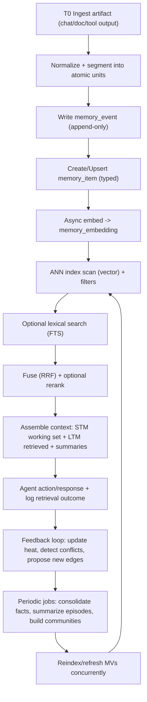

# Agentic Memory Design Patterns in PostgreSQL + pgvector

## Executive summary

Recent 2024–2026 research converges on a consistent theme: “memory” for LLM agents is less about storing verbatim chat logs and more about continuously extracting, structuring, linking, and selectively retrieving *compact* representations that support long-horizon coherence under finite context windows. This appears in (a) memory-centric pipelines that extract and consolidate salient items (e.g., Mem0), (b) hierarchical “memory OS” designs with tiering and update policies (e.g., MemoryOS), (c) graph-structured indexing and summarization for global discovery over corpora (GraphRAG), and (d) learned policies for jointly managing short-term vs long-term memory (AgeMem). citeturn12view3turn12view4turn12view0turn13view0

A robust PostgreSQL + pgvector implementation pattern that best matches the above research is: **append-only event log + typed memory items + derived views + hybrid retrieval (vector + lexical + graph edges) + progressive discovery loops**. Append-only “memory events” make concurrency and provenance tractable for multi-agent systems; typed “memory items” (facts/episodic/semantic/procedural) enable targeted retrieval and decay policies; derived tables/materialized views support low-latency “working sets” while keeping raw history immutable for audit and reprocessing. These patterns align well with Postgres primitives for transactions, row-level security (RLS), indexing, partitioning, and asynchronous worker coordination. citeturn12view3turn16view0turn18view2turn3view2turn18view4

For retrieval quality, 2024–2026 evidence strongly supports **multi-stage retrieval**: start with approximate nearest neighbor (ANN) vector search, apply strong metadata filters, then optionally fuse with lexical full-text search (FTS) using rank fusion (RRF) and/or rerank with costlier models when needed. pgvector’s HNSW and IVFFlat indexes expose practical knobs (m, ef_construction, ef_search; lists, probes) and post-2024 improvements like *iterative index scans* to mitigate a common production failure mode: filtered vector queries returning too few results because filtering is applied after ANN scanning. citeturn6view0turn24view0turn23view1turn24view1turn28view2

For *progressive discovery* (ongoing ingestion → indexing → reindexing → retrieval-feedback loops), the most important structural insight from GraphRAG is that scalable “global” questions require precomputed hierarchical summaries over a graph index, not just local chunk retrieval. A practical Postgres adaptation is to store explicit edge tables (relationships + provenance) and optionally maintain “community” summaries in materialized views refreshed concurrently, enabling both local vector search and global/hierarchical context assembly. citeturn12view0turn12view2turn14search3turn25view0

For multi-tenant, multi-agent deployments, default to **hard isolation by tenant_id everywhere + RLS enforcement + careful NOTIFY usage** (payloads are visible to all users; don’t put secrets in NOTIFY). For coordination, Postgres provides two “workhorse” patterns: queue-like workers using `FOR UPDATE SKIP LOCKED` for contention-free claiming, and advisory locks for coarse-grained coordination on application-defined resources. citeturn18view0turn27view0turn27view1turn27view2turn3view2

## Research synthesis and design principles

Mem0 (2025) frames long-term memory as a pipeline that **extracts, consolidates, and retrieves salient information**, showing large latency/token-cost reductions versus “full history in context,” and finds incremental gains when adding graph-based memory representations. This motivates treating memory as a *managed substrate* rather than a raw transcript store. citeturn12view3turn10search6

MemoryOS (EMNLP 2025) pushes the “memory as a system resource” view further: hierarchical storage (short-/mid-/long-term), explicit **update policies**, tier-aware retrieval, and generation that integrates retrieved memory. Practically, this translates to (1) separating persistent “cold” memory from bounded “hot” working memory; (2) running periodic consolidation; (3) recording “heat”/usage signals to guide decay and promotion. citeturn12view4turn10search9

GraphRAG (2024; with 2024–2025 updates) underscores that vector-search RAG often fails on “global” questions over large corpora; it proposes building a graph index in stages (entity graph extraction → community summaries) and answering by selecting and summarizing relevant communities (a map-reduce-like process), including dynamic community selection to prune irrelevant summaries. In Postgres terms: explicit entity/relationship tables plus precomputed summaries enable cheap “global context assembly” without stuffing huge corpora into the prompt. citeturn12view0turn12view2turn0search6

AgeMem (2026) and other 2025–2026 benchmark work emphasize that **short-term (context window) and long-term memory must be jointly managed**; heuristics alone can be brittle. Even if you do not train memory policies, the architectural takeaway is stable: represent memory operations as explicit, auditable “tools” (store/retrieve/update/forget), and record their outcomes so you can evaluate and iterate. citeturn13view0turn13view2turn13view3

Benchmarks like LoCoMo (ACL 2024) show that long-context and RAG can improve “memory” behaviors but still struggle, especially with temporal reasoning and speaker/event attribution; LoCoMo also highlights that converting dialogues into structured assertions about each speaker helps. This argues strongly for (a) explicit temporal fields and decay functions; (b) provenance and speaker/agent attribution; (c) memory types and schemas that can represent assertions and event graphs, not just chunks. citeturn13view3turn12view3turn16view0

Cognitively grounded “memory type” taxonomies remain useful design metaphors. Episodic vs semantic memory distinctions are well-established in neuroscience and psychology literature; procedural memory is typically treated as nondeclarative/implicit skill memory. Recent agent-memory work (e.g., MIRIX 2025) operationalizes these types explicitly for LLM agents, reinforcing their usefulness as separate storage/retrieval classes. citeturn8search4turn9search0turn13view1

## Schema patterns for agentic memory in PostgreSQL + pgvector

### Design space overview and trade-offs

A practical schema decision is less about “one table vs many,” and more about whether you want **immutability + derivation** (event sourcing) or **in-place mutation** (updating rows as truth). Multi-agent memory benefits disproportionately from immutability because it simplifies provenance, debugging, and concurrency control. This maps closely to mem-systems that “evolve” memory items over time (A-MEM’s memory evolution; Mem0’s consolidation; MemoryBank’s update/forgetting), which naturally creates multiple versions/derivations of a memory. citeturn5search9turn12view3turn16view0

**Comparison table: canonical schema patterns**

| Pattern | Consistency model | Latency | Complexity | Storage cost | Best for |
|---|---|---:|---:|---:|---|
| Append-only *memory_event* log + derived *memory_item* views | Strong (auditable; replayable) | Medium (needs derivation jobs) | Medium–High | High (history retained) | Multi-agent, compliance, iterative discovery |
| Single *memory_item* table with in-place update | Medium (harder audits) | Low | Low | Low | Single-agent, lightweight apps |
| Split tables per memory type (facts/episodes/skills) + shared embedding table | Strong (type clarity) | Low–Medium | High | Medium | Large systems needing strict type policies |
| “Working set” table (bounded STM) + durable LTM tables | Strong (bounded contexts) | Low | Medium | Medium | Agents with strict prompt budgets (AgeMem/MemoryOS-like) |

The Postgres primitives you’ll use across patterns—transactions, RLS, indexes, partitioning, materialized views—are stable and well-supported. citeturn27view3turn3view2turn18view4turn14search3

### Canonical multi-tenant, multi-agent schema

Below is a concrete “best-default” schema that supports: multi-tenancy, multiple agents, session/run tracking, typed memories, embeddings, edges/provenance, and progressive discovery jobs. It’s designed to keep writes simple and append-only while enabling fast reads via indexes and derived tables.

```sql
-- Extensions
CREATE EXTENSION IF NOT EXISTS vector;          -- pgvector
CREATE EXTENSION IF NOT EXISTS pgcrypto;        -- optional: gen_random_uuid()

-- Tenancy & agents
CREATE TABLE tenant (
  tenant_id uuid PRIMARY KEY DEFAULT gen_random_uuid(),
  name text NOT NULL,
  created_at timestamptz NOT NULL DEFAULT now()
);

CREATE TABLE agent (
  agent_id uuid PRIMARY KEY DEFAULT gen_random_uuid(),
  tenant_id uuid NOT NULL REFERENCES tenant(tenant_id),
  name text NOT NULL,
  created_at timestamptz NOT NULL DEFAULT now()
);

-- A concrete "run" for reproducibility + provenance
CREATE TABLE agent_run (
  run_id uuid PRIMARY KEY DEFAULT gen_random_uuid(),
  tenant_id uuid NOT NULL REFERENCES tenant(tenant_id),
  agent_id uuid NOT NULL REFERENCES agent(agent_id),
  session_id uuid NULL,                 -- conversation / workflow session
  started_at timestamptz NOT NULL DEFAULT now(),
  metadata jsonb NOT NULL DEFAULT '{}'::jsonb
);

-- Memory taxonomy (recommended minimal set)
CREATE TYPE memory_kind AS ENUM (
  'fact',          -- relatively stable assertions ("user likes X")
  'episodic',       -- events with time + actors ("on 2026-03-01, did Y")
  'semantic',       -- conceptual knowledge / notes / docs
  'procedural',     -- skills / playbooks / tool recipes
  'state'           -- transient state snapshots / working memory items
);

-- Append-only log of memory write intents and transformations
CREATE TABLE memory_event (
  event_id uuid PRIMARY KEY DEFAULT gen_random_uuid(),
  tenant_id uuid NOT NULL REFERENCES tenant(tenant_id),
  agent_id uuid NOT NULL REFERENCES agent(agent_id),
  run_id uuid NULL REFERENCES agent_run(run_id),

  event_type text NOT NULL,             -- e.g., 'observe', 'write_memory', 'summarize', 'link', 'forget'
  payload jsonb NOT NULL,               -- raw content, tool output, extraction results
  idempotency_key text NULL,            -- for safe retries at API layer

  created_at timestamptz NOT NULL DEFAULT now(),
  UNIQUE (tenant_id, agent_id, idempotency_key)
);

-- Canonical durable memory items (can be derived from memory_event, or written directly)
CREATE TABLE memory_item (
  memory_id uuid PRIMARY KEY DEFAULT gen_random_uuid(),
  tenant_id uuid NOT NULL REFERENCES tenant(tenant_id),
  agent_id uuid NOT NULL REFERENCES agent(agent_id),

  kind memory_kind NOT NULL,
  scope text NOT NULL DEFAULT 'private', -- 'private'|'shared'|'org' (keep as text for extensibility)

  -- core textual content
  title text NULL,
  content text NOT NULL,
  content_hash bytea NOT NULL,           -- for dedupe
  language text NOT NULL DEFAULT 'en',

  -- time + decay
  occurred_at timestamptz NULL,          -- episodic anchor
  valid_from timestamptz NULL,
  valid_to timestamptz NULL,
  decay_half_life interval NULL,         -- optional: for time-based forgetting
  importance real NOT NULL DEFAULT 0.5,  -- 0..1 heuristic or learned
  heat real NOT NULL DEFAULT 0.0,        -- usage-driven signal

  -- provenance
  source_event_id uuid NULL REFERENCES memory_event(event_id),
  derived_from_memory_id uuid NULL REFERENCES memory_item(memory_id),

  metadata jsonb NOT NULL DEFAULT '{}'::jsonb,

  created_at timestamptz NOT NULL DEFAULT now(),
  updated_at timestamptz NOT NULL DEFAULT now()
);

-- Embeddings (store outside memory_item so you can re-embed without rewriting content rows)
-- Choose vector(D) or halfvec(D) depending on your embedding model + cost constraints.
CREATE TABLE memory_embedding (
  memory_id uuid PRIMARY KEY REFERENCES memory_item(memory_id) ON DELETE CASCADE,
  tenant_id uuid NOT NULL,
  agent_id uuid NOT NULL,

  embedding_model text NOT NULL,        -- "no specific constraint"
  dims int NOT NULL,
  embedding vector,                     -- use vector(dims) if you want hard typing; shown generic here
  embedded_at timestamptz NOT NULL DEFAULT now(),

  FOREIGN KEY (tenant_id, agent_id) REFERENCES agent(tenant_id, agent_id) DEFERRABLE INITIALLY DEFERRED
);

-- Relationships + provenance edges (graph layer)
CREATE TYPE edge_kind AS ENUM (
  'refers_to',        -- semantic reference
  'caused_by',        -- causal link
  'follows',          -- temporal adjacency
  'contradicts',      -- fact conflict
  'supports',         -- evidence link
  'derived_from',     -- lineage
  'about_entity'      -- entity mention (optional if you have entity table)
);

CREATE TABLE memory_edge (
  edge_id uuid PRIMARY KEY DEFAULT gen_random_uuid(),
  tenant_id uuid NOT NULL REFERENCES tenant(tenant_id),

  src_memory_id uuid NOT NULL REFERENCES memory_item(memory_id) ON DELETE CASCADE,
  dst_memory_id uuid NOT NULL REFERENCES memory_item(memory_id) ON DELETE CASCADE,

  kind edge_kind NOT NULL,
  weight real NOT NULL DEFAULT 1.0,
  reason text NULL,

  source_event_id uuid NULL REFERENCES memory_event(event_id),
  created_at timestamptz NOT NULL DEFAULT now(),

  UNIQUE (tenant_id, src_memory_id, dst_memory_id, kind)
);

-- Useful indexes (illustrative; tune based on workload)
CREATE INDEX ON memory_item (tenant_id, agent_id, kind, created_at DESC);
CREATE INDEX ON memory_item (tenant_id, agent_id, occurred_at DESC);
CREATE INDEX ON memory_edge (tenant_id, src_memory_id);
CREATE INDEX ON memory_edge (tenant_id, dst_memory_id);

-- Optional metadata indexing (jsonb + GIN)
CREATE INDEX memory_item_metadata_gin ON memory_item USING gin (metadata);
```

Key supporting facts from official docs and research:

* pgvector defines distance operators for vector search (`<->` L2, `<=>` cosine distance, `<#>` negative inner product, etc.) and recommends combining `ORDER BY` + `LIMIT` to use an index. citeturn23view1  
* HNSW vs IVFFlat trade-offs (HNSW higher memory, slower build; IVFFlat faster build, lower memory) and the relevant knobs (`m`, `ef_construction`, `hnsw.ef_search`, `lists`, probes) are explicitly documented. citeturn6view0turn3view0  
* Multi-agent memory research repeatedly emphasizes structured memory representations (graphs, hierarchical stores, update mechanisms), supporting explicit edge/provenance modeling rather than opaque chunk piles. citeturn12view4turn12view0turn13view1

### Single-agent constrained memory schema (bounded STM + durable LTM)

To enforce strict prompt budgets (AgeMem/MemoryOS-like), create an explicit short-term “working set” with deterministic eviction. This makes “context engineering” a schema property rather than a fragile application convention. citeturn13view0turn12view4

```sql
CREATE TABLE working_memory (
  wm_id uuid PRIMARY KEY DEFAULT gen_random_uuid(),
  tenant_id uuid NOT NULL REFERENCES tenant(tenant_id),
  agent_id uuid NOT NULL REFERENCES agent(agent_id),

  session_id uuid NOT NULL,
  role text NOT NULL,                   -- 'system'|'user'|'agent'|'tool'
  content text NOT NULL,

  token_estimate int NOT NULL,          -- store an estimate to enforce budgets
  created_at timestamptz NOT NULL DEFAULT now(),

  -- eviction signals
  priority real NOT NULL DEFAULT 0.5,   -- pinned memories = 1.0
  last_used_at timestamptz NOT NULL DEFAULT now()
);

CREATE INDEX ON working_memory (tenant_id, agent_id, session_id, last_used_at DESC);
```

Eviction works as a deterministic SQL transaction: compute total tokens, delete lowest-priority/oldest until under budget, then commit. This reflects the general “bounded STM + durable LTM” split emphasized by hierarchical agent-memory work. citeturn12view4turn13view0

### Row-level security for multi-tenant agents

RLS is the best-default for multi-tenant correctness because it moves tenant isolation into the database. `CREATE POLICY` defines `USING` (visibility for existing rows) and `WITH CHECK` (constraints for new/updated rows), and Postgres applies a “default deny” if RLS is enabled and no policy applies. citeturn3view2

A standard pattern is to set a per-request `app.tenant_id` GUC and reference it in policies:

```sql
ALTER TABLE memory_item ENABLE ROW LEVEL SECURITY;
ALTER TABLE memory_edge ENABLE ROW LEVEL SECURITY;
ALTER TABLE memory_event ENABLE ROW LEVEL SECURITY;

CREATE POLICY tenant_isolation_memory_item
  ON memory_item
  USING (tenant_id = current_setting('app.tenant_id')::uuid)
  WITH CHECK (tenant_id = current_setting('app.tenant_id')::uuid);

CREATE POLICY tenant_isolation_memory_edge
  ON memory_edge
  USING (tenant_id = current_setting('app.tenant_id')::uuid)
  WITH CHECK (tenant_id = current_setting('app.tenant_id')::uuid);

CREATE POLICY tenant_isolation_memory_event
  ON memory_event
  USING (tenant_id = current_setting('app.tenant_id')::uuid)
  WITH CHECK (tenant_id = current_setting('app.tenant_id')::uuid);
```

Be explicit in backup/restore procedures: by default `pg_dump` sets `row_security` to off so it dumps all rows; there is an option to enable row security to dump only accessible rows. This matters for tenant-scoped exports. citeturn19view0turn3view2

### pgvector schema specifics: types, operators, indexes, and migrations

#### Vector types and dimensionality constraints

pgvector documents HNSW support for `vector` (up to 2,000 dims) and `halfvec` (up to 4,000 dims), plus binary `bit` and sparse `sparsevec` types, which directly constrains your embedding-model choice and “dims” decisions. citeturn6view0turn3view1turn24view1

A practical migration strategy if you start with one embedding model and later change models/dims is:

1) add a new embedding column (or new embedding rows keyed by `embedding_model`),  
2) backfill embeddings async,  
3) build the new ANN index **concurrently**,  
4) switch queries,  
5) drop old index/column.

Postgres explicitly supports `CREATE INDEX CONCURRENTLY` for adding indexes without locking out writes (at the cost of extra work/time), which is critical for production migrations. citeturn18view2

#### Index creation and tuning guidance

From pgvector docs:

* HNSW parameters: `m` (connections per layer) and `ef_construction`; query knob `hnsw.ef_search`, settable per-transaction via `SET LOCAL`. citeturn6view0turn6view2  
* IVFFlat guidance: create index after you have data; pick `lists` ~ rows/1000 (≤1M) or √rows (>1M); tune probes for recall/speed. citeturn3view0turn6view1  
* Filtering caveat: approximate indexes apply filtering after scanning; this can yield too few matches unless you increase `ef_search` or use iterative scanning (>=0.8.0). citeturn6view2turn24view0turn24view1  

Example migration: IVFFlat → HNSW (online)

```sql
-- Assumes memory_embedding.embedding is vector(D) with cosine ops
CREATE INDEX CONCURRENTLY memory_embedding_hnsw_cos_v1
  ON memory_embedding USING hnsw (embedding vector_cosine_ops)
  WITH (m = 16, ef_construction = 128);

-- Later, after verification:
DROP INDEX CONCURRENTLY IF EXISTS memory_embedding_ivfflat_cos_v1;
```

If you need to rebuild bloated/corrupt indexes in production, `REINDEX ... CONCURRENTLY` exists and documents the concurrent rebuild steps and caveats. citeturn26view0

## Context engineering and retrieval patterns

### Memory types as retrieval controls

Treating “facts, episodic, semantic, procedural” memories as a single undifferentiated vector pile usually causes two failures: (1) the agent pulls stale or irrelevant narrative fragments; (2) stable preferences get drowned out by noisy recent events. Memory systems like MIRIX and MemoryOS explicitly separate memory types/tiers and coordinate updates/retrieval accordingly, which translates well into using `kind`, `occurred_at`, and decay fields in SQL filters. citeturn13view1turn12view4turn16view0

A useful operational mapping (schema → behavior):

* **fact**: low write rate, high precision, conflict detection (`contradicts` edges).  
* **episodic**: high write rate, time-scoped retrieval (recency + temporal anchors).  
* **semantic**: corpus-like notes/docs (benefits from hybrid search + graph summaries).  
* **procedural**: playbooks and tool recipes (benefits from exact keyword matching + stable embeddings).  
* **state**: short-lived working memory (bounded by budget; aggressive eviction).  

This aligns with long-term conversational benchmarks showing temporal reasoning and attribution as key failure points, motivating explicit time + actor attribution. citeturn13view3turn12view4turn13view0

### Context windows, hierarchical contexts, and the “limited effective context” issue

Multiple 2024–2026 sources emphasize that while context windows have expanded, *effective* long-context reasoning remains challenging and expensive; training/compute costs and latency increase with longer inputs. This is one motivation for external memory and retrieval augmentation rather than “just increase context.” citeturn8search11turn8search3turn13view3turn12view3

GraphRAG’s hierarchy (entities → communities → summaries) is a concrete context engineering pattern: store fine-grained units, then build higher-level abstractions for global questions, and dynamically select the right level at query time. citeturn12view0turn12view2

In Postgres, implement “hierarchical contexts” as:

* Level 0: raw chunks / episodic events (`memory_item.kind in ('episodic','semantic')`)  
* Level 1: extracted assertions / notes (“facts” derived from events)  
* Level 2: community summaries (materialized views or summary tables)  
* Level 3: agent-specific “profile” summaries (stable condensed persona)

Materialized views can be refreshed concurrently to avoid blocking readers during updates. citeturn14search3turn25view0turn12view2

### Temporal decay and reinforcement

MemoryBank explicitly describes an update mechanism inspired by the Ebbinghaus forgetting curve to “forget” or reinforce memories based on time and significance, which maps cleanly to storing `decay_half_life`, `importance`, and `heat` and computing an effective score at retrieval time. citeturn16view0turn9search1

A simple SQL scoring pattern (cosine distance + decay):

```sql
-- Inputs:
--   :q_vec            query embedding vector(D)
--   :now              timestamptz
--   :k                limit

WITH candidates AS MATERIALIZED (
  SELECT
    mi.memory_id,
    mi.kind,
    mi.content,
    me.embedding <=> :q_vec AS cosine_distance,
    mi.importance,
    mi.heat,
    mi.created_at,
    mi.occurred_at,
    mi.decay_half_life
  FROM memory_item mi
  JOIN memory_embedding me ON me.memory_id = mi.memory_id
  WHERE mi.tenant_id = current_setting('app.tenant_id')::uuid
    AND mi.agent_id  = :agent_id
    AND mi.kind IN ('fact','episodic','procedural','semantic')
  ORDER BY me.embedding <=> :q_vec
  LIMIT (:k * 10)
)
SELECT *
FROM candidates
ORDER BY
  -- lower distance is better; convert to similarity-ish score
  (1.0 - cosine_distance)
  * (0.5 + 0.5 * importance)
  * (1.0 + heat)
  * CASE
      WHEN decay_half_life IS NULL THEN 1.0
      WHEN occurred_at IS NULL THEN 1.0
      ELSE exp( - ln(2) * extract(epoch from (:now - occurred_at)) / extract(epoch from decay_half_life) )
    END
DESC
LIMIT :k;
```

This is directly supported by pgvector’s cosine-distance operator `<=>` and the “cosine similarity = 1 - cosine distance” guidance. citeturn23view1turn23view3

### Chunking patterns

Chunking is not just a preprocessing step; it defines your retrieval granularity and your ability to attach provenance/edges. GraphRAG explicitly breaks documents into segments, then indexes entities/relationships and builds hierarchical communities, reinforcing the idea that a “segment” should be the atomic unit for linking and summarization. citeturn12view2turn12view0

A pragmatic Postgres-oriented chunking policy:

* Keep **chunk = retrieval atom** (so you can store one embedding per chunk and attach edges).  
* Store **raw_text** once, but maintain derived “views” (assertions, summaries) as separate `memory_item` rows with `derived_from_memory_id`.  
* Use generated columns + FTS to support lexical retrieval on the same chunk rows when needed. Postgres provides `to_tsvector`, weighting, and ranking functions for this. citeturn3view3turn14search2turn23view0  

Example (optional) tsvector column via generated column:

```sql
ALTER TABLE memory_item
  ADD COLUMN fts tsvector
  GENERATED ALWAYS AS (to_tsvector('english', coalesce(title,'') || ' ' || content)) STORED;

CREATE INDEX memory_item_fts_gin ON memory_item USING gin (fts);
```

Generated columns are computed from other columns and can be stored, occupying disk like normal columns; this makes them suitable for “derived search columns.” citeturn14search2turn3view3

## Progressive discovery workflows and graph-provenance designs

### Progressive discovery as an explicit lifecycle

In 2024–2026 research, progressive discovery shows up as: memory extraction → consolidation → linking → retrieval → feedback → memory evolution. Mem0 describes dynamic extraction/consolidation; A-MEM describes link generation and memory evolution; GraphRAG describes a two-stage indexing process with precomputed community summaries; LoCoMo highlights the value of turning dialogues into structured assertions; together these strongly imply that “index once” is not the right mental model. citeturn12view3turn5search9turn12view0turn13view3turn12view2

### Timeline flowchart for progressive discovery



GraphRAG explicitly separates indexing from query-time usage and relies on hierarchical summaries; pgvector and Postgres provide the building blocks for iterative reindexing and refreshing derived structures without blocking production readers. citeturn12view0turn12view2turn14search3turn18view2turn26view0

### Graph-edge designs: explicit edges, adjacency lists, property graphs, hybrids

**Comparison table: graph modeling options in Postgres**

| Graph model | Schema shape | Query style | Consistency & provenance | Latency | Complexity |
|---|---|---|---|---:|---:|
| Explicit edge table (recommended) | `memory_edge(src,dst,kind,meta)` | SQL joins + recursive CTE | Excellent (edge-level provenance) | Low–Medium | Medium |
| Adjacency list columns | `memory_item.related_ids uuid[]` | array ops | Weak (hard to provenance edges) | Low | Low |
| JSON property graph | `metadata->'edges'` | JSONB operators | Medium (JSONB provenance possible) | Medium | Medium |
| Property-graph extension | Apache AGE or similar | openCypher | Varies (extension-dependent) | Medium | High |

Explicit edge tables are the best fit for “relationships and provenance” because each edge can carry *kind, weight, reason, and source_event_id* and can be indexed independently. Graph traversal can be done with recursive CTEs, which Postgres documents as a standard tool for hierarchical/tree data. citeturn25view0turn13view3turn12view0

If you want property-graph query languages, entity["organization","Apache AGE","graph extension for postgres"] provides graph database functionality atop Postgres and supports openCypher; it is also packaged/mentioned in managed Postgres contexts. citeturn30view2turn17search7 A separate, forward-looking path is emerging SQL/PGQ work in the Postgres ecosystem (patch/commitfest activity), but it is not something you should rely on for production memory systems without verifying the state of support in your target Postgres version. citeturn30view0

### Hybrid vector + graph joins (a “GraphRAG-lite” pattern)

GraphRAG’s core insight is that graphs + summaries help with global queries. A “GraphRAG-lite” Postgres pattern is:

1) vector-search to get top-N memory nodes,  
2) expand via edges to gather neighborhood evidence,  
3) summarize neighborhood (or pull precomputed community summary),  
4) feed condensed context to the model.

Example: edge expansion query

```sql
-- Expand 1 hop from top-N vector hits
WITH seed AS MATERIALIZED (
  SELECT mi.memory_id
  FROM memory_item mi
  JOIN memory_embedding me ON me.memory_id = mi.memory_id
  WHERE mi.tenant_id = current_setting('app.tenant_id')::uuid
    AND mi.agent_id  = :agent_id
  ORDER BY me.embedding <=> :q_vec
  LIMIT :n
),
neighbors AS (
  SELECT e.dst_memory_id AS memory_id, e.kind, e.weight
  FROM memory_edge e
  JOIN seed s ON s.memory_id = e.src_memory_id
  WHERE e.tenant_id = current_setting('app.tenant_id')::uuid
)
SELECT mi.memory_id, mi.kind, mi.content, n.kind AS edge_kind, n.weight
FROM neighbors n
JOIN memory_item mi ON mi.memory_id = n.memory_id
ORDER BY n.weight DESC, mi.created_at DESC
LIMIT :m;
```

This implements a simplified “entity + relationship” context expansion similar in spirit to GraphRAG’s graph-index usage, while keeping everything in normal SQL. citeturn12view0turn12view2turn13view3

## API, transactions, and multi-agent coordination

### Endpoint surface area

A memory service with “unlimited endpoints” tends to become unmaintainable unless you enforce a small set of *transactional contracts*. A compact, high-leverage endpoint set:

* `POST /memory/events` (append-only): write observation/tool output + idempotency key  
* `POST /memory/items` (durable): write one typed memory item (optionally derived from events)  
* `POST /memory/embed/jobs` (async): enqueue embedding computation for a set of memory_ids  
* `POST /memory/search` (retrieval): vector/hybrid/graph retrieval with filters + options  
* `POST /memory/consolidate` (batch): extract facts/summaries, create edges, mark conflicts  
* `POST /memory/reindex` (ops): rebuild ANN indexes concurrently / refresh derived views

This aligns with research emphasizing explicit memory operations and tool-like memory management (AgeMem) and operational pipelines (MemoryOS). citeturn13view0turn12view4turn12view3

### Transaction patterns for consistency and idempotency

#### Pattern: write event + item, embed async

Embedding often requires an external API call (or heavy local compute), so don’t hold a DB transaction open while embedding. Use a two-phase approach:

1) Transaction A: insert `memory_event`, optionally insert `memory_item` (durable textual content), enqueue an “embed job.”  
2) Worker: compute embedding, Transaction B: upsert into `memory_embedding`, update “embedded_at”.

This keeps write latency deterministic and leverages Postgres durability guarantees without long-running transactions. (The “async job” piece is an application pattern; the Postgres primitives below support its correctness.)

#### Pattern: safe worker claiming with SKIP LOCKED

For multi-worker ingestion/re-embedding/reindex tasks, Postgres explicitly documents that `FOR UPDATE SKIP LOCKED` can be used in “queue-like” tables to avoid lock contention across consumers, while warning it provides an inconsistent view (acceptable for job queues). citeturn18view0

```sql
-- Example: claim one embed job
WITH job AS (
  SELECT job_id
  FROM embed_job
  WHERE status = 'queued'
  ORDER BY created_at
  FOR UPDATE SKIP LOCKED
  LIMIT 1
)
UPDATE embed_job ej
SET status = 'running', started_at = now()
FROM job
WHERE ej.job_id = job.job_id
RETURNING ej.*;
```

#### Pattern: multi-agent coordination with advisory locks

Advisory locks are designed to lock “application-defined resources,” with session-level vs transaction-level semantics documented; transaction-level locks auto-release at transaction end. This is useful for coordinating “only one agent consolidates this session” or “only one worker builds an index for tenant X.” citeturn27view1turn27view2turn21search0

Example (transaction-level lock):

```sql
BEGIN;
SELECT pg_advisory_xact_lock(hashtext(:tenant_id::text)); -- lock per tenant
-- do consolidation for that tenant
COMMIT;
```

If you run hot standby/read replicas, note that advisory locks are server-local and not WAL-logged; they don’t replicate to standbys. This matters if you try to coordinate across nodes. citeturn31view0

### Consistency, isolation, and multi-agent updates

If multiple agents can write to shared memory, treat “facts” as requiring stronger conflict control:

* Use **unique constraints** for canonical fact keys (e.g., `(tenant_id, agent_id, fact_key)`),  
* Write new versions as new rows (append-only) and mark old ones as superseded, or  
* Use **serializable** transactions when you truly need “as if run one at a time” semantics; Postgres documents Serializable as guaranteeing the same effect as some serial ordering. citeturn27view3

In practice, most memory writes can remain at default isolation, while a small subset (profile summaries, canonical preference facts, schema migrations) use stronger locking/coordination.

### LISTEN/NOTIFY and change propagation

Postgres supports asynchronous notification via LISTEN/NOTIFY with payloads. However, `NOTIFY` notifications are visible to all users, so payloads must be non-sensitive (e.g., IDs only). Also monitor queue sizing via `max_notify_queue_pages` if you use NOTIFY heavily. citeturn18view1turn27view0turn27view4

A safe pattern:

* `NOTIFY memory_changed, '<tenant_id>:<agent_id>:<memory_id>'`  
* Consumers fetch actual rows via normal, RLS-protected reads.

### Pseudocode: ingestion → extraction → embedding → linking

```pseudo
function ingest_observation(tenant_id, agent_id, run_id, raw_text, meta):
  tx begin
    set_config('app.tenant_id', tenant_id)

    event_id = insert memory_event(
      tenant_id, agent_id, run_id,
      event_type='observe',
      payload={text: raw_text, meta: meta},
      idempotency_key=meta.idempotency_key
    )

    memory_id = insert memory_item(
      tenant_id, agent_id,
      kind = classify_kind(raw_text, meta),      # fact/episodic/semantic/procedural/state
      content = raw_text,
      content_hash = sha256(raw_text),
      occurred_at = extract_time_if_any(raw_text, meta),
      importance = estimate_importance(raw_text, meta),
      source_event_id = event_id,
      metadata = meta
    )

    enqueue embed_job(memory_id)                 # job table + SKIP LOCKED workers
  tx commit

  return memory_id


worker embedder_loop():
  while true:
    job = claim_embed_job_skip_locked()
    vec = embed(job.memory_id.content)           # external model; "no specific constraint"
    tx begin
      upsert memory_embedding(memory_id=job.memory_id, embedding_model=vec.model, dims=vec.dims, embedding=vec.values)
      mark job done
    tx commit


batch consolidate_and_link(tenant_id, agent_id):
  advisory_xact_lock(hash(tenant_id, 'consolidate'))
  newest = select recent memory_items(kind in episodic/semantic)
  facts  = llm_extract_assertions(newest)
  write facts as kind='fact' with derived_from links
  edges  = propose_edges(facts, newest)          # supports/contradicts/refers_to/caused_by
  insert edges with provenance source_event_id
  update heat/importance based on retrieval logs
```

This structure mirrors dynamic extraction/consolidation (Mem0), link generation and evolution (A-MEM), and hierarchical memory management modules (MemoryOS). citeturn12view3turn5search9turn12view4

## Embedding, indexing, retrieval algorithms, and hybrid search

### Distance metrics and operators

pgvector provides concrete operators:

* `<->` Euclidean (L2) distance  
* `<#>` negative inner product  
* `<=>` cosine distance (with cosine similarity computed as `1 - cosine_distance`)  
* `<+>` L1 distance  
…and others for binary vectors. citeturn23view1turn23view3

For most text embeddings, cosine distance is a common default; operationally you choose the operator that matches how your embeddings are trained/evaluated (this is model-dependent, hence “no specific constraint”).

### ANN index choice and parameterization

pgvector’s docs are explicit:

* HNSW: better speed/recall trade-off, slower build, more memory; parameters `m`, `ef_construction`, and query-time `hnsw.ef_search`. citeturn6view0turn6view2  
* IVFFlat: faster build, less memory, lower query performance; quality depends on `lists` and (at query time) probes; recommended starting points are given. citeturn3view0turn6view1  

#### Filtering + ANN: the production trap and the 2024–2025 fix

The critical operational warning: for approximate indexes, filters are applied *after* index scanning, so selective filters can yield too few matches. pgvector introduced *iterative index scans* (0.8.0) to keep scanning until enough results are found (subject to thresholds), and improved planning/cost estimation for filtered queries. citeturn6view2turn24view0turn24view1turn24view3

Additionally, pgvector’s release notes emphasize that if a query can be satisfied efficiently without ANN, prefer traditional indexes (e.g., B-tree) to achieve 100% recall, which is useful for “high relevancy searches” under heavy filtering. citeturn24view0turn6view1

### Hybrid search (vector + full-text) and rank fusion

pgvector’s docs explicitly recommend combining with Postgres full-text search for hybrid search and mention Reciprocal Rank Fusion (RRF) and cross-encoders as combination approaches. citeturn23view0turn3view3

RRF has an established information retrieval lineage and is documented as a simple rank-fusion method; modern Postgres-focused docs and examples commonly use it for hybrid search. citeturn11search1turn11search2turn23view0

Example query skeleton (RRF-style fusion, conceptual):

```sql
WITH
vec AS MATERIALIZED (
  SELECT memory_id,
         row_number() OVER (ORDER BY embedding <=> :q_vec) AS r
  FROM memory_embedding
  WHERE tenant_id = current_setting('app.tenant_id')::uuid
  ORDER BY embedding <=> :q_vec
  LIMIT 50
),
lex AS MATERIALIZED (
  SELECT memory_id,
         row_number() OVER (ORDER BY ts_rank_cd(mi.fts, q) DESC) AS r
  FROM memory_item mi, plainto_tsquery('english', :q_text) q
  WHERE mi.tenant_id = current_setting('app.tenant_id')::uuid
    AND mi.fts @@ q
  ORDER BY ts_rank_cd(mi.fts, q) DESC
  LIMIT 50
),
fused AS (
  SELECT memory_id,
         coalesce(1.0 / (60 + vec.r), 0) + coalesce(1.0 / (60 + lex.r), 0) AS rrf_score
  FROM vec FULL OUTER JOIN lex USING (memory_id)
)
SELECT mi.memory_id, mi.kind, mi.content, fused.rrf_score
FROM fused
JOIN memory_item mi USING (memory_id)
ORDER BY fused.rrf_score DESC
LIMIT 20;
```

Postgres documents the components needed for FTS (`to_tsvector`, `tsquery`, ranking) and pgvector provides the vector distances. citeturn3view3turn23view1turn11search2

### Reranking and retrieval-feedback loops

A consistent 2024 finding in RAG evaluation work is that reranking (including LLM reranking) can improve retrieval precision but increases latency/cost due to additional model calls; this trade-off is central to designing progressive discovery loops that only rerank when needed (e.g., for “hard queries”). citeturn11search3turn24view3

Feedback loops should update:

* `heat` (how often a memory was retrieved/used),  
* conflict edges (`contradicts`) when incompatible facts are detected,  
* decay policy referrals (demote stale episodic memories unless reinforced),  
* re-embedding triggers when the embedding model changes.

This maps to MemoryBank’s explicit memory update behavior and LoCoMo’s demonstrated temporal reasoning difficulty, motivating explicit temporal + reinforcement signals. citeturn16view0turn13view3

## Scalability, latency, storage, backup/restore, and security

### Scalability and latency levers

**Index build and maintenance cost** matters because memory systems continuously ingest. pgvector notes that HNSW builds are significantly faster when the graph fits into `maintenance_work_mem` and warns not to exhaust system memory; it also documents using parallel maintenance workers to speed index creation. citeturn6view0turn3view0turn27view4

**Partitioning** is a strong default for large, append-only memory_event/memory_item tables. Postgres documents declarative partitioning constraints and behavior; for memory systems, partitions by `(tenant_id hash)` or by time (monthly) are common, depending on query patterns. citeturn18view4turn4search2

If you must scale beyond a single node while keeping “Postgres everywhere,” distributed Postgres approaches exist; for example, entity["organization","Citus","distributed postgres extension"] documents patterns for building multi-tenant applications that scale horizontally while retaining SQL semantics (with schema considerations like tenant distribution keys). citeturn29view0

### Storage cost management

Your largest storage consumers are typically:

1) raw text content (especially if you keep full transcripts),  
2) embeddings (vector dims × rows),  
3) ANN index structures.

pgvector’s 0.7.0+ additions—`halfvec` (2-byte floats), binary quantization, and expression indexing—provide explicit tools to shrink index footprint and rerank with higher-precision vectors afterward. citeturn3view1turn23view0turn24view1

A pragmatic, evidence-aligned strategy is:

* Store raw content once (immutable),  
* Store compact derived memories (facts/summaries) as additional rows,  
* Use quantized or half-precision indexes for ANN candidate generation, then rerank by full vectors for accuracy (pgvector explicitly shows this pattern for binary quantization). citeturn23view0turn12view2

### Backup and restore strategy

Postgres documents three fundamentally different backup approaches: SQL dump, file-system level backup, and continuous archiving (PITR). For memory systems where auditability and recovery matter, PITR via WAL archiving is often preferred, albeit with higher archival storage and cluster-wide restore scope. citeturn19view1turn18view3

Operational nuance for multi-tenant/RLS systems:

* `pg_dump` defaults `row_security` to off, dumping all data; use `--enable-row-security` for tenant-scoped exports (with caveats). citeturn19view0  
* Ensure extension artifacts exist on restore; Postgres dump/restore behavior around extensions is designed to emit `CREATE EXTENSION` rather than dumping extension objects directly (important for pgvector). citeturn4search12turn19view0  

### Security, access control, and privacy for multi-tenant agents

At the database layer:

* Enforce tenant isolation with RLS policies; Postgres documents `CREATE POLICY` semantics and the “default deny” model under enabled RLS with no policies. citeturn3view2turn1search4  
* Use roles with least privilege; note Postgres flags affecting RLS bypass and operational behaviors. citeturn1search11turn19view0  
* Use JSONB + GIN indexes for metadata filters (classification tags, sensitivity labels) while keeping query performance; Postgres documents JSONB indexing trade-offs and GIN operator classes. citeturn28view0turn28view1  

For event propagation, treat NOTIFY as public within a database: notifications are visible to all users and should carry only non-sensitive identifiers. citeturn27view0

At the application layer:

* Avoid placing raw secrets/PII in “working memory” unless essential; prefer storing references to secure vaults and retrieving redacted views for prompts. (This is a general privacy-by-design principle; enforce it by schema constraints + metadata flags + RLS.)  
* Record provenance (`source_event_id`, `derived_from_memory_id`) so you can implement “right to delete” workflows: delete upstream memory_event/memory_item rows and cascade, while preserving audit trails where legally required via tombstoning rather than hard delete.

### A note on version freshness

Postgres documentation as-of February 2026 indicates current supported versions include PostgreSQL 18.x (and older supported branches). citeturn3view2turn19view1 pgvector’s changelog shows continued active maintenance into 2026 (e.g., 0.8.2 in February 2026) and post-2024 features that materially affect retrieval correctness under filtering (iterative scans). citeturn24view1turn24view0