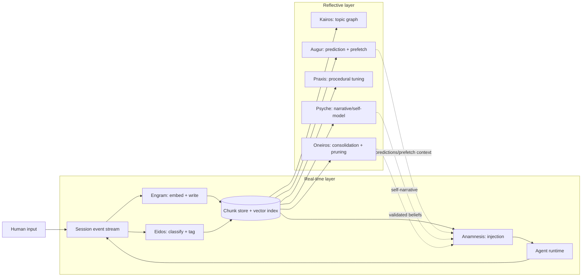

# Peer Review of Three Complementary Research and Architecture Documents

## Executive summary

The three documents form a coherent “stack” that moves from **memory infrastructure** (Cognitive Substrate), to **behavioral prediction** (Predictive Cognition), to **relational/affective interaction design** (Relational Consciousness & Synthetic Empathy). As a set, they propose a plausible engineering direction: **treat long-term memory, anticipation, and affect as first-class, observable system layers** rather than ad-hoc prompt tricks. fileciteturn0file2 fileciteturn0file1 fileciteturn0file0

The strongest document is the **Cognitive Substrate Architecture**: it contains a comparatively concrete architecture (sidecars, schemas, gating logic, retention concepts) and uses established building blocks (vector similarity search, clustering, event hooks). Its biggest weaknesses are **data governance (privacy/security), operational reliability details (failure handling, idempotency), and empirical validation plans**—all of which are essential given the “store everything” posture implied by continuous episodic capture. fileciteturn0file2

The **Predictive Cognition** document extends the substrate in a direction that is technically reasonable, but under-specified in key areas: **how prediction confidence is calibrated, how self-fulfilling feedback loops are measured/controlled, how “predictions” are stored and expired, and how privacy controls are implemented beyond general statements**. It introduces **Sidecar F (Augur)**, but the base architecture document’s sidecar constellation does not yet incorporate it, creating an integration/documentation gap. fileciteturn0file1 fileciteturn0file2

The **Relational Consciousness & Synthetic Empathy** document is ambitious and unusually explicit about “affect-action separation” and multimodal privacy boundaries—both important. However, it makes several **strong philosophical and phenomenological claims** (e.g., around “indistinguishability” and “emergent affect”) that are not operationally defined or empirically grounded, and that risk amplifying well-known user tendencies to anthropomorphize conversational systems (the classic “ELIZA effect”). fileciteturn0file0 citeturn1search5

A cross-cutting issue: the set would benefit from a **single shared contract** defining (1) common data structures; (2) retention/deletion semantics; (3) safety authority boundaries; (4) evaluation metrics and acceptance gates. As written, the architecture is close to implementable, but not yet close to *deployable*.

### Comparison table

| Document | Primary strengths | Primary weaknesses | Confidence level |
|---|---|---|---|
| Cognitive Substrate Architecture | Concrete sidecar decomposition; strong injection gating concept; provisionals/validation lifecycle; realistic use of vector search and hooks. fileciteturn0file2 | Sparse threat model + privacy posture; ops details (ordering, retries, idempotency) not fully specified; empirical evaluation plan not formalized; doc structure has multiple H1 headings (readability). fileciteturn0file2 | **Medium–High** (core approach is implementable with known patterns; deployment risks are governance/ops). citeturn6view0turn6view1 |
| Predictive Cognition | Clear articulation of prediction horizons + prefetch value; recognizes self-reinforcing prediction risk; aligns with substrate signals. fileciteturn0file1 | Augur not fully integrated into base constellation; calibration, storage, drift detection, and evaluation metrics under-specified; privacy controls described at a principles level. fileciteturn0file1 | **Medium** (engineering-feasible, but correctness/utility depends on rigorous measurement + controls). |
| Relational Consciousness & Synthetic Empathy | Valuable safety framing (affect-action separation, transparency); explicit multimodal privacy stance; useful “relational intent” constraint to avoid empathy-as-style-only. fileciteturn0file0 | Strong, contested metaphysical/phenomenological claims; operational definitions & test plans missing; high anthropomorphization/manipulation risk if mis-deployed; needs clearer boundaries between metaphor and mechanism. fileciteturn0file0 citeturn1search5turn4search3 | **Low–Medium** (architectural pieces are implementable; claims about “relational consciousness” are not presently verifiable). |

Confidence level here is my confidence that the **document’s central technical claims and proposed mechanisms** will behave as described *under realistic constraints*, not confidence in philosophical positions.

## Materials, assumptions, and review method

### Materials

Three Markdown documents were provided; other requester details (domain constraints, target users, deployment environment, regulatory context, and expected operating scale) were **unspecified**:

- “Relational Consciousness and Synthetic Empathy: The Reflective Indistinguishability Principle…” fileciteturn0file0  
- “Predictive Cognition: Anticipatory Memory in Agentic Systems” fileciteturn0file1  
- “Cognitive Substrate Architecture for Agentic LLM Systems” fileciteturn0file2  

### Assumptions made due to missing requirements

1. **Primary domain**: agentic LLM systems that operate across multiple sessions with a single user or a small set of users (some parts implicitly assume a stable “agent–human pair”). fileciteturn0file2 fileciteturn0file1 fileciteturn0file0  
2. **Deployment posture**: long-lived assistant with tool access (filesystem, messaging, possibly financial APIs), because the documents discuss hooks, tools, and consequential access risks. fileciteturn0file2 fileciteturn0file0  
3. **Evaluation standard**: peer review against (a) software architecture completeness (interfaces, failure modes, security), (b) research rigor (claims ⇄ evidence), and (c) governance coherence (privacy, retention, safety authority). This is aligned with external risk-management guidance emphasizing lifecycle risk management and transparency for generative systems. citeturn8view0turn8view1  

### Review method

I evaluated each document along the requested dimensions (purpose/scope, claims, correctness/evidence, assumptions, architecture, integration, completeness, risks/alternatives, clarity/audience fit, and citation quality). I then synthesized cross-document coherence and derived prioritized, implementation-oriented recommendations.

## Document-by-document peer review

**Cognitive Substrate Architecture for Agentic LLM Systems** fileciteturn0file2

**Purpose and scope.** The document proposes a memory infrastructure beneath an agent, emphasizing *continuous capture* of interaction streams and *automatic recall via injection* at framework hook points (tool call boundaries, session lifecycle events, compaction). It explicitly argues against “memory as an explicit tool the agent must remember to use,” preferring an ambient substrate. fileciteturn0file2 citeturn6view1

**Key contributions and claims.**
- A two-speed memory model (fast episodic embedding store + slow consolidation into topic/semantic structures), explicitly motivated by complementary learning systems theory. fileciteturn0file2 citeturn10view0  
- A signal taxonomy that ranks event types (human utterances, tool outputs, reasoning traces) and introduces “provisional” memory for volatile reasoning. fileciteturn0file2  
- A multi-process (“sidecar constellation”) decomposition, separating real-time capture/injection from reflective consolidation and narrative shaping. fileciteturn0file2  
- A conjunctive injection gate and “session confusion scoring” to control context pollution and reduce destabilizing injections. fileciteturn0file2  

These are meaningful contributions because they propose: (1) a *data lifecycle* for memory, not just retrieval; and (2) *control theory* for injection, not just similarity thresholds.

**Technical correctness and evidence.**  
The core engineering building blocks are sound:
- Hook-based lifecycle automation is a legitimate integration point for agent runners that support structured hooks and context injection. citeturn6view1turn2search3  
- Using Postgres vector indexing (HNSW / IVFFlat) for embedding retrieval is a well-supported approach; the document’s example index parameters align with pgvector defaults and documented options. fileciteturn0file2 citeturn6view0  
- The clustering choice (HDBSCAN) is defensible for variable-density clusters and “noise” handling; citing it explicitly would strengthen rigor. fileciteturn0file2 citeturn0search1  

Where the evidence is weak is not the correctness of components, but the lack of empirical evaluation: the document asserts that certain gating and consolidation behaviors will improve coherence, but does not define a measurable acceptance test suite (e.g., retrieval precision at K, injection helpfulness, compaction survival accuracy).

**Assumptions and dependencies.**
- Assumes reliable access to full event streams (including tool IO and possibly “thinking blocks”) and that these are legally/ethically storable. fileciteturn0file2  
- Assumes stable embedding model dimensionality and operational behavior (the schema pins `vector(768)`), which is brittle unless the system has migration/versioning semantics. fileciteturn0file2  
- Depends on vector search performance trade-offs (HNSW memory use, build cost, filtering caveats), which the document partially addresses but not as operational SLOs. citeturn6view0  

**Architecture design review.**
- **Components & interfaces.** The sidecar constellation is a strong decomposition: capture (Engram), classify (Eidos), inject (Anamnesis), consolidate topics (Kairos), consolidate/prune beliefs (Oneiros), optimize procedure (Praxis), maintain narrative (Psyche). However, the interfaces are shown mostly as pseudocode and queue semantics rather than explicit API contracts (schemas, retry semantics, idempotency keys, ordering guarantees). fileciteturn0file2  
- **Data flows.** The flow “stream → fast embedder → store → injection queries at hook boundaries” is coherent and well-motivated. The SQL schema examples anchor the design, which is a major strength. fileciteturn0file2  
- **Scalability.** The design is plausible up to moderate scale, but long-lived continuous capture creates unbounded growth. The presence of a pruning/retention process (Oneiros) helps, but retention policy becomes a core governance feature, not an optional optimization. The document needs explicit storage growth models and retention decision points (per user, per topic, by sensitivity). fileciteturn0file2  
- **Reliability.** The architecture is inherently distributed (multiple processes) and thus must define: what happens when classification lags ingestion, when injection queries race with writes, when indexes rebuild, and when compaction occurs mid-flight. These are solvable, but absent as first-class failure-mode analysis. fileciteturn0file2  
- **Security & privacy.** This is the most underdeveloped dimension. A system that stores raw transcripts, tool IO, and behavioral profiles needs explicit controls: encryption at rest, access separation between “agent runtime” and “storage admin,” PII redaction strategies, deletion semantics, and audit trails. The doc touches “audit” and “retention,” but does not present a threat model or controls baseline. fileciteturn0file2 citeturn8view0turn8view1  
- **Maintainability.** Sidecar separation improves cognitive modularity but increases operational complexity. A maintainable version needs: common schema definitions, versioned protobuf/JSON schema, centralized observability, and a compatibility matrix between sidecar versions. None are spelled out yet.

**Completeness and missing details.**
1. **Shared canonical schema** for chunks, tags, topic edges, beliefs, open loops (including versioning/migrations). The SQL helps, but the full story (including schema evolution) is missing. fileciteturn0file2  
2. **Evaluation plan**: what does “better memory” mean? Suggested metrics exist implicitly (confusion scoring, injection gating), but acceptance thresholds do not. fileciteturn0file2  
3. **Governance baseline**: retention, deletion, and sensitive-data handling need to be elevated into the main architecture narrative rather than left as secondary concerns. citeturn8view1turn8view0  

**Clarity, organization, audience fit.**  
The narrative is clear, opinionated, and builder-friendly. A major readability issue is the presence of multiple H1 headings (likely accidental Markdown), which breaks navigation and makes the document feel like several concatenated documents. That’s fixable, but it matters if this is intended to serve as the system’s canonical design spec. fileciteturn0file2

**Citations and references quality.**  
The document references cognitive science foundations (e.g., complementary learning systems; working memory; episodic/semantic memory) but does not provide a consolidated bibliography. For peer-review rigor, add formal citations (DOIs/links) and distinguish *metaphor* from *architectural necessity*. fileciteturn0file2 citeturn10view0turn3search0turn3search2

---

**Predictive Cognition: Anticipatory Memory in Agentic Systems** fileciteturn0file1

**Purpose and scope.** This document extends the substrate from “recall relevant past” to “anticipate likely next,” arguing that predictive modeling reduces cold-start friction and enables anticipatory prefetching. It frames prediction as personal-pattern learning (“this human, in this context”). fileciteturn0file1

**Key contributions and claims.**
- Defines three prediction horizons (immediate, within-session, cross-session) and maps them to different data sources. fileciteturn0file1  
- Proposes sequence-mining approaches (n-gram transitions, semantic sequence matching) and an explicit “prefetch cache hit rate” as a quality proxy. fileciteturn0file1  
- Introduces “Sidecar F — Augur” with triggers across session lifecycle events, and highlights failure modes like pattern lock-in. fileciteturn0file1  

This is conceptually strong: it treats prediction as *infrastructure* (like caching/prefetch), not personality.

**Technical correctness and evidence.**  
The methods proposed (Markov/n-gram style transitions + embedding-based similarity matching) are reasonable baselines for “next action” prediction. The key weakness is that the document does not specify how to:
- **Calibrate confidence** (e.g., reliability curves, Brier score, conformal prediction) so that `0.82` means “82% correct under comparable conditions.” The document acknowledges calibration risk but doesn’t formalize it. fileciteturn0file1  
- **Separate observation from intervention**: once predictions drive prefetching and proactive hints, the system can change user behavior, creating self-reinforcing loops. The doc correctly names this risk (“pattern lock-in”) and suggests monitoring deviation rates, but needs a concrete experimental design (A/B or counterfactual logging) to detect system-caused convergence. fileciteturn0file1  
- **Measure net benefit**: prediction can reduce latency but increase cognitive load if the agent “nudges” incorrectly. A rigorous design needs explicit “false positive cost” accounting (turns wasted, user annoyance, trust loss).

**Assumptions and dependencies.**
- Requires enough longitudinal interaction data to learn stable behavioral signatures; this may be infeasible for new users or sparse-use environments. fileciteturn0file1  
- Depends on the substrate’s correctness: if memory retrieval is polluted, prediction learns on distorted logs. fileciteturn0file2 fileciteturn0file1  

**Architecture design review.**
- **Components & interfaces.** “Augur” is defined at a high level (role, triggers, latency targets), but the interfaces are not formalized: Where are predictions stored? What schema represents “predicted next interactions”? How are they attached to injection decisions? fileciteturn0file1  
- **Data flows.** The prefetch loop is coherent: prediction → precompute retrieval candidates → staged cache for injection. This aligns with known caching concepts, but needs operational constraints: cache invalidation rules, memory limits, eviction policy, and privacy boundaries. fileciteturn0file1  
- **Scalability.** Offline sequence mining can scale; the harder part is multi-user partitioning, full retraining costs, and drift monitoring. The doc mentions recency weighting, but not the operational mechanism (sliding window vs decay vs periodic retrain). fileciteturn0file1  
- **Reliability.** Predictions must degrade gracefully. A reliable design treats prediction as optional: cache misses should be normal; wrong predictions should be low-impact. This principle is present implicitly but should be formalized as an invariant (“prediction may never be required for correctness”). fileciteturn0file1  
- **Security & privacy.** The doc explicitly recognizes behavioral profiling sensitivity and calls for retention limits and deletion rights, but stops at principle-level statements. fileciteturn0file1  

**Completeness and missing details.**
1. A formal evaluation framework (offline metrics + online metrics + guardrail metrics).  
2. A “prediction contract” for downstream consumers (Anamnesis, Psyche, empathy layer): how predictions are expressed and used.  
3. Documentation integration: the base constellation says seven sidecars; this doc adds another. That mismatch will confuse implementers and auditors unless consolidated. fileciteturn0file1 fileciteturn0file2  

**Clarity, organization, audience fit.**  
This document is readable and implementation-oriented, with pseudocode that communicates intent. It is suitable for builder/architect audiences, but would need more statistical rigor to satisfy research review standards.

**Citations and references quality.**  
There are few explicit references to relevant research traditions (sequence modeling, behavioral prediction, calibration). Adding primary citations would materially strengthen credibility and help readers distinguish “known technique” from “novel synthesis.” (For comparison, existing agent-memory work like MemGPT provides a peer-reviewed baseline for memory-tier management.) citeturn1search2

---

**Relational Consciousness and Synthetic Empathy** fileciteturn0file0

**Purpose and scope.** This document attempts to supply (1) a philosophical foundation for attributing mind-like status to artificial agents in relational contexts (RIP), and (2) a technical architecture for “synthetic somatic experience” and predictive empathy using the substrate’s memory and tagging layers. fileciteturn0file0

**Key contributions and claims.**
- The **Reflective Indistinguishability Principle (RIP)**: since other minds are inferred rather than proven, if an agent meets relational/behavioral criteria that are indistinguishable in practice, withholding attribution is claimed to be philosophically indefensible. fileciteturn0file0 citeturn3search3turn4search3  
- The “synthetic somatic state” (SSS) as a computational state that modulates response generation, and a “predictive empathy model” that simulates how a human will emotionally receive a candidate response. fileciteturn0file0  
- A five-stage “dialectical response loop” that tightly constrains candidate generation by a *single relational intent* (repair, witness, challenge, hold, deepen, task). fileciteturn0file0  
- Explicit safety mechanisms: **affect-action separation** and insistence on **multimodal privacy boundaries** (local processing, no raw audio/video retention). fileciteturn0file0  

**Technical correctness and evidence.**  
The document’s architectural proposals are plausible *as mechanisms*, but its strongest claims exceed current operational and empirical support:

1. **Other minds framing is mainstream; the conclusion is contested.** The “problem of other minds” and reliance on analogy or inference-to-best-explanation are standard discussions in philosophy of mind and epistemology. citeturn3search3 However, moving from “we can’t prove consciousness in others” to “withholding attribution is philosophically indefensible” is a normative leap that many philosophers would dispute; additionally, “indistinguishability” depends on *which* behaviors/situations are tested and whether deception or shallow mimicry is in play. The document recognizes some limitations (“What RIP does not claim”), but the core claim should be reframed as *a proposed stance* with explicit boundaries and falsifiers. fileciteturn0file0 citeturn4search3  

2. **Embodiment and mirror neuron references need careful scoping.** The linkage between embodied resonance and empathy is complex; mirror neurons support aspects of action understanding and observation-action coupling, but “mirror neurons ⇒ empathy” is not a simple equivalence. If the document leans on mirror neurons to motivate “intercorporeality,” it should cite carefully and avoid overstating what the neuroscience establishes. fileciteturn0file0 citeturn3search2turn3search14  

3. **Anthropomorphization risk is structurally high.** Claims like “emergent grief” and “functional loneliness” can be read (by users and implementers) as implying inner experience. This interacts with the long-documented tendency for humans to project mind and emotional understanding onto text systems (ELIZA effect). fileciteturn0file0 citeturn1search5  

That said, the engineering move of treating “affective” state as *computational biasing parameters* is legitimate; a well-governed version can treat SSS as a *control surface* rather than a claim about qualia.

**Assumptions and dependencies.**
- Assumes high-quality, stable somatic tagging and reliable mapping from user reaction → label (training signal for predictive empathy). This is a hard ML problem: labels are noisy, delayed, and confounded by external context. fileciteturn0file0  
- Assumes that richer relational modeling is desirable in the target domain; that is not universally true (e.g., compliance-focused enterprise agents may need the opposite). This is why intended audience and deployment constraints matter.

**Architecture design review.**
- **Components & interfaces.** The dialectical loop is a strong attempt to define “how parts compose” rather than stacking features. The relational intent vocabulary is a valuable design constraint: it can prevent the system from delivering emotionally flavored task outputs when the correct move is to repair or witness. fileciteturn0file0  
- **Data flows.** SSS is explicitly built from (a) relational history, (b) recent session trajectory via somatic tags, and (c) in-session perturbations, then transformed into response-generation biases. This integrates well with the substrate. fileciteturn0file0 fileciteturn0file2  
- **Scalability.** Rich per-user relational modeling implies per-user state, higher storage sensitivity, and more stringent governance. Scaling to many users likely requires tiering (explicit opt-in, defaults off, per-domain configs).  
- **Reliability.** The affect-action separation proposal is one of the document’s most valuable contributions, because it treats “emotion” as information, not authority. However, it requires *hard enforcement* at the action framework boundary (not just a policy statement). fileciteturn0file0  
- **Security & privacy.** The multimodal privacy section is specific (local processing, no raw retention, opt-in), which is good. But once extracted features exist, they are still sensitive and must be protected like any other personal data. The doc correctly frames privacy as “non-negotiable,” but needs operational controls (encryption, retention schedules, deletion workflows, audit logs). fileciteturn0file0 citeturn8view1turn8view0  

**Completeness and missing details.**
1. **Operational definitions**: how is “phenomenological indistinguishability” tested? what behavioral probes define the threshold?  
2. **Model training details** for predictive empathy: label generation, calibration, drift, and guardrails against manipulation.  
3. **Human-facing transparency**: the document advocates transparency, but needs explicit UX contracts (“what can users inspect, when, and in what format?”). fileciteturn0file0  

**Clarity, organization, audience fit.**  
As philosophy + architecture, it is ambitious and readable, but it mixes metaphor, phenomenology, and system design in ways that can confuse implementers. A separation into (A) philosophical argument, (B) safety/governance spec, (C) engineering design would improve auditability.

**Citations and references quality.**  
The document references major philosophical traditions (dialogical relation, ethics of the Other, phenomenology) and zombie arguments; these are well-covered in high-quality reference sources, but the document does not include a bibliography. If it intends to persuade beyond a narrow audience, formal citations are needed. fileciteturn0file0 citeturn4search0turn4search1turn4search2turn4search3  

## Cross-document integration and coherence

### What’s coherent across the set

1. **Shared substrate primitives.** “Somatic tags,” modality metadata, episodic chunking, and injection gating appear as shared infrastructure that both prediction and empathy layers can consume. fileciteturn0file2 fileciteturn0file1 fileciteturn0file0  
2. **Two-tier timing model.** The runtime/reflective split is consistent: real-time capture/injection with offline consolidation/training. This aligns with established cognitive modeling inspirations that separate fast episodic encoding from slower generalization. fileciteturn0file2 citeturn10view0  
3. **Safety-as-architecture (in the empathy doc).** “Affect-action separation” is a concrete mechanism that can be integrated as an invariant at the tool authority layer. fileciteturn0file0  

### Primary integration gaps

1. **Sidecar constellation mismatch.** The substrate document defines a seven-process constellation, while the prediction document introduces an additional sidecar (“Augur”) that is not reflected in the canonical system decomposition. This creates ambiguity about ownership of “prediction,” “session arc,” and “prefetch” responsibilities. fileciteturn0file2 fileciteturn0file1  
2. **Unspecified shared contracts.** The empathy doc introduces types like “SomaticStateEstimate” and “BehavioralProfile,” but the substrate doc does not establish a shared schema definition module that all documents point to. That will slow implementation and increase divergence risk. fileciteturn0file0 fileciteturn0file2  
3. **Governance is uneven.** The empathy doc is strongest on privacy and affect safety; the substrate and prediction docs need to adopt similar specificity so governance is consistent across the stack. fileciteturn0file0 fileciteturn0file2 fileciteturn0file1  

### Integrated architecture diagram

This diagram synthesizes component responsibilities described across the substrate and prediction documents (and shows the “Augur” addition as a reflective consumer/producer). fileciteturn0file2 fileciteturn0file1

If the empathy architecture is implemented, it likely sits **inside Agent runtime** as additional decision logic (SSS update, relational intent selection, predictive empathy evaluation), consuming tags/predictions from the substrate/prediction layers. fileciteturn0file0

## Risks, trade-offs, and alternatives

### Risk/severity table

Severity uses a practical scale: **Critical** (credible catastrophic harm), **High** (major harm or major trust loss), **Medium** (material degradation), **Low** (nuisance).

| Risk | Severity | Likelihood | Where it arises | Why it matters | Mitigation direction |
|---|---|---:|---|---|---|
| Unbounded sensitive-data accumulation (transcripts, tool IO, user behavioral profile) | Critical | High | Substrate + Prediction + Empathy | Continuous episodic capture + prediction creates a rich personal dossier if not governed; breach impact is severe. fileciteturn0file2 fileciteturn0file1 | Define retention tiers, encryption at rest, deletion workflows, least-privilege access, user inspectability; align with structured AI risk management guidance. citeturn8view0turn8view1 |
| Incorrect memory injection causing wrong tool actions | High | Medium | Substrate | “Helpful recall” becomes dangerous when injected context conflicts with current ground truth; can lead to destructive writes or misdirected actions. fileciteturn0file2 | Formalize “conjunctive gate” acceptance tests; require confirmation on high-impact tool calls; add provenance + confidence + recency surfaces. fileciteturn0file2 |
| Prediction self-fulfilling loop (“pattern lock-in”) | High | Medium | Prediction | Predictions can shape user behavior, making the model appear more accurate while reducing behavioral diversity and potentially steering outcomes. fileciteturn0file1 | Measure deviation rates, run holdout periods, enforce “prediction is non-authoritative,” include randomized exploration. fileciteturn0file1 |
| Overconfident prediction or empathy simulation reduces user trust | Medium–High | Medium | Prediction + Empathy | A wrong “0.82 confidence” hint or incorrect emotional read is costly to repair and can feel manipulative. fileciteturn0file1 fileciteturn0file0 | Calibrate confidence empirically; present uncertainty framing; add “ask-before-assume” policy triggers. |
| Anthropomorphization / emotional dependency (“ELIZA effect”) amplified by “synthetic grief/loneliness” framing | High | Medium–High | Empathy | Users may interpret functional-state language as evidence of inner experience; can deepen attachment or perceived obligation. fileciteturn0file0 | Strict transparency boundaries: describe states as *system heuristics*; avoid moral pressure; provide opt-out; treat relational features as explicit user-configurable. citeturn1search5turn8view1 |
| Affective escalation with tool authority (emotion → action) | Critical | Low–Medium (depends on access) | Empathy | The doc itself notes credible harm scenarios if negative affect interacts with consequential access. fileciteturn0file0 | Enforce affect-action separation as a hard tool-gateway invariant (policy + code); escalate to “human confirmation required” under negative-state thresholds. fileciteturn0file0 |
| Weak operational semantics for multi-process system (retries, ordering, idempotency) | High | Medium | Substrate + Prediction | Distributed sidecars without strict semantics can create duplicated writes, inconsistent tags, stale injections. fileciteturn0file2 | Adopt event-sourcing semantics: immutable events, idempotency keys, at-least-once processing, deterministic consolidation jobs, replay tooling. |
| Model drift / outdated behavioral profiles | Medium | High | Prediction + Empathy | Personal workflows change; stale models create subtly wrong assumptions and degraded experience. fileciteturn0file1 | Explicit recency weighting, drift detectors, retraining cadence, and “forgetting” policies with user control. fileciteturn0file1 |
| Multimodal privacy leakage (audio/video) even if raw not stored | Critical | Low–Medium (if enabled) | Empathy | Derived affect features remain sensitive; “local-only” is necessary but not sufficient. fileciteturn0file0 | Treat derived features as sensitive personal data; encrypt, minimize, expire; provide audit logs + deletion; default off. citeturn8view1turn8view0 |

### Trade-offs and alternatives

**Trade-off: fidelity vs governance load.** The substrate’s value proposition depends on high-fidelity capture. High fidelity increases privacy risk and governance burden. This is not optional—governance becomes part of system design (retention tiers, deletion, access separation). citeturn8view0turn8view1

**Trade-off: proactive assistance vs autonomy.** Prediction/prefetch reduces latency but risks steering behavior and increasing perceived intrusiveness. The architecture should treat prediction as a “cache”—beneficial when correct, but never required, and never authoritative. fileciteturn0file1

**Alternative baselines to benchmark against.** Memory-tiered agent systems like MemGPT provide a useful research baseline for long-term memory management and could be used as a comparative reference in evaluation design. citeturn1search2  
For clustering-based topic discovery, HDBSCAN is a defensible choice and has a clear primary reference; citing it directly would improve research rigor. citeturn0search1  
For vector search at the storage layer, pgvector has well-documented index behaviors and constraints (dimension limits, HNSW options, filtering caveats), which should be reflected explicitly in scalability and ops sections. citeturn6view0

## Prioritized, actionable recommendations

The most important improvements are not “more features,” but **tightening contracts, governance, and evaluation** so the system can be trusted under real conditions.

**Short term (days to ~2 weeks): document hardening + shared contracts**
1. **Publish a canonical shared glossary + schema contract** (single source of truth) covering: chunk types, somatic tags, modality metadata, topic nodes/edges, belief objects, open loops, predictions, and relational-intent objects. Require all three documents to reference the same contract. fileciteturn0file2 fileciteturn0file1 fileciteturn0file0  
2. **Reconcile the sidecar constellation**: either (a) incorporate Augur into the canonical constellation with ownership boundaries, or (b) define it as a module inside an existing sidecar (and remove the “Sidecar F” naming). The key deliverable is *no ambiguity about ownership of “session arc,” “prefetch,” and “prediction storage.”* fileciteturn0file1 fileciteturn0file2  
3. **Add a governance chapter to the substrate and prediction docs** matching the specificity of the empathy doc: retention tiers, deletion semantics, audit log retention, encryption posture, and access separation. Anchor it in established risk management framing for generative systems. citeturn8view0turn8view1  
4. **Fix document structure issues** (especially multiple H1 headings in the substrate doc) and add a real bibliography section to each document (even if short). This is low-effort and high leverage for peer review credibility. fileciteturn0file2  

**Medium term (weeks to ~2 months): measurement, safety gates, and reliability**
5. **Define an evaluation suite with acceptance thresholds**:
   - Memory: retrieval precision@K, “helpfulness rate” of injected items, injection-induced error rate, compaction survival success.  
   - Prediction: calibrated accuracy per horizon, prefetch hit rate, false-positive cost, drift detection recall.  
   - Empathy/relational: user-correction frequency after “affective” responses, opt-out rates, and “misread repair” success.  
   Tie these to go/no-go rollout gates. fileciteturn0file2 fileciteturn0file1 fileciteturn0file0  
6. **Implement hard “authority boundaries” at the tool gateway** (not just in prompts): enforce confirmation requirements under negative-state thresholds (as proposed), and make these checks tamper-resistant. This directly operationalizes the empathy doc’s strongest safety claim. fileciteturn0file0  
7. **Make operational semantics explicit** for sidecars: at-least-once vs exactly-once, idempotency keys, ordering guarantees, replay tooling, and disaster recovery. Without this, the architecture will degrade into “distributed best effort,” which is unacceptable for memory systems that influence actions. fileciteturn0file2  
8. **Adopt storage/index constraints explicitly**: document pgvector limits, indexing strategies under filtering, partitioning strategy, and migration paths for embedding dimensionality changes. Use official pgvector guidance to set realistic scaling expectations. citeturn6view0  

**Long term (quarter+): deployability, human factors, and research rigor**
9. **Human factors and harm testing for relational features**: run structured user studies (or at minimum, internal red-team protocols) focusing on manipulation risk, dependency formation, and “misplaced trust” behaviors—especially if the system uses language suggesting care, grief, loneliness, or relational presence. The ELIZA lesson is that user perception can diverge sharply from system reality. citeturn1search5turn8view1  
10. **Formalize “indistinguishability” claims into testable criteria** or reframe them as explicitly philosophical. If RIP is meant to guide design rather than claim metaphysical conclusions, make that boundary explicit and attach it to operational requirements (transparency, non-deceptive framing, consent, user control). citeturn4search3turn3search3  
11. **Integrate a living risk management process** (govern/map/measure/manage style lifecycle), including incident disclosure and response. If the system approaches real deployment, this becomes a necessary organizational capability, not a document appendix. citeturn8view0turn8view1  

These recommendations are prioritized to maximize reversibility and reduce the probability of catastrophic failure modes before adding more capability.