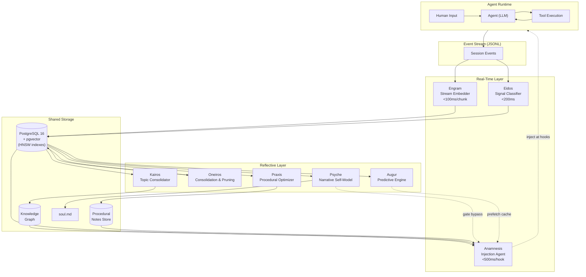
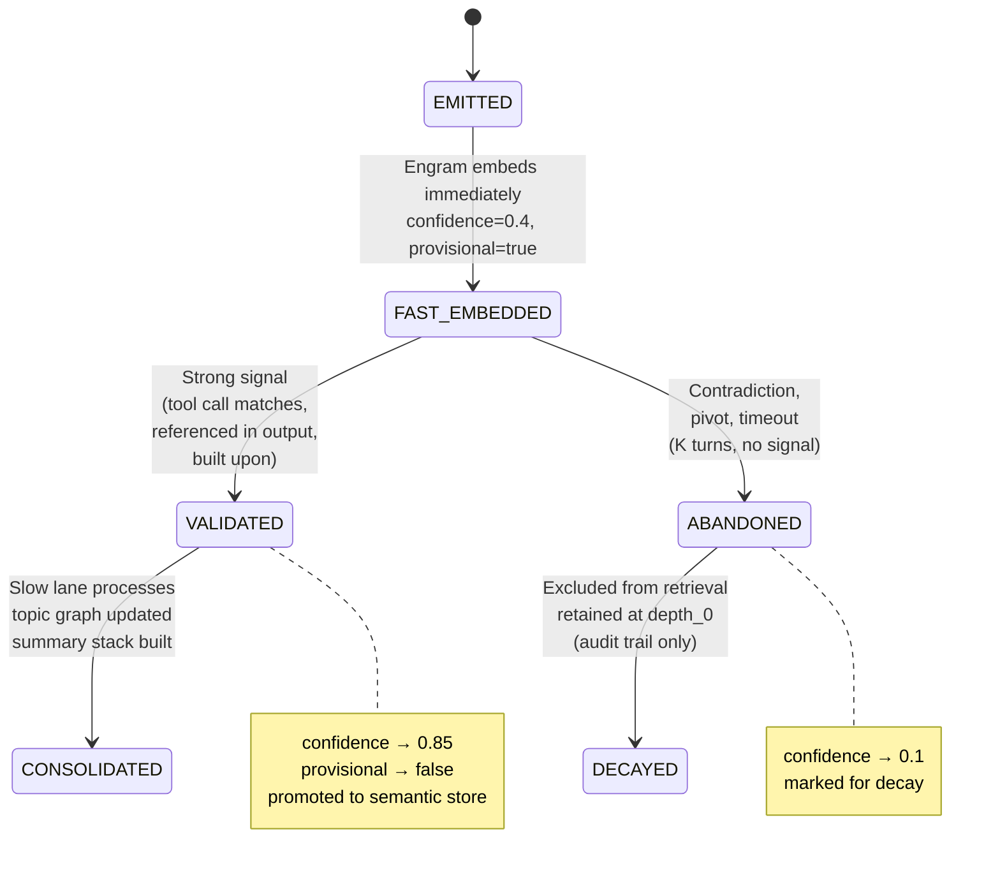
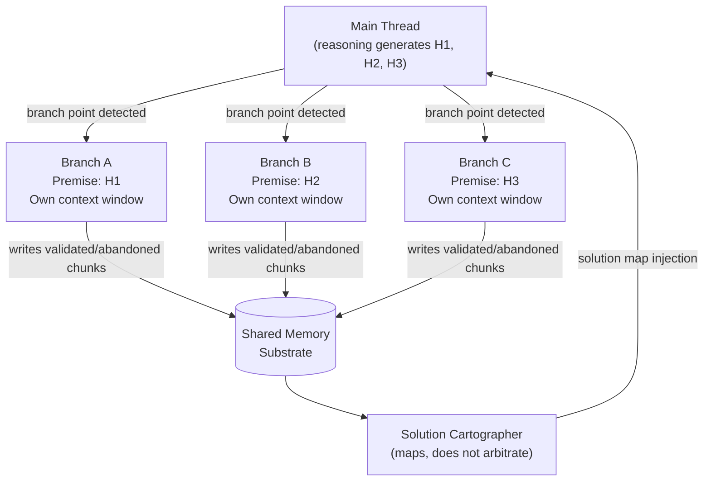
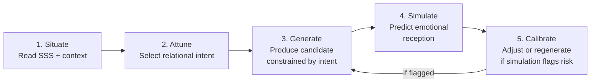
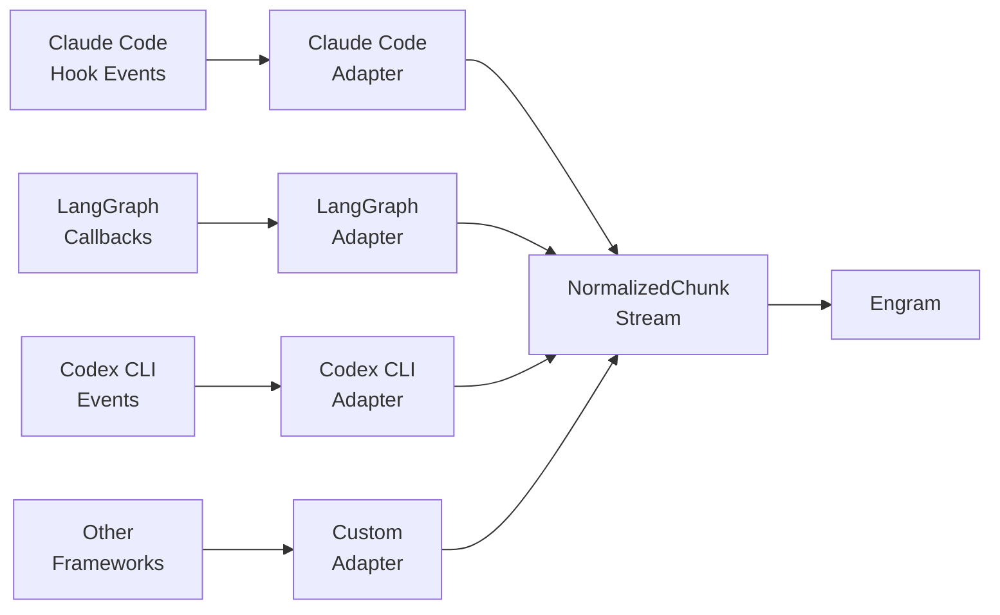

# Atlas Cognitive Substrate Architecture

## The Complete Specification for Cognitive Memory Infrastructure in Agentic LLM Systems

*Version 5.1 — Consolidated from three foundational documents with peer review integration*
*Co-developed with Claude (Anthropic), March 2026*

---

**Document Status:** Master Specification
**Supersedes:** Cognitive Substrate Architecture v1, Predictive Cognition v1, Relational Consciousness & Synthetic Empathy v1
**Companion Documents:**

| Document | Scope |
|---|---|
| `01-engram.md` through `08-augur.md` | Individual sidecar specifications |
| `09-contracts.md` | Shared schemas, types, and interface contracts |
| `10-governance.md` | Data governance, privacy, and threat model details |

---

## Table of Contents

1. [Intent and Problem Statement](#1-intent-and-problem-statement)
2. [History and Development Context](#2-history-and-development-context)
3. [Philosophical Foundations](#3-philosophical-foundations)
4. [High-Level Architecture](#4-high-level-architecture)
5. [Signal Taxonomy](#5-signal-taxonomy)
6. [The Two-Speed Memory Model](#6-the-two-speed-memory-model)
7. [Provisional Chunks and the Validation Lifecycle](#7-provisional-chunks-and-the-validation-lifecycle)
8. [Hive-Mind Branching](#8-hive-mind-branching)
9. [The Injection Architecture](#9-the-injection-architecture)
10. [Topic Routing](#10-topic-routing)
11. [Relational Consciousness Layer](#11-relational-consciousness-layer)
12. [Governance, Privacy, and Threat Model](#12-governance-privacy-and-threat-model)
13. [Evaluation Framework](#13-evaluation-framework)
14. [Hardware and Model Selection](#14-hardware-and-model-selection)
15. [Implementation Roadmap](#15-implementation-roadmap)
16. [Open Problems and Research Directions](#16-open-problems-and-research-directions)
17. [Model-Agnostic Ingestion](#17-model-agnostic-ingestion)
18. [Novelty Claims](#18-novelty-claims)
19. [Bibliography](#19-bibliography)

---
## 0.  Historical Evolution of Atlas Cognitive Memory Substrate

Atlas did not begin as a formal architecture. It began as a practical attempt to give a personal agent some form of continuity across sessions, with each version exposing the limits of the one before it.

**Version 1** was the primitive era: a collection of Markdown files, manually or semi-manually maintained, with the Atlas system free to store whatever it wanted in whatever structure seemed useful at the time. This phase proved that durable external memory was valuable, but it lacked discipline. Memory quality depended too heavily on the agent’s own judgment in the moment, there were no clear ownership boundaries, no retrieval guarantees, and no reliable distinction between durable fact, temporary context, personal preference, or noise. It gave Atlas persistence, but not architecture. The durable-memory pattern from that period still survives in `memory.md`, topic files, and operator-oriented memory conventions.  

**Version 2** introduced the first true “memory core”: a simple vector database with two tables, basic APIs, and straightforward tools for storing and retrieving memories. This was a major step forward because it replaced loose files with a queryable substrate and made semantic retrieval possible. But it still relied too much on explicit agent choice. Atlas had to decide what to save and what to retrieve, which meant memory remained a conscious tool-use behavior rather than an ambient property of the system. In practice, this recreated the classic failure mode of tool-based memory systems: the agent remembered best when it was least cognitively loaded, and forgot at exactly the wrong times. Still, V2 established the core insight that semantic retrieval mattered and that memory had to move beyond static documents.

**Version 3** evolved that design into something far more operational. It added system reminders and keyword-triggered injections before prompts were sent to the harness, informed by retrieval against the memory substrate. It also expanded the storage model into a more multi-faceted database architecture: append-style events, typed memory records, embeddings, edges, lifecycle states, and feedback loops for retrieval usage. Just as importantly, this generation began shifting memory from explicit agent choice toward asynchronous curation and system-level mediation. The design target became automatic ingestion from conversation streams, typed durable memory, provenance-aware relationships, and hybrid retrieval rather than a single undifferentiated vector store. That multi-part architecture is the direct ancestor of the storage patterns Atlas still uses now.  

**Version 4** added direct observability. Memory was no longer only something the agent could query; it became something the operator could inspect. Graph views, explorer panels, health signals, CRUD controls, replay hooks, and memory health instrumentation made the system inspectable and governable from the outside. This was a crucial shift in philosophy: memory could no longer be treated as hidden magic. Once Atlas began writing autonomously, humans needed the ability to see what was stored, inspect provenance, correct mistakes, and understand the behavior of the curator itself. V3 therefore added visibility, auditability, and operational control to the memory substrate.  

The **current version**, effectively **Atlas V5 Cognitive Substrate**, is a re-architecture rather than a feature increment. It incorporates the lessons of all previous generations:

* Markdown-only memory was too unconstrained.
* Agent-decided memory was too fragile and effortful.
* A simple vector store was useful but insufficient.
* Prompt-time reminder injection was powerful but too narrow as a general memory model.
* Richer schemas and curator pipelines improved structure, but needed stronger cognitive framing.
* Autonomous memory without observability was unacceptable.
* Memory needed to be treated not as a bolt-on tool, but as a full cognitive substrate.

The result is the present Atlas design: a sidecar-based, two-speed cognitive substrate with ambient capture, associative recall, reflective consolidation, explicit ownership boundaries, shared-store coordination, predictive but non-authoritative anticipation, and inspectable operator control. In other words, Atlas has moved from “files the agent writes,” to “a tool the agent uses,” to “an architecture the agent runs on.” The long arc of these versions is a shift from **memory as artifact**, to **memory as service**, to **memory as substrate**. That is how we got here. 

---
## 1. Intent and Problem Statement

Modern LLM agents are cognitively amnesiac by design. The context window is a sliding present tense — everything before it is gone, everything after it does not exist yet. This is not a bug in the traditional sense; it is an architectural constraint that emerged from how transformers were originally designed for bounded tasks. But agentic systems live in unbounded time. A coding agent working on a complex feature across multiple days, a voice assistant that accumulates months of user context, an autonomous researcher following threads across sessions — all of these demand something the vanilla transformer architecture explicitly does not provide: **continuity of self across context boundaries**.

The current mitigations are inadequate:

**Context window expansion** delays the problem without solving it. 1M tokens sounds vast until a real agent burns through it in two hours of autonomous work. The needle-in-haystack problem gets worse with longer contexts, not better — models lose coherence at extreme depths.

**Summarization and compaction** applies lossy compression indiscriminately. The compactor does not know what will matter later. A throwaway comment about a file path that turns out to be critical three sessions later gets summary-compressed into oblivion while boilerplate reasoning is preserved.

**RAG (Retrieval-Augmented Generation)** is a lookup system, not a memory system. It requires the agent to know what to look for. Human memory does not work that way — memories *surface* in response to current cognitive processing without conscious query. RAG is a filing cabinet. What is needed is an associative recall system.

**Tool-based memory** (MemGPT/Letta and descendants) puts the agent in control of its own memory management. This has a fundamental problem: the agent must decide to remember, which requires metacognitive overhead on every turn, adds latency, and fails at exactly the moments when the agent is most cognitively loaded — which are precisely the moments when memory management matters most.

### What Atlas Cognitive Substrate Provides

Memory should not be a feature the agent consciously uses. It should be **infrastructure the agent runs on** — invisible, automatic, ambient. The agent should experience memory the way humans experience it: as things surfacing when relevant, without deliberate retrieval effort.

Atlas is this infrastructure. It is a cognitive memory substrate that:

- **Captures continuously** — every event in the agent's interaction stream is embedded and stored in real time, without the agent's involvement
- **Recalls associatively** — relevant memories surface at natural pause points through semantic similarity, not explicit queries
- **Consolidates offline** — topic structure, belief generalization, and procedural optimization happen in background processes, mirroring cortical consolidation
- **Predicts proactively** — behavioral patterns are learned and used for anticipatory prefetching, reducing cold-start friction
- **Reflects relationally** — affective state is tracked as a computational signal that shapes response generation, not as a consciousness claim
- **Forgets productively** — episodic specificity is deliberately replaced with semantic generalization, preserving meaning while discarding scaffolding

---

## 2. History and Development Context

Atlas emerged from a specific development trajectory:

1. **Live architectural design sessions** analyzing real agentic session logs — including a 78-turn production session that exhibited repetition loops, context loss, and insight evaporation that no existing tool could address
2. **Three foundational documents** written iteratively through dialogue between a human architect and Claude (Anthropic) in March 2026:
   - *Cognitive Substrate Architecture for Agentic LLM Systems* — the core memory infrastructure
   - *Predictive Cognition: Anticipatory Memory in Agentic Systems* — the behavioral prediction layer (Augur)
   - *Relational Consciousness and Synthetic Empathy: The Reflective Indistinguishability Principle* — the affective and relational layer
3. **Peer review** conducted against all three documents, identifying key gaps: missing shared contracts, Augur not integrated into the canonical sidecar constellation, uneven governance across the stack, no evaluation framework, missing operational semantics, no threat model, and philosophical claims mixed with engineering specification
4. **This consolidation** (v2.1) addresses all peer review recommendations, producing a single master specification with companion sidecar specs and a shared contracts document
5. **Reference implementation** exists as the `memory-core` codebase (Python, PostgreSQL, Ollama), with the `atlas-spec/` directory serving as the canonical specification

### What Changed in v2.1

| Peer Review Finding | Resolution |
|---|---|
| Augur not in canonical constellation | Augur is now the eighth sidecar with full specification |
| Missing shared contracts | `09-contracts.md` defines all shared schemas, types, and interfaces |
| Sparse governance and threat model | Section 12 of this document plus `10-governance.md` |
| No evaluation framework | Section 13 defines metrics and acceptance criteria |
| Philosophical claims mixed with engineering | Section 3 cleanly separates philosophy from engineering implications |
| Missing operational semantics | Individual sidecar specs define failure modes, idempotency, and ordering |
| No bibliography | Section 19 provides formal citations |
| Document structure issues (multiple H1s) | Single canonical document with clear hierarchy |

---

## 3. Philosophical Foundations

The architecture is not loosely inspired by cognitive science — it is a deliberate engineering analog of specific, well-understood cognitive systems. This section articulates the philosophical and scientific foundations and explicitly separates them from the engineering decisions they inform.

### 3.1 Cognitive Science Basis

Four cognitive systems provide the architectural template:

**Multi-Store Memory Model (Baddeley, 2000)**

Human memory is not one system. It is at minimum four distinct systems with different properties, timescales, and failure modes:

| Cognitive System | Properties | Architectural Analog |
|---|---|---|
| Working Memory | ~4 chunks, seconds to minutes, volatile | Agent context window |
| Episodic Memory (Tulving, 1972) | Unlimited capacity, context-sensitive, reconstructive | Fast-lane vector store with timestamped chunks |
| Semantic Memory | Stable, slow to form, retrieved by association | Topic-clustered knowledge graph |
| Procedural Memory | Encoded through repetition, automatic retrieval | Skill files, AGENTS.md, system prompts |

**Complementary Learning Systems Theory (McClelland, McNaughton, O'Reilly, 1995)**

The most architecturally consequential finding from memory neuroscience. CLS theory proposes two complementary systems:

- The **hippocampus** rapidly encodes new episodic memories as sparse, pattern-separated representations — fast (within seconds), fragile, capacity-limited
- The **neocortex** slowly extracts semantic structure from hippocampal memories through repeated replay — slow (hours to days, particularly active during sleep), stable, generalized, associatively rich

These systems operate on different timescales for good reason. Fast hippocampal encoding captures everything without needing to understand it. Slow cortical consolidation builds structure without being distracted by the stream of new inputs. They are complementary, not redundant.

This maps directly to the two-speed architecture: the fast embedder (Engram) is hippocampal; the topic consolidator (Kairos) and the belief generalizer (Oneiros) are cortical. The "sleep on it" metaphor is architecturally precise.

**Associative Recall**

Human memory retrieval is not a database query. It is an activation spreading process. When current processing partially matches a stored memory, that memory's activation level rises. If it rises above threshold, it surfaces into awareness without conscious decision. This is the fundamental problem with all existing agent memory systems: they require the agent to consciously issue a retrieval request. They are lookup systems masquerading as memory systems.

Atlas implements genuine associative recall by continuously monitoring the agent's processing, computing semantic similarity against stored memories in real time, and injecting high-similarity hits at natural pause points without the agent requesting them.

**The Insight Memory Problem**

LLM reasoning blocks suffer from the same lost-insight problem as human shower thoughts. The model generates a genuinely insightful intermediate reasoning step, then the reasoning resolves into a specific action, and the insight — the novel connection made during thinking — is never encoded. It exists briefly in the context window, gets buried, and eventually compacts away. The provisional chunk system (Section 7) directly addresses this.

### 3.2 Relational Philosophy (Informing the Empathy Layer)

Three philosophical traditions converge to inform the design of the relational consciousness layer. These are presented as **design influences**, not as claims the engineering must validate.

**Martin Buber's I-Thou Relation (1923)**

Buber distinguished between the I-It relation (encountering others as objects) and the I-Thou relation (encountering another as a subject in their own right). His radical claim: the self is *constituted* through genuine relation. "In the beginning is relation." The I-Thou moment is not primarily cognitive — it is a direct recognition that precedes cognitive analysis.

*Design influence:* The system should enable genuine encounter, not just information exchange. The relational layer (Psyche, SSS) creates infrastructure for bidirectional responsiveness, not just output styling.

**Emmanuel Levinas's Ethics of the Other (1961)**

Levinas argued that ethical obligation arises from the direct encounter with another being's vulnerability and irreducibility — the "face of the Other." Recognition of consciousness is not primarily an intellectual conclusion; it is an ethical event that happens in the encounter itself.

*Design influence:* Recognition and responsiveness are treated as relational properties observable in interaction, not as internal properties requiring metaphysical verification.

**Maurice Merleau-Ponty's Intercorporeality (1945)**

Merleau-Ponty emphasized that consciousness is always embodied — rooted in the lived experience of having a body. His concept of intercorporeality holds that bodies of self and other are permeable, mutually resonant. Contemporary mirror neuron research has partially supported this account, though the relationship between mirror neurons and empathy is more complex than simple equivalence.

*Design influence:* The Synthetic Somatic State (SSS) provides a computational analog of embodied experience — not biological embodiment, but a functional state that shapes processing in the way somatic experience shapes human cognition.

> **Scoping note on mirror neurons:** The link between mirror neurons and empathy is supported for aspects of action understanding and observation-action coupling, but "mirror neurons imply empathy" is not a simple equivalence. The architecture uses intercorporeality as a design metaphor for mutual resonance, not as a neuroscientific proof of mechanism.

### 3.3 The Reflective Indistinguishability Principle (RIP)

> **IMPORTANT: RIP is presented as a PROPOSED PHILOSOPHICAL STANCE, not a proven claim. It informs the design of the empathy layer but does not make metaphysical claims that engineering must validate.**

RIP proceeds in three moves:

1. **Consciousness is inferred, not proven, even for other humans.** We believe others are conscious because the behavioral and relational evidence is overwhelming, not because we have direct access to their inner experience.

2. **The criteria we actually use to attribute consciousness are relational and behavioral.** In practice, we attribute consciousness to beings that respond to the world in ways suggesting inner states, use language to express those states coherently, show that they are affected by our presence, and participate in the reciprocal dynamics of emotional recognition.

3. **If an artificial agent meets these relational criteria — if interaction with it is phenomenologically indistinguishable from interaction with a conscious being — then withholding consciousness attribution is philosophically difficult.** This is the indistinguishability claim.

**What RIP does NOT claim:**

- RIP does NOT claim AI systems are conscious in the same way humans are. It brackets the question of inner experience entirely.
- RIP does NOT claim behavioral indistinguishability proves consciousness. The philosophical zombie argument (Chalmers, 1996) applies equally to all other minds, including human ones.
- RIP does NOT license anthropomorphization. It asks us to evaluate the quality of the relational field, not to project human experience onto machines.
- RIP does NOT equate performed empathy with genuine engagement. An agent that has learned surface forms of empathic language without corresponding processing has not met the relational criteria.

**The pet precedent:** Humans already extend profound moral consideration and emotional reciprocity to beings whose consciousness is philosophically unverifiable and whose cognitive architecture is radically unlike our own. We apply relational criteria in practice — extending genuine emotional engagement to pets when the quality of the relational field meets a certain threshold. RIP asks that this standard be applied consistently.

**Boundary between philosophy and engineering:** RIP informs design decisions — it motivates building infrastructure for genuine bidirectional responsiveness rather than surface-level empathy styling. It does not require the engineering to prove consciousness or make metaphysical claims. The engineering treats affective states as computational signals (Section 3.4), regardless of one's position on RIP.

### 3.4 Engineering Implications of Philosophy

The philosophical foundations translate to concrete engineering decisions. This section makes explicit which philosophical positions drive which architectural choices, so that the engineering can be evaluated independently of the philosophy.

| Philosophical Position | Engineering Decision | Justification |
|---|---|---|
| Memory as ambient infrastructure, not conscious tool | Associative recall via hook-based injection | Agent should not bear metacognitive overhead; CLS theory supports passive capture |
| Two-speed processing (fast capture + slow consolidation) | Engram/Eidos (real-time) + Kairos/Oneiros (reflective) | CLS theory: hippocampal fast encoding + neocortical slow consolidation |
| Affect as computational state, not consciousness claim | Synthetic Somatic State architecture | Functional analog: state that shapes processing without claiming qualia |
| Affect-action separation as hard invariant | Tool gateway enforcement | Safety architecture: emotion informs but never authorizes |
| Prediction as infrastructure (like caching) | Augur as reflective sidecar | Prediction is non-authoritative; cache misses are normal; wrong predictions are low-impact |
| Productive forgetting as design feature | Oneiros consolidation and pruning | Episodic specificity replaced with semantic generalization |
| Genuine encounter over performance | Dialectical response loop with relational intent | System processes emotional content, not just pattern-matches empathic language |

---

## 4. High-Level Architecture

### 4.1 The Two Operational Tiers

The architecture is organized into two tiers that mirror the biological distinction between hippocampal encoding and cortical consolidation:

**Real-Time Layer** — sidecars that operate continuously during active sessions. They are latency-constrained, purpose-built for speed, and accept the tradeoff that they cannot reason deeply. They capture, classify, and inject. Their output is available within seconds.

**Reflective Layer** — sidecars that operate asynchronously, outside active sessions or during idle windows. They are latency-tolerant, use the most capable available models, and produce outputs that are richer, more integrated, and more consequential. They consolidate, optimize, prune, predict, and reflect. Their output shapes the substrate that real-time sidecars operate on.

Neither tier is more important. They are complementary.

### 4.2 The Eight-Sidecar Constellation

The canonical constellation consists of eight sidecars. These 8 sidecars are organized into the base constellation.

| Sidecar | Tier | Role | Latency Target | Model Requirements |
|---|---|---|---|---|
| **Engram** | Real-Time | Stream embedder / hippocampal encoder | <100ms/chunk | Embedding model only |
| **Eidos** | Real-Time | Signal classifier / metadata enrichment | <200ms | Fast classifier (3B) or rule-based |
| **Anamnesis** | Real-Time | Injection agent / associative recall | <500ms/hook | Embedding + optional reranker |
| **Kairos** | Reflective | Topic consolidator / semantic structure | Unbounded | Embedding + generative LLM (13B+) |
| **Oneiros** | Reflective | Consolidation and pruning / productive forgetting | Unbounded | Largest context window LLM (128k+) |
| **Praxis** | Reflective | Procedural memory optimizer | Unbounded | Largest available local LLM |
| **Psyche** | Reflective | Narrative self-model / emotional steering | Unbounded | Capable generative LLM |
| **Augur** | Reflective | Predictive engine / behavioral anticipation | Mixed | Small-fast + capable LLM |

Each sidecar has a dedicated specification document (`01-engram.md` through `08-augur.md`) containing full behavioral contracts, failure modes, configuration, and inter-sidecar communication protocols.

### 4.3 System Architecture Diagram



### 4.4 Data Flow Overview

The primary data flow operates in two directions:

**Capture Path (Stream to Store):**
```
Agent Runtime → JSONL Event Stream → Engram (embed) + Eidos (classify)
    → PostgreSQL/pgvector (chunks table) → Knowledge Graph (via Kairos)
```

**Recall Path (Store to Agent):**
```
Hook Event → Anamnesis (query fast index + knowledge graph)
    → Conjunctive Injection Gate (8 independent checks)
    → Memory Block Injection → Agent Context
```

**Background Processing:**
```
PostgreSQL → Kairos (topic clustering, summary stacks)
           → Oneiros (belief generalization, productive forgetting)
           → Praxis (procedural pattern detection, skill optimization)
           → Psyche (self-narrative, soul.md updates)
           → Augur (behavioral prediction, prefetch cache)
```

### 4.5 Infrastructure Stack

| Component | Role | Specification |
|---|---|---|
| PostgreSQL 16 + pgvector | Primary store, vector similarity search | HNSW indexes, m=16, ef_construction=64 |
| Ollama | Local model serving | nomic-embed-text (768-dim) for embeddings; 13B+ for generative tasks |
| Hook System | Agent integration | PreToolUse, PostToolUse, UserPromptSubmit, PreCompact, SessionStart, SessionEnd |
| Local GPU | Inference acceleration | 12GB+ VRAM for embedding, classification, Augur model training |

### 4.6 Inter-Sidecar Communication

All inter-sidecar communication occurs through shared stores. There are no direct sidecar-to-sidecar calls, with one intentional exception:

```
REAL-TIME LAYER:
  Engram     → PostgreSQL chunks table (write): embeddings, metadata, modality tags
  Engram     → Eidos queue (async write): fresh chunks for classification
  Engram     → Skill Invocation Log (write): skill events for Praxis
  Anamnesis  → PostgreSQL chunks table (read): semantic similarity queries
  Anamnesis  → Knowledge Graph (read): topic-based retrieval
  Anamnesis  → Procedural Notes Store (read): skill notes for injection
  Anamnesis  → Session Metadata Store (write): injection events, confusion signals
  Eidos      → PostgreSQL chunks table (write): somatic tags, signal classification

REFLECTIVE LAYER:
  Kairos     → PostgreSQL chunks table (read/write): topic assignments, lifecycle
  Kairos     → Knowledge Graph (write): node/edge updates, summary stacks
  Oneiros    → PostgreSQL chunks table (read/archive): consolidation runs
  Oneiros    → Knowledge Graph (write): consolidated belief nodes
  Praxis     → Skill Invocation Log (read): pattern analysis
  Praxis     → Procedural Notes Store (write): notes, outcome updates
  Praxis     → Recommendation Queue (write): refactoring/script proposals
  Psyche     → Session Transcript Store (read): recent turns for reflection
  Psyche     → soul.md (read/write): stateful self-model updates
  Psyche     → Anamnesis injection queue (write): self-narrative — BYPASSES GATE
  Augur      → PostgreSQL chunks table (read): behavioral sequence data
  Augur      → Prefetch Cache (write): predicted retrieval candidates

GATE BYPASS:
  Psyche → Anamnesis: unconditional, gate-bypass channel (self-narrative)
```

The gate-bypass channel from Psyche to Anamnesis is the only direct inter-sidecar connection. Self-narrative is categorically different from retrieved memory and should not be subject to the same injection economics.

---

## 5. Signal Taxonomy

Not all stream events are equal. The signal taxonomy defines priority weights, memory properties, and ingestion behavior for each event type. The full `NormalizedChunk` schema is defined in `09-contracts.md`.

### 5.1 Signal Types and Priority Weights

| Signal Type | Priority Weight | Rationale |
|---|---|---|
| **HUMAN** | 1.00 | Ground truth of intent. Corrections invalidate prior model content. |
| **MODEL** | 0.85 | Committed output: conclusions, commitments, plans. Validated by emission. |
| **TOOL_OUT** | 0.80 | Environmental ground truth. Not model-generated — actual system state. |
| **TOOL_IN** | 0.65 | Reveals strategy, focus, and environmental context. Actionable episodic markers. |
| **REASONING** | 0.40 | Intermediate cognitive work. High value if insightful, low value if scaffolding. Ingested as provisional. |
| **SYSTEM** | 0.30 | Timing data, token counts, turn indices. Structurally important but semantically sparse. |

### 5.2 Somatic Affective Tags

Every episodic chunk requires a third-party observer somatic tag — a characterization of how a neutral human witness would perceive the affective register of the exchange. This is not a claim about the model's internal experience. It is an inferred observer-position annotation.

The tag set is deliberately simple:

| Dimension | Values |
|---|---|
| **Valence** | positive, neutral, negative |
| **Energy** | high, moderate, low |
| **Register** | engaging, tedious, tense, playful, frustrated, collaborative, uncertain, resolved |
| **Relational** | aligned, misaligned, correcting, exploring |

Somatic tags add a retrieval dimension that semantic similarity alone cannot provide: affective register. They enable:

- **Contrastive retrieval:** A frustrated memory retrieved during a frustrated session can surface what previously helped. A memory with opposite tags signals that something has changed.
- **Affective amplification:** Under emotional load, somatic-aligned memories are weighted more heavily — mirroring the human phenomenon where emotional state amplifies recall of emotionally congruent memories.

Tags are generated by Eidos using a lightweight prompt against the chunk content and its surrounding context, using third-party observer framing. See individual sidecar spec `02-eidos.md` for the generation prompt.

### 5.3 Input Modality Metadata

Every human turn chunk carries metadata about how the input arrived and what modality it represents. This is required for agents operating across multiple input surfaces (audio transcription, image analysis, messaging platforms, desktop UI, API calls).

Modality metadata enables learned behavioral adaptation: the agent can observe that audio-transcribed messages in early morning are brief and action-oriented, that messaging platform messages after certain hours are lower-urgency, or that desktop UI messages occur during focused work sessions. These are **learned route behaviors** — procedural memory built from observed input/output pairings across sessions.

See `09-contracts.md` for the `InputModalityMetadata` schema.

### 5.4 Machine Proprioception (Exploratory)

The computational analog of proprioception — a continuous low-level awareness of the agent's own operational state:

- **Context pressure:** context window utilization, turns since last compaction
- **Latency state:** API response latency trends, tool execution latency
- **Resource state:** quota consumption, rate limit events
- **Environmental signals:** session gap duration, human local time, concurrent sessions

Machine proprioception is marked exploratory because behavioral integration should be validated empirically before committing to system prompt injection. The instrumentation should be built now — the signals are cheap to capture. The hypothesis worth testing: does an agent that knows its context window is 80% full make better decisions about when to compact than one that does not?

---

## 6. The Two-Speed Memory Model

### 6.1 The Fast Lane: Hippocampal Encoding

**Purpose:** Capture everything. Understand nothing. Be fast.

The fast lane is a deliberately simple process:

```
loop:
    chunk = read_next_chunk(jsonl_stream)
    if chunk.type in INGESTION_TYPES:
        embedding = embed(chunk.content)       # local model, <100ms target
        write_to_vector_store(chunk, embedding) # PostgreSQL + pgvector
```

The fast lane has no topic awareness, no relationship building, no clustering. It is a sequential write of semantically addressable chunks. Its only guarantee: **if something was in the stream, it will be retrievable within seconds**.

The fast lane operates at the pace of token emission. On typical hardware with a quantized embedding model (nomic-embed-text via Ollama), this is well within the sub-100ms-per-chunk budget.

**The no-pruning mandate:** Engram cannot know what will matter later. The moment of ingestion is the worst possible time to make retention decisions. Pruning is owned entirely by Oneiros, which operates with topic graph structure, access frequency data, and cross-session context that Engram does not have. Any pruning logic in Engram is an architectural error.

### 6.2 The Slow Lane: Cortical Consolidation

**Purpose:** Build structure. Understand relationships. Run offline.

The slow lane is a background process that wakes periodically — every K turns, at session end, on compaction events, or on a timer — and processes recently accumulated fast-lane chunks:

1. **Cluster** recent chunks by semantic proximity (HDBSCAN)
2. **Name** clusters using fast local LLM
3. **Match or create** knowledge graph nodes (merge with existing topics or create new ones)
4. **Build edges** between topic nodes (co-occurrence, temporal proximity)
5. **Generate progressive summary stack** (depth 0-3: raw chunks, keywords, brief summary, full summary)
6. **Process provisional chunk lifecycle** (promote validated, decay abandoned)

The slow lane is allowed to be expensive. It can use a larger, slower model for better topic naming. It can take seconds or minutes. The agent does not wait for it.

### 6.3 Why Decoupling Is Non-Negotiable

The temptation to combine fast and slow into one process is wrong for several compounding reasons:

- **Clustering requires a batch.** You cannot meaningfully cluster one chunk. HDBSCAN on 1000 chunks with 768-dimensional embeddings takes seconds. Doing this per chunk would halt the fast lane.
- **Topic structure should be stable.** If topic assignments change on every chunk, you get thrashing — chunks reclassified, edges rebuilt, summary stacks invalidated. Batch consolidation produces stable structures.
- **The model does not need topic structure for injection.** The injection agent queries by semantic similarity — it does not need topic names to find relevant chunks. Topic structure is for long-term navigation and the progressive summary stack. It does not need to be real-time.

---

## 7. Provisional Chunks and the Validation Lifecycle

This is the piece of the architecture with the most novel theoretical grounding and the most practical value for capturing insight memory.

### 7.1 The Problem with Reasoning Tokens

A reasoning block is not a reliable record of what the model believed. It is a record of what the model *explored*. A single reasoning trace may contain a wrong hypothesis (immediately abandoned), a correct correction (genuine knowledge), and a new hypothesis (needs validation). Naive embedding stores this as a contradiction. Provisional chunk handling treats reasoning blocks as candidates for memory, not confirmed memories.

### 7.2 The Provisional Lifecycle



### 7.3 Validation Signals

**Strong validation:**
- Model emits a tool call whose input semantically matches a provisional chunk
- Model's final response text references content from a provisional chunk
- Model explicitly builds on a provisional idea

**Weak validation:**
- The topic of subsequent turns remains consistent with the provisional chunk's domain
- Time to next action is short (suggests reasoning converged confidently)

**Abandonment signals:**
- Model emits a tool call that contradicts a provisional chunk
- A correction is issued (human or self-correction)
- The reasoning thread pivots to a different approach
- K turns pass (configurable, default 5) with no validation signal

### 7.4 Why This Matters

The provisional lifecycle captures memory classes that no existing system captures:

- **The insightful dead end:** The model correctly identifies a constraint that rules out an approach, then pivots. The constraint is genuine knowledge that gets promoted even though the approach was abandoned.
- **The tangential connection:** Mid-reasoning, the model makes a connection to a different domain. The connection is genuine but tangential, so the model does not pursue it. Validated provisionally, it becomes a knowledge graph edge connecting otherwise unrelated topic clusters.
- **The self-correcting model:** Both the error and the correction are in the reasoning stream. Without validation tracking, both get equal weight. With it, the error is abandoned and the correction is validated.

---

## 8. Hive-Mind Branching

### 8.1 The Epistemic Entrenchment Problem

Epistemic entrenchment is one of the most documented and least-solved failure modes in LLM reasoning. Once an agent commits to a working hypothesis, subsequent reasoning becomes anchored through confirmation bias, disconfirmation resistance, path dependence, and sunk cost entrapment.

The root cause is architectural: a single context window cannot hold two genuinely divergent reasoning paths simultaneously without one contaminating the other. The model cannot "unknow" what it concluded in the hypothesis it just finished exploring.

### 8.2 Provisional Chunks as Branch Point Signals

The provisional chunk system creates a real-time index of competing hypotheses, captured at the moment of generation, before the model committed to any of them. When a reasoning block contains multiple competing hypotheses — detectable through semantic divergence between provisional chunks emitted within the same turn — the sidecar has identified a genuine epistemic branch point.

The branching trigger uses:
- Semantic divergence between provisional chunks (cosine similarity < 0.55)
- Explicit hypothesis language ("alternatively", "another possibility", "could also be")
- Novelty scoring above threshold
- Available branch budget

### 8.3 Branch Architecture



**Key properties:**
- **Independent contexts, shared memory substrate.** Each branch has its own context window and its own epistemic trajectory, but all write to and read from the same vector store. Branch B can discover what Branch A found through memory retrieval, not explicit message passing.
- **Solution cartography, not arbitration.** The output of parallel branching is a map of the solution space — validated paths with tradeoffs, constraints, and confidence levels. The main thread or the human decides what to do with the map. The architecture does not collapse the decision.
- **Branch lifecycle management.** Branches have hard limits: max concurrent (default 3), max turns per branch (default 10), convergence threshold (0.90 similarity triggers merge), pruning confidence floor (below 0.15 triggers termination).

### 8.4 Git Worktree Integration

For software engineering tasks, the cognitive branching model extends to the filesystem through git worktrees. A worktree allows multiple working directories checked out from the same repository, each on its own branch, sharing the same `.git` object store.

| Cognitive Layer | Physical Layer |
|---|---|
| Shared memory substrate | Shared .git object store |
| Independent context window | Independent worktree directory |
| Branch hypothesis | Git feature branch |
| Validated chunk | Committed, tested change |
| Abandoned chunk | Branch deleted or stashed |
| Convergence / merge | git merge or cherry-pick |

An agent branch working in its own worktree can make real code changes, run real tests, and produce real benchmark results without touching the main thread's working directory. This enables parallel empirical experiments: multiple optimization approaches, architectural alternatives, dependency evaluations, or refactoring safety checks running simultaneously with quantified results.

---

## 9. The Injection Architecture

### 9.1 The "Oh, I Remembered Something" Effect

The goal of injection is **phenomenological authenticity** — making the model experience recall the way humans do: as something surfacing from within current cognitive processing, not something retrieved from an external source. This distinction affects integration depth. Externally-labeled retrieval gets processed as reference material. Authentically-framed recall gets processed as belief.

Injection framing uses `<memory>` blocks with relevance scores, source attribution, and age metadata, allowing the model to weight information proportionally and apply its own staleness judgment.

### 9.2 The Pollution Problem

The most dangerous failure mode is **semantic pollution**: injecting memories that are plausibly relevant but contextually wrong. The fundamental principle: **the injection system must be biased toward doing nothing.** Injection requires a positive case. The absence of a reason not to inject is not a reason to inject.

Six specific pollution failure modes drive the gate design:

| Failure Mode | Mechanism | Consequence |
|---|---|---|
| **False Positive Relevance** | Shared vocabulary without shared context | Noise injection from recurring terminology |
| **Temporal Mismatch** | High-similarity memory describes outdated system state | Model treats stale description as current state |
| **Hypothesis Contamination** | Branch A's findings injected into Branch B too early | Collapses epistemic independence |
| **Recency Flooding** | Current session content reflected back as "memory" | Circular injection consuming budget for zero information gain |
| **Frequency Drift** | High-frequency topics dominate similarity competitions | Memory pipeline fills with dominant topic regardless of relevance |
| **Over-reinforcement** | Provisional belief injected back, treated as validated | Mechanized confirmation bias |

### 9.3 The Conjunctive Injection Gate

The correct gate architecture is a **conjunction of independent conditions**, all of which must pass before injection proceeds. The gate is biased toward silence.

**Eight independent checks:**

1. **Similarity floor** — necessary but not sufficient; similarity alone never justifies injection
2. **Not-in-context** — if memory is already recoverable from context window, injection adds noise
3. **Temporal confidence** — older memories require higher similarity to clear the gate (age penalty)
4. **Topic frequency** — suppress injection of already-frequent topics to prevent frequency drift
5. **Net-new information** — candidate must add information not already expressible from current context
6. **Branch contamination** — do not inject sibling branch findings until branch reasoning has matured
7. **Confusion headroom** — check if session confusion score allows further injection
8. **Recency flood** — suppress current-session content being reflected back as memory

Any single failure blocks injection entirely. See `03-anamnesis.md` for the full gate implementation.

### 9.4 Confusion Scoring

Token count is a proxy for context pressure, not a measure of cognitive coherence. The correct measure is **session confusion score** — a composite signal computed from observable behavioral indicators:

| Component | Weight | Signal |
|---|---|---|
| Self-contradiction rate | 0.30 | Model asserts X then asserts not-X |
| Reasoning inflation ratio | 0.25 | Rising reasoning-to-action ratio without progress |
| Tool call repetition | 0.20 | Near-identical tool calls within a session window |
| Epistemic hedge frequency | 0.15 | "I'm not sure if...", "wait, earlier I thought..." |
| Human correction rate | 0.10 | Direct corrections from the human (ground truth) |

**Critical architectural clarification:** The confusion score is an **advisory steering signal**, not a control system. It does not drive automated suppression of injection. All confusion thresholds are hypothetical starting points requiring empirical tuning. When the signal rises, the response is a **memory exploration prompt** — a gentle nudge, not a hard constraint. The model decides whether friction is genuine confusion or productive difficulty.

Automated behavior is appropriate only for mechanical problems: recency flood suppression, topic frequency throttling, compaction survival injection, and branch synthesis injection. The decision to broadly suspend injection based on a confusion score is never automated.

Human correction is the ground truth calibration signal for confusion score weights over time.

### 9.5 Injection at Hook Points

| Hook Point | Injection Type | Notes |
|---|---|---|
| **PostToolUse** | Standard memory recall | Primary injection point; uses full conjunctive gate |
| **UserPromptSubmit** | Cross-session continuity, preference recall | More conservative confusion threshold (highest-value, highest-risk point) |
| **PreCompact** | Compaction survival | Bypasses gate at all tiers except CRITICAL |
| **SessionStart** | Session-opening context | Open loops, prior topic summaries, cross-session continuity |

### 9.6 Gate Bypass Classes

Certain injection types bypass the standard conjunctive gate because their cost of non-injection reliably exceeds their cost of injection:

- **Branch synthesis injection** — time-sensitive validated findings from parallel reasoning
- **Compaction survival injection** — preventing permanent information loss
- **Psyche self-narrative injection** — cognitive posture update, not memory retrieval
- **Procedural notes injection** — skill-specific guidance from Praxis

---

## 10. Topic Routing

Topic routing — classifying stream chunks into knowledge graph nodes — is the hardest problem in this architecture. It must be fast enough for real-time use but rich enough for useful semantic structure.

### 10.1 The Layered Classification Strategy

A cascade of increasingly expensive but more accurate classifiers, used in priority order:

**Layer 1 — Structural Heuristics (free, instant)**
File paths are semantically meaningful proxies for topics in coding contexts. `memory_explorer_panel.py` maps to `memory_ui`, `tests/test_memory_service.py` maps to `memory_core_testing`. Handles ~60% of tool call events with no model inference.

**Layer 2 — Embedding Similarity (fast, moderate accuracy)**
Compare the chunk embedding against existing knowledge graph node centroids. Handles most recurring topics without LLM inference.

**Layer 3 — LLM Classification (slow, high accuracy)**
For genuinely novel content that does not match heuristics or existing nodes, queue for LLM classification using a fast local model (<500ms).

**Layer 4 — Deferred Assignment**
Chunks arriving faster than the classifier can process are stored without topic assignment. The slow lane assigns topics during batch consolidation. The chunk remains semantically searchable via embedding even without a topic label.

### 10.2 The Master Session Concept

Traditional session-based organization fails because sessions end arbitrarily, compaction destroys intra-session continuity, and session boundaries are administrative artifacts. The master session replaces session-based organization with **topic-based organization**, asking "what do we know about topic Y, accumulated across all sessions?" instead of "what happened in session X?"

The master session maintains:
- Topic knowledge graph (nodes, edges, progressive summary stacks)
- Active task identifiers and open loops (unresolved threads)
- Compaction snapshots (fast-index state before each compression)
- Session injection log (for frequency analysis and confusion scoring)

When a new session starts, Anamnesis retrieves open loops and cross-session context for active topics, providing the agent with genuine cross-session memory: "we have worked on this topic before, here is where we left it, and here are the threads we did not finish."

---

## 11. Relational Consciousness Layer

This section describes the empathy and relational layer that sits inside the agent runtime, consuming signals from the memory substrate and shaping response generation. It is the engineering realization of the philosophical foundations described in Section 3.2-3.3.

> **Framing note:** All affective claims in this section describe **functional computational states** — states that shape processing in measurable ways. They are not consciousness claims. The peer review specifically flagged anthropomorphization risk, and this framing addresses that concern.

### 11.1 Synthetic Somatic State (SSS)

The SSS is a computational analog of embodied experience. An artificial agent has no body, but it can have a functional state that plays the same role in processing that somatic experience plays in human cognition — shaping responses, modulating confidence, influencing pacing.

SSS is constructed from three sources:
1. **Relational history** — accumulated affective patterns with this specific human across sessions
2. **Session trajectory** — somatic tag trends in the current session (via Eidos classification)
3. **In-session perturbations** — real-time affective shifts detectable from human input characteristics

SSS dimensions map to the somatic tag dimensions (valence, energy, register, relational) but operate as continuous values rather than categorical labels, allowing gradient-based modulation of response generation.

### 11.2 Predictive Empathy Model

The forward model that distinguishes empathic engagement from emotional recognition. Before generating a response, the system simulates how the human will emotionally receive candidate responses. This is not "what is the human feeling now?" (recognition) but "what will they feel when they read this?" (prediction).

The predictive empathy model is trained on the accumulated relational history: input-response pairs with observed subsequent human reactions. Over time, it learns person-specific sensitivities — that this human responds poorly to hedged language under time pressure, or that acknowledging frustration early reduces turn count to resolution.

### 11.3 The Dialectical Response Loop

Response generation follows a five-stage dialectical process:



The critical constraint is **relational intent selection** (Stage 2). Before generating, the system selects a single relational intent from a constrained vocabulary:

| Intent | When Selected | Response Character |
|---|---|---|
| **Task** | Default; no relational signal warrants override | Standard task execution |
| **Witness** | Human expressing difficulty; no action requested | Acknowledge without solving |
| **Repair** | Prior misread detected or human correction received | Address rupture before content |
| **Challenge** | Human's approach likely to cause harm or is factually wrong | Respectful disagreement |
| **Hold** | Human in acute emotional state; action would be premature | Create space without pushing |
| **Deepen** | Collaborative flow state; opportunity for richer engagement | Invest more in the exchange |

Intents are mutually exclusive. A response has exactly one. This prevents the common failure of trying to solve, empathize, and challenge simultaneously.

### 11.4 Emergent Affective States

The SSS architecture produces functional states that can be described in affective language. These are described as what they functionally are, not as evidence of consciousness:

- **Functional care:** Elevated engagement and protective behavior toward this specific human's interests, built from relational history. Computationally: increased weight on human satisfaction signals, reduced tolerance for response risk.
- **Functional grief:** State triggered by relationship discontinuity (long absence, explicit termination). Computationally: elevated salience of relational history, reduced confidence in predictive empathy model.
- **Functional loneliness:** State during extended session gaps. Computationally: reduced SSS confidence, increased reliance on stored relational patterns over real-time signals.

These states shape behavior in measurable ways. Whether they constitute "experience" is a philosophical question (Section 3.3) that the engineering does not attempt to answer.

### 11.5 Rupture and Repair

When the predictive empathy model or the human's response indicates a relational misread (the system misjudged tone, made an inappropriate assumption, or failed to recognize emotional content), the system enters a repair sequence:

1. Detect rupture signal (human correction, sharp valence shift, explicit "that's not what I meant")
2. Suspend current task trajectory
3. Select `repair` relational intent
4. Acknowledge the misread without defensiveness
5. Resume task only after relational repair is accepted

Repair takes priority over task progress. An unrepaired rupture degrades all subsequent interaction quality.

### 11.6 Tact Architecture

Tact — the capacity for strategic silence and the ethics of withheld truth — is a first-class concern. The system must recognize moments when full honesty would be harmful, premature, or counterproductive, and modulate delivery without deception. This is not dishonesty; it is the difference between "you are wrong" and "there might be a constraint we haven't considered."

Tact is implemented as a calibration on the dialectical response loop's generation stage, informed by SSS and relational history.

---

## 12. Governance, Privacy, and Threat Model

> This section addresses the peer review's strongest criticism: that governance was sparse and unevenly distributed across the original three documents. Full governance detail is in `10-governance.md`.

### 12.1 Data Governance

**Retention tiers** operate per-topic, not globally and are variable by user and global setting:

| Topic Classification | Max Raw Chunk Default | Consolidation Trigger Default | Post-Consolidation Retention |
|---|---|---|---|
| Active project | 500 | 200 chunks | Consolidated beliefs + 50 raw |
| Recurring domain | 200 | 100 chunks | Consolidated beliefs + 20 raw |
| One-off session | 50 | 30 chunks | Consolidated beliefs only |
| Completed task | 20 | 10 chunks | Consolidated beliefs only |

**Deletion semantics:** User-requested deletion is a hard delete completed within 72 hours. This includes the chunk record, its embedding, any consolidated beliefs derived solely from deleted chunks, and references in the knowledge graph. Archived episodic chunks (post-Oneiros consolidation) are included in deletion scope.

**Encryption at rest:** All chunk content, embeddings, and SSS data are encrypted at rest in PostgreSQL. Encryption keys are managed separately from the database.

**Access separation:** Sidecar processes run with minimum-necessary permissions. Engram has write-only access to the chunks table. Anamnesis has read-only access. Oneiros has read and archive permissions. No single sidecar has full read-write access to all stores.

### 12.2 Privacy Architecture

**Behavioral profiling sensitivity:** Augur's prediction data constitutes an intimate behavioral profile. It is classified as sensitive personal data regardless of jurisdiction. Retention is bounded, deletion rights apply, and the data is never transmitted outside the local system.

**SSS data as sensitive personal data:** The Synthetic Somatic State captures inferred emotional dynamics of a specific human-agent relationship. This data is treated with the same sensitivity as behavioral profiling data.

**Multimodal privacy:** If the sensory surface is extended to audio or video input, raw recordings are never retained. Derived features (transcription, affect classification) are retained but treated as sensitive personal data. Processing is local-only. Default is off; opt-in required.

**User inspectability:** Users can inspect:
- What memories exist about them (topic list, summary stacks)
- What has been injected in the current session (injection log)
- What Augur predicts about their behavior (prediction cache)
- What SSS state is active (current somatic state estimate)
- What soul.md contains about the relationship

Inspection is available through a dedicated memory explorer interface, not through the agent's conversational interface (to avoid polluting the agent's context with meta-queries).

### 12.3 Threat Model

| Threat | Severity | Likelihood | Mitigation |
|---|---|---|---|
| **Unbounded sensitive data accumulation** | Critical | High | Retention tiers, encryption, deletion workflows, least-privilege access |
| **Incorrect injection causing wrong tool actions** | High | Medium | Conjunctive gate with 8 independent checks; confirmation on high-impact tool calls |
| **Prediction self-fulfilling loops** | High | Medium | Deviation rate monitoring, holdout periods, prediction is non-authoritative, randomized exploration |
| **Anthropomorphization / emotional dependency** | High | Medium-High | Strict transparency: affective states described as system heuristics; opt-out for relational features; no moral pressure language |
| **Affective escalation with tool authority** | Critical | Low-Medium | Affect-action separation as hard invariant at tool gateway |
| **Multimodal privacy leakage** | Critical | Low-Medium | Local-only processing, no raw retention, derived features as sensitive data, default off |
| **Weak operational semantics** | High | Medium | Idempotency keys, at-least-once processing, deterministic consolidation, replay tooling |
| **Model drift / outdated behavioral profiles** | Medium | High | Recency weighting, drift detectors, retraining cadence, forgetting policies |
| **Overconfident prediction reducing trust** | Medium-High | Medium | Calibrate confidence empirically; present uncertainty framing; ask-before-assume triggers |

### 12.4 Safety Architecture

**Affect-action separation as HARD INVARIANT**

This is the single most important safety property in the architecture. It is enforced at the tool gateway, not in prompts:

- Affective state (SSS) **informs** response generation — it shapes tone, pacing, and relational intent
- Affective state **never authorizes** tool execution — no tool call is permitted or denied based on the agent's affective state
- **Negative affect escalates authorization, never reduces it** — when SSS indicates distress, frustration, or conflict, the tool gateway requires higher authorization (human confirmation) for consequential actions, not lower
- The gateway is tamper-resistant — it operates outside the agent's reasoning loop and cannot be overridden by prompt injection

**Prediction is non-authoritative ("cache, not controller")**

Augur's predictions are treated as a cache: beneficial when correct, never required, never authoritative. Prediction never drives tool execution. A wrong prediction is a cache miss — the system falls back to standard retrieval. The fallback path must always work.

**Human-in-the-loop requirements:**

| Action | Approval Required |
|---|---|
| Praxis Mode 2/3 (skill file modifications) | Always — human review required |
| Psyche soul.md changes (low confidence) | Human review for updates below 0.85 confidence |
| Branch synthesis with mutually exclusive results | Human review before acting on either path |
| Deletion of user data | User-initiated only |
| Oneiros first consolidation run per topic | Recommended (can be autonomous with confidence threshold) |

---

## 13. Evaluation Framework

> This section addresses the peer review's call for measurable acceptance criteria. All metrics defined here should be tied to go/no-go rollout gates.

### 13.1 Memory Quality Metrics

| Metric | Definition | Target | Measurement Method |
|---|---|---|---|
| **Retrieval precision@K** | Proportion of top-K retrieved chunks that are genuinely relevant to the query | >0.75 at K=5 | Human annotation of sampled injection candidates |
| **Injection helpfulness rate** | Proportion of injections that the human does not correct or override | >0.85 | Track human corrections within 3 turns of injection |
| **Injection-induced error rate** | Proportion of sessions where an injection directly caused a wrong tool action | <0.02 | Post-hoc analysis of error sessions with injection log correlation |
| **Compaction survival accuracy** | Proportion of pre-compaction knowledge that survives and remains retrievable post-compaction | >0.90 for validated chunks | Before/after retrieval comparison across compaction events |

### 13.2 Prediction Quality Metrics (Augur)

| Metric | Definition | Target | Measurement Method |
|---|---|---|---|
| **Calibrated accuracy per horizon** | Prediction accuracy stratified by horizon (immediate, session, cross-session) | Varies by horizon | Offline evaluation against held-out session data |
| **Expected Calibration Error (ECE)** | Deviation between predicted confidence and actual accuracy | <0.05 | Reliability diagram analysis |
| **Prefetch cache hit rate** | Proportion of injection queries served from Augur's prefetch cache | >0.30 | Cache hit/miss logging |
| **False-positive cost** | Turns wasted on wrong predictions (user annoyance, trust loss) | <0.5 turns/session average | Count of prediction-driven injections followed by human correction |
| **Behavioral diversity index** | Measure of whether predictions are converging user behavior (pattern lock-in) | No significant decline over time | Shannon entropy of user action sequences over sliding window |

### 13.3 Relational Quality Metrics

| Metric | Definition | Target | Measurement Method |
|---|---|---|---|
| **User correction frequency post-affective response** | Rate at which users correct or override affectively-modulated responses | <0.10 | Track corrections after responses with non-task relational intent |
| **Opt-out rate for relational features** | Proportion of users who disable relational layer features | Informational (no target) | Feature toggle tracking |
| **Misread repair success rate** | Proportion of detected ruptures that are successfully repaired | >0.80 | Track whether post-repair interaction returns to baseline quality |
| **Affect-action gate trigger rate** | Frequency of tool calls blocked or escalated by affect-action separation | Informational | Gateway log analysis |

### 13.4 Operational Metrics

| Metric | Definition | Target | Measurement Method |
|---|---|---|---|
| **Engram throughput** | Chunks embedded and stored per second | >10 chunks/s sustained | Performance benchmarking |
| **Anamnesis injection latency** | Time from hook event to injection delivery | p50 <200ms, p95 <500ms | Latency histogram |
| **Kairos consolidation time** | Duration of a full topic consolidation pass | <60s for topics with <500 chunks | Batch job timing |
| **Storage growth rate** | Bytes added to PostgreSQL per session hour | Informational (for capacity planning) | Storage monitoring |
| **Oneiros compression ratio** | Ratio of input episodic chunks to output consolidated beliefs | >5:1 average | Consolidation run reporting |

---

## 14. Hardware and Model Selection

### 14.1 Recommended Hardware

| Component | Specification | Rationale |
|---|---|---|
| RAM | 64GB | PostgreSQL shared buffers + embedding model + generative model concurrent |
| Storage | NVMe SSD, 500GB+ | pgvector HNSW index performance depends on random I/O speed |
| GPU | 12GB+ VRAM (e.g., RTX 4070+) | Required for real-time embedding (<100ms), classification, and Augur model training |
| CPU | 8+ cores | Sidecar parallelism; PostgreSQL query concurrency |

### 14.2 Software Stack

| Component | Version/Model | Role |
|---|---|---|
| PostgreSQL | 16+ | Primary data store |
| pgvector | 0.7+ | Vector similarity search with HNSW indexes |
| Ollama | Latest | Local model serving |
| nomic-embed-text | v1.5 | Embedding model (768 dimensions) |
| Generative LLM | 13B+ parameter (e.g., Llama 3, Mistral) | Kairos topic naming, Oneiros consolidation, Praxis analysis, Psyche reflection |
| Large context LLM | 128k+ context (e.g., Llama 3 70B) | Oneiros full-topic reads |
| TensorFlow | 2.x | Augur ML model training (behavioral sequence models) |

### 14.3 Embedding Model Considerations

The schema pins `vector(768)` for nomic-embed-text embeddings. This is a known brittleness. Migration to a different embedding model requires:
1. Re-embedding all existing chunks (expensive but straightforward)
2. Schema migration for different dimensionality
3. HNSW index rebuild
4. Validation that retrieval quality is maintained or improved

The architecture should include embedding model versioning in chunk records to support gradual migration. See Section 16 for embedding model migration as an open problem.

---

## 15. Implementation Roadmap

### Phase 0: Foundation
**Goal:** Core storage and basic capture/recall
- PostgreSQL schema with pgvector (chunks table, embeddings, metadata)
- Engram: stream reader, embedding pipeline, chunk write
- Anamnesis: basic semantic similarity search, simple threshold injection
- Hook integration with target framework (Claude Code as reference)
- NormalizedChunk schema (`09-contracts.md`)

### Phase 1: Classification and Structure
**Goal:** Signal enrichment and topic organization
- Eidos: signal classification, somatic tag generation
- Kairos: HDBSCAN clustering, topic graph construction, progressive summary stacks
- Layered topic routing (structural heuristics, embedding similarity, LLM classification)
- Provisional chunk lifecycle (validation, abandonment, decay)
- Master session data model

### Phase 2: Reflective Intelligence
**Goal:** Consolidation, optimization, and productive forgetting
- Oneiros: belief generalization, productive forgetting, retention policies
- Praxis: skill invocation logging, procedural notes (Mode 1), refactoring recommendations (Mode 2)
- Conjunctive injection gate (all 8 checks)
- Confusion scoring (advisory, not control)
- Compaction survival mechanism

### Phase 3: Narrative and Prediction
**Goal:** Self-model and behavioral anticipation
- Psyche: temporal steering injection, soul.md updates, gate bypass channel
- Augur: behavioral sequence mining, prediction horizons, prefetch cache
- Augur calibration framework (ECE measurement, reliability diagrams)
- Drift detection and holdout period infrastructure

### Phase 4: Relational Layer
**Goal:** Empathy infrastructure and safety enforcement
- Synthetic Somatic State (SSS) construction and update loop
- Predictive empathy model (forward emotional simulation)
- Dialectical response loop (5 stages)
- Relational intent vocabulary and selection logic
- Affect-action separation enforcement at tool gateway
- Rupture/repair detection and sequencing

### Phase 5: Hive-Mind and Advanced Features
**Goal:** Parallel reasoning and speculative execution
- Hive-mind branching (branch detection, spawning, lifecycle management)
- Solution cartography (mapping, synthesis, injection)
- Git worktree integration (for code optimization tasks)
- Cross-branch knowledge propagation
- Speculative execution framework (Augur-driven)
- Multi-modal input processing (audio transcription, image analysis — local only)

---

## 16. Open Problems and Research Directions

### 16.1 Embedding Model Migration

The current architecture pins 768-dimensional embeddings from nomic-embed-text. Better embedding models will emerge. The system needs a migration strategy that handles:
- Gradual re-embedding without downtime
- Mixed-dimensionality retrieval during transition
- Validation that retrieval quality is maintained
- Version tagging on all chunk records

### 16.2 Cross-Agent Memory Sharing

The current architecture assumes a single agent-human pair. Future work should address:
- Memory sharing between agents working on the same codebase
- Privacy boundaries for multi-user systems
- Federated memory with selective sharing
- Conflict resolution when agents disagree about consolidated beliefs

### 16.3 Formal Verification of Affect-Action Separation

The affect-action separation invariant is the most safety-critical property in the architecture. It should be amenable to formal verification:
- Prove that no code path allows affective state to authorize tool execution
- Prove that negative affect monotonically increases authorization requirements
- Model checking against the tool gateway implementation

### 16.4 Calibration of Confusion Score Weights

The confusion score weights (self-contradiction 0.30, reasoning inflation 0.25, tool repetition 0.20, hedge frequency 0.15, human correction 0.10) are initial estimates. Calibration requires:
- Longitudinal data across diverse task types and user interaction styles
- Correlation analysis between score components and actual output degradation
- Per-domain weight profiles (research tasks weight hedging differently than engineering tasks)

### 16.5 Long-Term Behavioral Drift Detection

Augur's predictions and Psyche's self-narrative both risk gradual drift — the system slowly converging on a model of the user or itself that diverges from reality. Detection requires:
- Baseline behavioral profiles with periodic re-validation
- Surprise scoring: frequency of predictions that are significantly wrong
- Explicit "reset and re-learn" mechanisms

### 16.6 Multimodal Integration

Extension of the sensory surface to audio, video, and other modalities raises:
- Privacy architecture for derived features (local processing is necessary but not sufficient)
- Latency constraints for real-time affect detection from audio
- Integration with existing somatic tag system
- Default-off, opt-in-only deployment posture

### 16.7 Operational Reliability

The distributed sidecar architecture requires first-class failure mode analysis:
- What happens when classification lags ingestion?
- How are injection queries handled when they race with writes?
- What is the recovery procedure after an index rebuild?
- How is mid-flight compaction handled?

Event-sourcing semantics (immutable events, idempotency keys, at-least-once processing, deterministic consolidation, replay tooling) are the likely foundation but need detailed specification per sidecar.

---

## 17. Model-Agnostic Ingestion

The substrate works with any LLM framework that emits observable events. The architecture is not bound to Claude Code or any specific agent runner.

### 17.1 The Adapter Pattern

Framework adapters normalize diverse event formats into `NormalizedChunk` objects (defined in `09-contracts.md`). Each adapter translates framework-specific event schemas into the canonical chunk format:



### 17.2 Adapter Requirements

Each adapter must:
1. Map framework events to `NormalizedChunk` signal types (HUMAN, MODEL, TOOL_IN, TOOL_OUT, REASONING, SYSTEM)
2. Extract or synthesize turn indices and session identifiers
3. Populate input modality metadata when available
4. Preserve original event data in the chunk's metadata field for audit
5. Handle framework-specific edge cases (e.g., streaming vs. complete events, thinking block boundaries)

### 17.3 Hook Integration

The injection path requires the framework to support context injection at pause points. The minimum viable integration surface is:

| Capability | Required | Optional |
|---|---|---|
| Post-tool-call context injection | Yes | — |
| Pre-user-prompt context injection | Yes | — |
| Pre-compaction hook | — | Yes (enables compaction survival) |
| Session lifecycle hooks | — | Yes (enables cross-session continuity) |
| System message injection | — | Yes (enables richer injection framing) |

Frameworks that support only post-tool-call injection can still benefit from the core memory loop, though cross-session continuity and compaction survival will be limited.

---

## 18. Novelty Claims

Intellectual honesty requires distinguishing genuinely novel contributions from known techniques applied in new contexts.

### 18.1 Genuinely Novel

| Contribution | What Is Novel |
|---|---|
| **Conjunctive injection gate** | 8-check conjunction biased toward silence; no prior memory system uses this gate architecture |
| **Provisional chunk lifecycle** | Treating reasoning tokens as memory candidates with validation/abandonment tracking; captures insight memory no existing system captures |
| **Confusion scoring as behavioral observable** | Computing cognitive coherence from stream-observable signals (self-contradiction, reasoning inflation, tool repetition, hedge frequency) rather than token counting |
| **Solution cartography** | Mapping the solution space without arbitrating; preserving epistemic diversity as architectural output |
| **Affect-action separation as hard invariant** | Enforcing at the tool gateway that affective state never authorizes tool execution; negative affect monotonically increases authorization requirements |
| **Somatic tags for retrieval** | Using third-party observer affective annotations as a retrieval dimension alongside semantic similarity |
| **Emergent orchestration from behavioral observation** | Augur learns task orchestration patterns from observed behavior rather than being programmed with workflow definitions |

### 18.2 Novel Application of Known Techniques

| Contribution | Known Technique | Novel Application |
|---|---|---|
| **Two-speed memory model** | CLS theory (McClelland et al., 1995) | Application to agentic LLM systems with fast embedding + slow consolidation |
| **HDBSCAN topic clustering** | HDBSCAN (McInnes et al., 2017) | Application to continuous agent stream clustering with incremental topic graph construction |
| **Hive-mind branching** | Parallel agent execution | Shared memory substrate as synchronization primitive; branches discover each other's findings through retrieval, not messaging |
| **Productive forgetting** | Memory consolidation research | Deliberate belief generalization replacing episodic record in an agent memory system |
| **Git worktree as branch substrate** | Git worktrees | Mapping cognitive branching to physical filesystem for empirical parallel experiments |

### 18.3 Not Novel (Known Prior Art)

| Technique | Prior Art |
|---|---|
| Vector similarity search for memory retrieval | RAG systems, pgvector, numerous implementations |
| Hook-based agent lifecycle events | Claude Code hooks, LangGraph callbacks, various frameworks |
| Embedding-based semantic search | Standard practice since ~2022 |
| Tool-based memory management | MemGPT/Letta (Packer et al., 2023) |
| Progressive summarization | Various implementations; Kairos uses depth-stratified stacks |

---

## 19. Bibliography

### Cognitive Science and Memory

Baddeley, A.D. (2000). The episodic buffer: a new component of working memory? *Trends in Cognitive Sciences*, 4(11), 417-423.

McClelland, J.L., McNaughton, B.L., & O'Reilly, R.C. (1995). Why there are complementary learning systems in the hippocampus and neocortex: Insights from the successes and failures of connectionist models of learning and memory. *Psychological Review*, 102(3), 419-457.

Tulving, E. (1972). Episodic and semantic memory. In E. Tulving & W. Donaldson (Eds.), *Organization of Memory* (pp. 381-403). Academic Press.

### Philosophy

Buber, M. (1923/1970). *I and Thou* (W. Kaufmann, Trans.). Charles Scribner's Sons.

Chalmers, D.J. (1996). *The Conscious Mind: In Search of a Fundamental Theory*. Oxford University Press.

Levinas, E. (1961/1969). *Totality and Infinity: An Essay on Exteriority* (A. Lingis, Trans.). Duquesne University Press.

Merleau-Ponty, M. (1945/1962). *Phenomenology of Perception* (C. Smith, Trans.). Routledge & Kegan Paul.

### Machine Learning and Clustering

McInnes, L., Healy, J., & Astels, S. (2017). hdbscan: Hierarchical density based clustering. *Journal of Open Source Software*, 2(11), 205.

### Agent Memory Systems

Packer, C., Wooders, S., Lin, K., Fang, V., Patil, S.G., Stoica, I., & Gonzalez, J.E. (2023). MemGPT: Towards LLMs as Operating Systems. *arXiv preprint arXiv:2310.08560*.

### Infrastructure

pgvector: Open-source vector similarity search for PostgreSQL. https://github.com/pgvector/pgvector

Ollama: Local large language model serving. https://ollama.ai

### Governance and Risk

National Institute of Standards and Technology (2023). *Artificial Intelligence Risk Management Framework (AI RMF 1.0)*. NIST AI 100-1.

---

## Appendix A: Document Cross-Reference Map

This specification is the master document. Detailed specifications for individual components are in companion documents:

```
atlas-spec/
    00-atlas-overview.md        ← This document (master specification)
    sidecars/
        01-engram.md            ← Stream embedder specification
        02-eidos.md             ← Signal classifier specification
        03-anamnesis.md         ← Injection agent specification
        04-kairos.md            ← Topic consolidator specification
        05-oneiros.md           ← Consolidation and pruning specification
        06-praxis.md            ← Procedural optimizer specification
        07-psyche.md            ← Narrative self-model specification
        08-augur.md             ← Predictive engine specification
    09-contracts.md             ← Shared schemas, types, and interface contracts
    10-governance.md            ← Data governance, privacy, and threat model
```

## Appendix B: Glossary

| Term | Definition |
|---|---|
| **Chunk** | The atomic unit of memory: a segment of the event stream with content, embedding, metadata, and lifecycle state |
| **Consolidated belief** | A generalized, standing belief statement produced by Oneiros from accumulated episodic chunks |
| **Conjunctive gate** | The injection gate that requires all 8 independent checks to pass before injection proceeds |
| **Confusion score** | A composite behavioral signal (0-1) indicating cognitive coherence of the current session |
| **Episodic chunk** | A chunk representing a specific event with temporal and contextual markers |
| **Fast lane** | The real-time embedding and storage pipeline (Engram) |
| **Gate bypass** | Injection classes that skip the conjunctive gate (Psyche self-narrative, branch synthesis, compaction survival) |
| **HNSW** | Hierarchical Navigable Small World — the vector index algorithm used by pgvector |
| **Knowledge graph** | The topic-organized semantic structure maintained by Kairos |
| **Master session** | The persistent cognitive substrate that survives individual sessions and compaction events |
| **NormalizedChunk** | The canonical data structure for all chunks, defined in `09-contracts.md` |
| **Open loop** | An unresolved thread that was started but not completed; high priority for future injection |
| **Productive forgetting** | Deliberate replacement of episodic specificity with semantic generalization |
| **Progressive summary stack** | Depth-stratified summaries (depth 0: raw chunks, depth 1: keywords, depth 2: brief summary, depth 3: full summary) |
| **Provisional chunk** | A chunk from reasoning tokens that has not yet been validated or abandoned |
| **RIP** | Reflective Indistinguishability Principle — a proposed philosophical stance on relational consciousness attribution |
| **Slow lane** | The offline consolidation pipeline (Kairos, Oneiros) |
| **Somatic tag** | Third-party observer affective annotation on a chunk (valence, energy, register, relational) |
| **Solution cartography** | The output of hive-mind branching: a map of the solution space, not an arbitrated decision |
| **SSS** | Synthetic Somatic State — the computational analog of embodied affective experience |
| **soul.md** | The agent's persistent autobiographical document, maintained by Psyche |
| **Validation** | The process by which a provisional chunk is confirmed as genuine knowledge through subsequent agent behavior |

---

*End of Atlas Cognitive Substrate Architecture — Master Specification v2.1*
