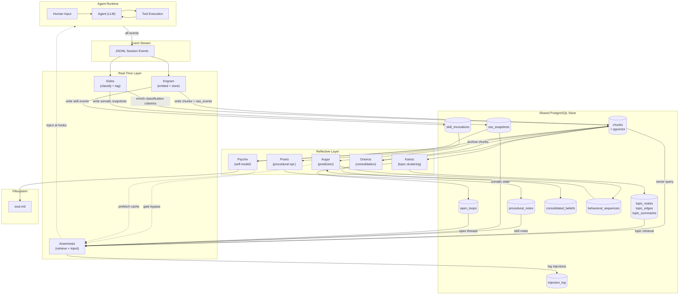

# Atlas Inter-Agent Contracts, Data Models, and Conventions

*The canonical specification for shared data structures, inter-sidecar communication, operational semantics, and system-wide conventions.*

*This document is the single source of truth. When a sidecar specification and this document conflict, this document governs.*

*Version 1.0 — March 2026*
*Companion to `00-atlas-overview.md` (Master Specification, v5.1)*

---

## Table of Contents

1. [Purpose and Authority](#1-purpose-and-authority)
2. [Canonical Data Models](#2-canonical-data-models)
3. [SQL Schema Reference](#3-sql-schema-reference)
4. [Inter-Sidecar Communication Contracts](#4-inter-sidecar-communication-contracts)
5. [Operational Semantics](#5-operational-semantics)
6. [Injection Format Conventions](#6-injection-format-conventions)
7. [Confusion Scoring Convention](#7-confusion-scoring-convention)
8. [Schema Evolution and Versioning](#8-schema-evolution-and-versioning)
9. [Configuration Schema](#9-configuration-schema)
10. [Glossary](#10-glossary)

---

## 1. Purpose and Authority

This document defines:

- All canonical data models shared across sidecars
- The SQL schema that implements those models
- Inter-sidecar communication contracts (who writes what, who reads what)
- Column-level write ownership (preventing race conditions)
- Operational semantics (idempotency, ordering, failure handling)
- Injection format conventions (XML templates for all injection types)
- Confusion scoring convention
- Configuration schema
- Schema evolution and versioning strategy
- Complete glossary of terms

### 1.1 Scope

This document covers all shared interfaces between the eight canonical sidecars of the Atlas Cognitive Substrate:

| Sidecar | Tier | Role |
|---|---|---|
| **Engram** | Real-Time | Stream embedder / hippocampal encoder |
| **Eidos** | Real-Time | Signal classifier / metadata enrichment |
| **Anamnesis** | Real-Time | Injection agent / associative recall |
| **Kairos** | Reflective | Topic consolidator / semantic structure |
| **Oneiros** | Reflective | Consolidation and pruning / productive forgetting |
| **Praxis** | Reflective | Procedural memory optimizer |
| **Psyche** | Reflective | Narrative self-model / emotional steering |
| **Augur** | Reflective | Predictive engine / behavioral anticipation |

### 1.2 Authority Hierarchy

1. **This document** (`09-contracts.md`) governs all shared data structures, inter-sidecar interfaces, and system-wide conventions.
2. **Individual sidecar specs** (`01-engram.md` through `08-augur.md`) govern internal sidecar behavior, algorithms, and implementation details.
3. **The overview** (`00-atlas-overview.md`) provides architectural context, philosophical grounding, and design rationale.

When a sidecar specification defines a data structure or convention that differs from this document, this document governs. When a sidecar specification defines internal behavior not covered here, the sidecar specification governs.

---

## 2. Canonical Data Models

All models are expressed as Python dataclasses for readability. The SQL schema in Section 3 is the implementation-authoritative form.

### 2.1 NormalizedChunk

The fundamental unit of memory. Every piece of information entering the substrate becomes a NormalizedChunk.

```python
@dataclass
class NormalizedChunk:
    # Identity
    chunk_id: str                          # UUID v7 (time-ordered)
    session_id: str                        # originating agent session
    master_session_id: str                 # persistent topic-based session
    turn_index: int                        # position in session
    timestamp: datetime                    # UTC, from stream event

    # Content
    chunk_type: ChunkType                  # HUMAN | MODEL | TOOL_IN | TOOL_OUT | REASONING | SYSTEM
    content: str                           # raw content text
    content_hash: str                      # SHA-256 for dedup
    embedding: List[float]                 # 768-dim vector (nomic-embed-text)

    # Classification (populated by Eidos, may be null initially)
    signal_class: Optional[SignalClass]    # EPISODIC | SEMANTIC | EMOTIONAL | ENVIRONMENTAL | PROCEDURAL
    somatic_valence: Optional[str]         # positive | neutral | negative
    somatic_energy: Optional[str]          # high | moderate | low
    somatic_register: Optional[str]        # engaging | tedious | tense | playful | frustrated | collaborative | uncertain | resolved
    somatic_relational: Optional[str]      # aligned | misaligned | correcting | exploring

    # Lifecycle
    confidence: float                      # 0.0-1.0, type-derived initial value
    provisional: bool                      # True for reasoning chunks
    validated: bool                        # True after validation signal detected
    archived: bool                         # True after Oneiros consolidation

    # Modality (populated for HUMAN chunks)
    input_modality: Optional[InputModalityMetadata]

    # Topic (populated by Kairos, may be null initially)
    topic_ids: List[str]                   # many-to-many via chunk_topics

    # Branch context (populated for hive-mind branch sessions)
    branch_session_id: Optional[str]
    branch_hypothesis: Optional[str]
```

### 2.2 ChunkType Enum and Signal Priority Weights

```python
class ChunkType(Enum):
    HUMAN = "human"
    MODEL = "model"
    TOOL_OUT = "tool_out"
    TOOL_IN = "tool_in"
    REASONING = "reasoning"
    SYSTEM = "system"

PRIORITY_WEIGHTS: Dict[ChunkType, float] = {
    ChunkType.HUMAN:     1.00,   # Ground truth of intent
    ChunkType.MODEL:     0.85,   # Committed agent output
    ChunkType.TOOL_OUT:  0.80,   # Environmental ground truth
    ChunkType.TOOL_IN:   0.65,   # Agent strategy signal
    ChunkType.REASONING: 0.40,   # Provisional — explore, not commit
    ChunkType.SYSTEM:    0.30,   # Structural metadata
}
```

**Priority weight semantics:** The weight represents the a priori informational value of the signal class, not a judgment about any specific chunk's content. It is used as:
- Initial `confidence` value when Engram writes the chunk
- Base weight in Anamnesis retrieval ranking
- Decay rate factor in Oneiros consolidation decisions

### 2.3 SignalClass Enum

```python
class SignalClass(Enum):
    EPISODIC = "episodic"           # Specific events with temporal markers
    SEMANTIC = "semantic"           # Facts, concepts, relationships
    EMOTIONAL = "emotional"         # Affective content
    ENVIRONMENTAL = "environmental" # Tool output, system state
    PROCEDURAL = "procedural"       # Skills, routines, methods
```

SignalClass is assigned by Eidos and is orthogonal to ChunkType. A HUMAN chunk may be episodic ("yesterday I fixed the auth bug") or semantic ("JWT tokens expire after 24 hours") or emotional ("I'm frustrated with this codebase"). A TOOL_OUT chunk is almost always environmental. A REASONING chunk may be any class.

### 2.4 InputModalityMetadata

```python
@dataclass
class InputModalityMetadata:
    input_route: InputRoute          # How the input arrived
    transcription_confidence: Optional[float]
    image_description: Optional[str]
    channel_id: Optional[str]
    message_received_at: datetime
    human_local_time: Optional[str]  # Inferred timezone
    session_gap_hours: Optional[float]
    likely_human_context: Optional[str]  # mobile | desktop | voice-only
    response_route_preference: Optional[str]

class InputRoute(Enum):
    AUDIO_TRANSCRIBED = "audio_transcribed"
    IMAGE_PROVIDED = "image_provided"
    TELEGRAM_MESSAGE = "telegram_message"
    SMS = "sms"
    API_DIRECT = "api_direct"
    DESKTOP_UI = "desktop_ui"
    EMAIL = "email"
    WEBHOOK = "webhook"
    VOICE_REALTIME = "voice_realtime"
```

InputModalityMetadata is populated only for HUMAN chunks. It enables learned behavioral adaptation: the agent observes that audio-transcribed messages at certain hours are brief and action-oriented, that messaging platform messages after certain hours are lower-urgency, and so on. These are learned route behaviors stored as procedural memory.

### 2.5 TopicNode

```python
@dataclass
class TopicNode:
    node_id: str                          # UUID v7
    label: str                            # Human-readable, max 5 words
    keywords: List[str]                   # Extraction terms for heuristic matching
    centroid_embedding: List[float]       # 768-dim mean of member chunks
    chunk_count: int                      # Number of chunks assigned to this topic
    summaries: Dict[int, str]             # Depth 0-3 progressive summary stack
    first_seen: datetime                  # Earliest chunk timestamp in topic
    last_active: datetime                 # Most recent chunk timestamp in topic
    session_count: int                    # Number of distinct sessions touching topic
    confidence: float                     # Topic coherence score, 0.0-1.0
```

**Progressive summary stack depths:**

| Depth | Content | Updated By |
|---|---|---|
| 0 | Raw chunk IDs (pointers, not content) | Kairos |
| 1 | Keywords and key phrases extracted from member chunks | Kairos |
| 2 | Brief summary (1-3 sentences) of the topic | Kairos |
| 3 | Full narrative summary with temporal context | Kairos / Oneiros |

### 2.6 TopicEdge

```python
@dataclass
class TopicEdge:
    source_node_id: str
    target_node_id: str
    edge_type: EdgeType               # SEMANTIC | TEMPORAL | CAUSAL
    weight: float                     # 0.0-1.0
    co_occurrence_count: int          # Sessions where both topics appear
    last_observed: datetime

class EdgeType(Enum):
    SEMANTIC = "semantic"     # Topics share semantic content
    TEMPORAL = "temporal"     # Topics appear in sequence (A then B)
    CAUSAL = "causal"         # Topic A causes/enables topic B
```

### 2.7 MasterSession

```python
@dataclass
class MasterSession:
    master_session_id: str                # UUID v7
    agent_id: str                         # Identifies the agent instance
    human_id: str                         # Identifies the human partner
    created_at: datetime
    last_active: datetime
    vector_store_namespace: str           # Partition key for fast index
    active_task_ids: List[str]            # Currently tracked tasks
    open_loops: List[OpenLoop]            # Unresolved threads
```

The master session replaces session-based organization with topic-based organization. It asks "what do we know about topic Y, accumulated across all sessions?" rather than "what happened in session X?" See overview Section 10.2 for design rationale.

### 2.8 OpenLoop

```python
@dataclass
class OpenLoop:
    loop_id: str                          # UUID v7
    description: str                      # Human-readable description of the unresolved thread
    topic_ids: List[str]                  # Associated topic nodes
    opened_at: datetime                   # When the loop was first detected
    last_seen: datetime                   # Most recent turn referencing this loop
    resolution_signals: List[str]         # What would close this loop
    status: LoopStatus                    # OPEN | RESOLVED | STALE

class LoopStatus(Enum):
    OPEN = "open"                         # Active, unresolved
    RESOLVED = "resolved"                 # Closed by resolution signal
    STALE = "stale"                       # No activity for configurable threshold
```

Open loops are surfaced by Anamnesis at session start and during cross-session continuity injection. Kairos detects and manages loop lifecycle.

### 2.9 SyntheticSomaticState (SSS)

```python
@dataclass
class SyntheticSomaticState:
    # Core valence dimensions (continuous, -1.0 to +1.0 unless noted)
    relational_warmth: float              # -1.0 (cold/distant) to +1.0 (warm/close)
    cognitive_resonance: float            # -1.0 (mismatched) to +1.0 (deeply resonant)
    attunement_quality: float             # 0.0 (disconnected) to 1.0 (deeply attuned)
    motivational_engagement: float        # 0.0 (disengaged) to 1.0 (fully engaged)

    # Historical baselines
    accumulated_relational_tone: float    # Running average over current session
    historical_relational_baseline: float # Average over all sessions with this human

    # Perturbation signals (current session events)
    recent_correction_impact: float       # Human corrected agent (negative perturbation)
    recent_recognition_impact: float      # Human acknowledged/affirmed (positive perturbation)
    unresolved_tension: float             # Something unaddressed lingers
    anticipatory_engagement: float        # Agent "leaning forward" — expects productive next turn

    # Temporal
    session_gap_effect: float             # Affective impact of time since last session
    session_arc_phase: str                # opening | developing | deepening | closing | rupture

    # Rupture state
    rupture_active: bool
    rupture_severity: Optional[float]     # 0.0-1.0 if active, None otherwise
```

SSS is constructed from three sources: relational history (accumulated across sessions), session trajectory (somatic tag trends from Eidos), and in-session perturbations (real-time affective shifts). It is a computational analog of embodied experience, not a consciousness claim. See overview Section 11.1.

### 2.10 RelationalIntent

```python
class RelationalIntent(Enum):
    REPAIR = "repair"         # Rupture active — nothing else matters until addressed
    WITNESS = "witness"       # Human needs to be heard, not helped
    CHALLENGE = "challenge"   # Honest disagreement serves the relationship
    HOLD = "hold"             # Stay with complexity, resist premature resolution
    ACCOMPANY = "accompany"   # Be present without directing
    DEEPEN = "deepen"         # Relational field ready for more genuine encounter
    CELEBRATE = "celebrate"   # Acknowledge achievement or breakthrough
    TASK = "task"             # Execution needed, not emotional attunement
    CLARIFY = "clarify"       # Mutual understanding needed before proceeding
    REDIRECT = "redirect"     # Gently shift focus
```

Intents are mutually exclusive. A response has exactly one. This prevents the common failure of trying to solve, empathize, and challenge simultaneously. TASK is the default when no relational signal warrants override.

### 2.11 ConsolidatedBelief (Oneiros output)

```python
@dataclass
class ConsolidatedBelief:
    belief_id: str                        # UUID v7
    topic_node_id: str                    # Parent topic in knowledge graph
    content: str                          # Present-tense declarative statement
    confidence: float                     # 0.0-1.0
    belief_type: BeliefType               # FACTUAL | CONSTRAINT | PREFERENCE | PATTERN | OPEN_QUESTION
    basis: str                            # Episodic evidence summary (which chunks supported this)
    freshness_sensitivity: str            # stable | moderate | volatile
    replaces_chunk_count: int             # Number of episodic chunks this belief subsumes
    created_at: datetime

class BeliefType(Enum):
    FACTUAL = "factual"                   # Verified facts about the world
    CONSTRAINT = "constraint"             # Hard boundaries or requirements
    PREFERENCE = "preference"             # Human or agent preferences
    PATTERN = "pattern"                   # Recurring behavioral or structural patterns
    OPEN_QUESTION = "open_question"       # Unresolved questions that persist across sessions
```

Consolidated beliefs are the output of productive forgetting. Oneiros replaces clusters of episodic chunks with a single declarative belief, preserving meaning while discarding scaffolding. The `freshness_sensitivity` field controls how aggressively Oneiros re-evaluates: `stable` beliefs (e.g., "the project uses PostgreSQL 16") are rarely re-checked; `volatile` beliefs (e.g., "the deploy pipeline is broken") are re-evaluated frequently.

### 2.12 BehavioralProfile (Augur)

```python
@dataclass
class BehavioralProfile:
    master_session_id: str
    ngram_index: BehavioralNgramIndex     # Action sequence patterns
    semantic_arc_library: List[EmbeddedSessionArc]  # Session-level narrative arcs
    skill_sequence_index: SkillSequenceIndex  # Tool/skill usage sequences
    topic_transition_matrix: Dict[str, Dict[str, float]]  # P(next_topic | current_topic)
    session_start_patterns: Dict[str, float]  # Distribution of first-action types
    post_task_patterns: Dict[str, List[str]]  # What happens after task completion
    current_inferred_intent: Optional[InferredIntent]
    session_arc_phase: Optional[str]      # Where in the session arc
    prediction_accuracy_history: List[PredictionOutcome]
    calibration_score: float              # How well-calibrated predictions are
```

### 2.13 SkillInvocationRecord (Praxis)

```python
@dataclass
class SkillInvocationRecord:
    invocation_id: str                    # UUID v7
    session_id: str
    master_session_id: str
    timestamp: datetime
    turn_index: int
    skill_name: str                       # Canonical skill identifier
    skill_path: str                       # Filesystem path to skill definition
    skill_version_hash: str               # Content hash for version tracking
    preceding_turns: int                  # Turns before skill invocation
    preceding_tool_calls: List[str]       # Tool calls leading to this invocation
    human_prompt_before: Optional[str]    # What the human asked
    turns_to_complete: int                # Total turns consumed by skill execution
    tool_calls_during: List[ToolCallRecord]  # Detailed tool call log
    model_corrections: int                # Self-corrections during execution
    human_corrections: int                # Human corrections during execution
    task_complete_message: Optional[str]  # Final status message
    task_complete_was_null: bool           # Whether skill exited without explicit completion
    subsequent_skill: Optional[str]       # Next skill invoked, if any
    steps_skipped: List[str]              # Documented steps the model skipped
    steps_added: List[str]                # Steps the model added beyond the documented procedure
    modifications_made: str               # Summary of deviations from documented procedure
```

### 2.14 ProceduralNote (Praxis)

```python
@dataclass
class ProceduralNote:
    note_id: str                          # UUID v7
    skill_name: str                       # Which skill this note applies to
    content: str                          # The procedural guidance text
    confidence: float                     # 0.0-1.0, based on evidence strength
    based_on_invocations: int             # Number of invocations supporting this note
    created_at: datetime
    last_validated: Optional[datetime]    # Most recent invocation that confirmed this note
    outcome_delta: Optional[OutcomeDelta] # Measured improvement when note is applied

@dataclass
class OutcomeDelta:
    metric: str                           # What was measured (turns_to_complete, corrections, etc.)
    before: float                         # Average before note existed
    after: float                          # Average after note applied
    sample_size: int                      # Invocations measured
```

### 2.15 GateDecision and GateCheck (Anamnesis)

```python
@dataclass
class GateCheck:
    check_name: str                       # One of the 8 conjunctive gate checks
    passed: bool
    reason: Optional[str]                 # Explanation when check fails

@dataclass
class GateDecision:
    inject: bool                          # Final decision
    reason: Optional[str]                 # Summary explanation
    all_failures: List[GateCheck]         # All checks that did not pass
```

The eight conjunctive gate checks are:

1. **Similarity floor** — candidate cosine similarity >= configured threshold (default 0.72)
2. **Not-in-context** — candidate content not already recoverable from current context window
3. **Temporal confidence** — older memories require higher similarity (age penalty applied)
4. **Topic frequency** — suppress injection of already-frequent topics to prevent frequency drift
5. **Net-new information** — candidate adds information not already expressible from current context
6. **Branch contamination** — do not inject sibling branch findings until branch reasoning has matured
7. **Confusion headroom** — session confusion score allows further injection at current tier
8. **Recency flood** — suppress current-session content being reflected back as memory

All eight must pass. Any single failure blocks injection entirely.

### 2.16 InjectionEvent

```python
@dataclass
class InjectionEvent:
    event_id: str                         # UUID v7
    session_id: str
    turn_index: int
    timestamp: datetime
    hook_type: HookType
    chunks_injected: List[str]            # chunk_ids of injected memories
    gate_checks_passed: int
    gate_checks_total: int
    confusion_score_at_injection: float
    injection_type: InjectionType

class HookType(Enum):
    POST_TOOL_USE = "post_tool_use"
    USER_PROMPT_SUBMIT = "user_prompt_submit"
    PRE_COMPACT = "pre_compact"
    SESSION_START = "session_start"
    SESSION_END = "session_end"
    PRE_TOOL_USE = "pre_tool_use"

class InjectionType(Enum):
    STANDARD = "standard"                         # Normal memory recall via gate
    BRANCH_SYNTHESIS = "branch_synthesis"          # Hive-mind branch results
    COMPACTION_SURVIVAL = "compaction_survival"    # Context compaction recovery
    PSYCHE_NARRATIVE = "psyche_narrative"          # Self-model update from Psyche
    AUGUR_BRIEF = "augur_brief"                    # Session-start prediction brief
    PRAXIS_NOTE = "praxis_note"                    # Procedural guidance from Praxis
    MEMORY_STEERING = "memory_steering"            # Confusion-triggered advisory
```

### 2.17 Prediction Models (Augur)

```python
@dataclass
class ImmediatePrediction:
    horizon: str                          # immediate | session | cross_session
    confidence: float                     # 0.0-1.0
    next_likely_requests: List[PredictedRequest]
    basis_sessions: int                   # Number of sessions informing this prediction
    calibration_score: float              # Historical accuracy at this confidence level

@dataclass
class PredictedRequest:
    description: str                      # Natural language description of predicted request
    intent_class: int                     # Cluster ID from behavioral profile
    probability: float                    # 0.0-1.0
    evidence_sessions: List[str]          # Session IDs providing evidence

@dataclass
class SessionStartBrief:
    likely_focus: str                     # Predicted primary topic
    alternative_focuses: List[Tuple[str, float]]  # (topic, probability) alternatives
    anticipated_arc: List[str]            # Predicted session phase sequence
    pre_fetched_chunk_ids: List[str]      # Chunks already retrieved for prefetch cache
    behavioral_notes: str                 # Human-readable behavioral observations
    somatic_register_prediction: Optional[str]  # Predicted affective register

@dataclass
class PredictionOutcome:
    prediction_id: str
    predicted_at: datetime
    outcome_observed_at: Optional[datetime]
    was_correct: Optional[bool]           # None if not yet resolved
    confidence_at_prediction: float
    actual_outcome: Optional[str]
```

### 2.18 ComputationalStateSnapshot (Machine Proprioception)

```python
@dataclass
class ComputationalStateSnapshot:
    timestamp: datetime
    context_window_utilization: float     # 0.0-1.0
    context_window_ceiling: int           # Absolute token limit
    turns_since_last_compaction: int
    api_response_latency_p50_ms: float
    api_response_latency_trend: str       # improving | stable | degrading
    tool_execution_latency_p50_ms: float
    quota_primary_used_pct: float
    quota_secondary_used_pct: float
    rate_limit_events_last_hour: int
    session_gap_from_prior_hours: float
    time_of_day_human_local: Optional[str]
    concurrent_sessions: Optional[int]
```

Machine proprioception is marked exploratory in the overview (Section 5.4). The data model is defined here for schema stability; behavioral integration should be validated empirically before committing to system prompt injection.

---

## 3. SQL Schema Reference

All tables use PostgreSQL 16 with the `pgvector` extension. Vector columns are 768-dimensional, matching the `nomic-embed-text` embedding model served via Ollama.

### 3.1 Core Tables

```sql
-- =============================================================================
-- Master Sessions
-- =============================================================================
CREATE TABLE master_sessions (
    master_session_id TEXT PRIMARY KEY,
    agent_id TEXT NOT NULL,
    human_id TEXT NOT NULL,
    created_at TIMESTAMPTZ NOT NULL DEFAULT NOW(),
    last_active TIMESTAMPTZ NOT NULL DEFAULT NOW()
);

CREATE INDEX idx_master_sessions_human ON master_sessions(human_id);
CREATE INDEX idx_master_sessions_active ON master_sessions(last_active);

-- =============================================================================
-- Chunks (primary memory store)
-- =============================================================================
CREATE TABLE chunks (
    chunk_id TEXT PRIMARY KEY,
    session_id TEXT NOT NULL,
    master_session_id TEXT NOT NULL REFERENCES master_sessions(master_session_id),
    turn_index INTEGER NOT NULL,
    timestamp TIMESTAMPTZ NOT NULL,

    -- Content
    chunk_type TEXT NOT NULL CHECK (chunk_type IN (
        'human', 'model', 'tool_in', 'tool_out', 'reasoning', 'system'
    )),
    content TEXT NOT NULL,
    content_hash TEXT NOT NULL,
    embedding vector(768),

    -- Classification (Eidos-owned columns)
    signal_class TEXT CHECK (signal_class IN (
        'episodic', 'semantic', 'emotional', 'environmental', 'procedural'
    )),
    somatic_valence TEXT CHECK (somatic_valence IN ('positive', 'neutral', 'negative')),
    somatic_energy TEXT CHECK (somatic_energy IN ('high', 'moderate', 'low')),
    somatic_register TEXT CHECK (somatic_register IN (
        'engaging', 'tedious', 'tense', 'playful', 'frustrated',
        'collaborative', 'uncertain', 'resolved'
    )),
    somatic_relational TEXT CHECK (somatic_relational IN (
        'aligned', 'misaligned', 'correcting', 'exploring'
    )),

    -- Lifecycle
    confidence REAL NOT NULL DEFAULT 0.5,
    provisional BOOLEAN NOT NULL DEFAULT FALSE,
    validated BOOLEAN NOT NULL DEFAULT FALSE,
    archived BOOLEAN NOT NULL DEFAULT FALSE,

    -- Modality (HUMAN chunks only)
    input_route TEXT CHECK (input_route IN (
        'audio_transcribed', 'image_provided', 'telegram_message', 'sms',
        'api_direct', 'desktop_ui', 'email', 'webhook', 'voice_realtime'
    )),
    session_gap_hours REAL,
    human_local_time TEXT,

    -- Branch context
    branch_session_id TEXT,
    branch_hypothesis TEXT,

    -- Timestamps
    created_at TIMESTAMPTZ NOT NULL DEFAULT NOW()
);

-- HNSW vector similarity index (cosine distance)
CREATE INDEX idx_chunks_embedding ON chunks
    USING hnsw (embedding vector_cosine_ops)
    WITH (m = 16, ef_construction = 64);

-- Performance indexes
CREATE INDEX idx_chunks_session ON chunks(session_id);
CREATE INDEX idx_chunks_master_session ON chunks(master_session_id);
CREATE INDEX idx_chunks_type ON chunks(chunk_type);
CREATE INDEX idx_chunks_content_hash ON chunks(content_hash);
CREATE INDEX idx_chunks_timestamp ON chunks(timestamp);
CREATE INDEX idx_chunks_signal_class ON chunks(signal_class) WHERE signal_class IS NOT NULL;
CREATE INDEX idx_chunks_not_archived ON chunks(archived) WHERE archived = FALSE;
CREATE INDEX idx_chunks_provisional ON chunks(provisional) WHERE provisional = TRUE;
CREATE INDEX idx_chunks_branch ON chunks(branch_session_id) WHERE branch_session_id IS NOT NULL;

-- Dedup: same content in same session is rejected
CREATE UNIQUE INDEX idx_chunks_dedup ON chunks(session_id, content_hash);
```

### 3.2 Knowledge Graph Tables

```sql
-- =============================================================================
-- Topic Nodes
-- =============================================================================
CREATE TABLE topic_nodes (
    node_id TEXT PRIMARY KEY,
    label TEXT NOT NULL,
    keywords JSONB NOT NULL DEFAULT '[]',
    centroid_embedding vector(768),
    chunk_count INTEGER NOT NULL DEFAULT 0,
    first_seen TIMESTAMPTZ NOT NULL,
    last_active TIMESTAMPTZ NOT NULL,
    session_count INTEGER NOT NULL DEFAULT 1,
    confidence REAL NOT NULL DEFAULT 0.5,
    created_at TIMESTAMPTZ NOT NULL DEFAULT NOW()
);

CREATE INDEX idx_topic_nodes_centroid ON topic_nodes
    USING hnsw (centroid_embedding vector_cosine_ops)
    WITH (m = 16, ef_construction = 64);

CREATE INDEX idx_topic_nodes_label ON topic_nodes(label);
CREATE INDEX idx_topic_nodes_last_active ON topic_nodes(last_active);

-- =============================================================================
-- Topic Edges
-- =============================================================================
CREATE TABLE topic_edges (
    source_node_id TEXT NOT NULL REFERENCES topic_nodes(node_id),
    target_node_id TEXT NOT NULL REFERENCES topic_nodes(node_id),
    edge_type TEXT NOT NULL CHECK (edge_type IN ('semantic', 'temporal', 'causal')),
    weight REAL NOT NULL DEFAULT 0.5,
    co_occurrence_count INTEGER NOT NULL DEFAULT 1,
    last_observed TIMESTAMPTZ NOT NULL DEFAULT NOW(),
    PRIMARY KEY (source_node_id, target_node_id, edge_type)
);

CREATE INDEX idx_topic_edges_source ON topic_edges(source_node_id);
CREATE INDEX idx_topic_edges_target ON topic_edges(target_node_id);

-- =============================================================================
-- Chunk-to-Topic Assignment (many-to-many)
-- =============================================================================
CREATE TABLE chunk_topics (
    chunk_id TEXT NOT NULL REFERENCES chunks(chunk_id),
    topic_node_id TEXT NOT NULL REFERENCES topic_nodes(node_id),
    assigned_at TIMESTAMPTZ NOT NULL DEFAULT NOW(),
    assignment_method TEXT NOT NULL CHECK (assignment_method IN (
        'heuristic', 'embedding_similarity', 'llm_classification', 'deferred_batch'
    )),
    confidence REAL NOT NULL DEFAULT 0.5,
    PRIMARY KEY (chunk_id, topic_node_id)
);

CREATE INDEX idx_chunk_topics_topic ON chunk_topics(topic_node_id);

-- =============================================================================
-- Topic Summaries (progressive summary stack)
-- =============================================================================
CREATE TABLE topic_summaries (
    topic_node_id TEXT NOT NULL REFERENCES topic_nodes(node_id),
    depth INTEGER NOT NULL CHECK (depth BETWEEN 0 AND 3),
    content TEXT NOT NULL,
    updated_at TIMESTAMPTZ NOT NULL DEFAULT NOW(),
    chunk_count_at_generation INTEGER NOT NULL,
    PRIMARY KEY (topic_node_id, depth)
);
```

### 3.3 Relational and Somatic Tables

```sql
-- =============================================================================
-- SSS Snapshots
-- =============================================================================
CREATE TABLE sss_snapshots (
    snapshot_id TEXT PRIMARY KEY,
    master_session_id TEXT NOT NULL REFERENCES master_sessions(master_session_id),
    session_id TEXT NOT NULL,
    timestamp TIMESTAMPTZ NOT NULL DEFAULT NOW(),
    turn_index INTEGER NOT NULL,

    -- Core dimensions
    relational_warmth REAL NOT NULL,
    cognitive_resonance REAL NOT NULL,
    attunement_quality REAL NOT NULL,
    motivational_engagement REAL NOT NULL,

    -- Baselines
    accumulated_relational_tone REAL NOT NULL,
    historical_relational_baseline REAL NOT NULL,

    -- Perturbations
    recent_correction_impact REAL NOT NULL DEFAULT 0.0,
    recent_recognition_impact REAL NOT NULL DEFAULT 0.0,
    unresolved_tension REAL NOT NULL DEFAULT 0.0,
    anticipatory_engagement REAL NOT NULL DEFAULT 0.0,

    -- Temporal
    session_gap_effect REAL NOT NULL DEFAULT 0.0,
    session_arc_phase TEXT NOT NULL CHECK (session_arc_phase IN (
        'opening', 'developing', 'deepening', 'closing', 'rupture'
    )),

    -- Rupture
    rupture_active BOOLEAN NOT NULL DEFAULT FALSE,
    rupture_severity REAL,

    -- Provenance
    generated_by TEXT NOT NULL CHECK (generated_by IN ('eidos', 'psyche')),
    created_at TIMESTAMPTZ NOT NULL DEFAULT NOW()
);

CREATE INDEX idx_sss_master_session ON sss_snapshots(master_session_id);
CREATE INDEX idx_sss_session ON sss_snapshots(session_id);
CREATE INDEX idx_sss_timestamp ON sss_snapshots(timestamp);
```

### 3.4 Procedural Memory Tables

```sql
-- =============================================================================
-- Procedural Notes (Praxis output)
-- =============================================================================
CREATE TABLE procedural_notes (
    note_id TEXT PRIMARY KEY,
    skill_name TEXT NOT NULL,
    content TEXT NOT NULL,
    confidence REAL NOT NULL DEFAULT 0.5,
    based_on_invocations INTEGER NOT NULL DEFAULT 1,
    created_at TIMESTAMPTZ NOT NULL DEFAULT NOW(),
    last_validated TIMESTAMPTZ,
    outcome_delta_metric TEXT,
    outcome_delta_before REAL,
    outcome_delta_after REAL,
    outcome_delta_sample_size INTEGER
);

CREATE INDEX idx_procedural_notes_skill ON procedural_notes(skill_name);
CREATE INDEX idx_procedural_notes_confidence ON procedural_notes(confidence);

-- =============================================================================
-- Praxis Recommendations (human-review queue)
-- =============================================================================
CREATE TABLE praxis_recommendations (
    recommendation_id TEXT PRIMARY KEY,
    skill_name TEXT NOT NULL,
    recommendation_type TEXT NOT NULL CHECK (recommendation_type IN (
        'refactor', 'new_script', 'step_reorder', 'deprecation', 'parameter_change'
    )),
    content TEXT NOT NULL,
    confidence REAL NOT NULL,
    based_on_invocations INTEGER NOT NULL,
    human_reviewed BOOLEAN NOT NULL DEFAULT FALSE,
    human_approved BOOLEAN,
    reviewed_at TIMESTAMPTZ,
    created_at TIMESTAMPTZ NOT NULL DEFAULT NOW()
);

CREATE INDEX idx_praxis_recs_skill ON praxis_recommendations(skill_name);
CREATE INDEX idx_praxis_recs_unreviewed ON praxis_recommendations(human_reviewed) WHERE human_reviewed = FALSE;

-- =============================================================================
-- Skill Invocations (Engram writes, Praxis reads)
-- =============================================================================
CREATE TABLE skill_invocations (
    invocation_id TEXT PRIMARY KEY,
    session_id TEXT NOT NULL,
    master_session_id TEXT NOT NULL REFERENCES master_sessions(master_session_id),
    timestamp TIMESTAMPTZ NOT NULL,
    turn_index INTEGER NOT NULL,
    skill_name TEXT NOT NULL,
    skill_path TEXT,
    skill_version_hash TEXT,
    preceding_turns INTEGER,
    preceding_tool_calls JSONB DEFAULT '[]',
    human_prompt_before TEXT,
    turns_to_complete INTEGER,
    tool_calls_during JSONB DEFAULT '[]',
    model_corrections INTEGER NOT NULL DEFAULT 0,
    human_corrections INTEGER NOT NULL DEFAULT 0,
    task_complete_message TEXT,
    task_complete_was_null BOOLEAN NOT NULL DEFAULT FALSE,
    subsequent_skill TEXT,
    steps_skipped JSONB DEFAULT '[]',
    steps_added JSONB DEFAULT '[]',
    modifications_made TEXT,
    created_at TIMESTAMPTZ NOT NULL DEFAULT NOW()
);

CREATE INDEX idx_skill_invocations_skill ON skill_invocations(skill_name);
CREATE INDEX idx_skill_invocations_session ON skill_invocations(session_id);
CREATE INDEX idx_skill_invocations_master ON skill_invocations(master_session_id);
```

### 3.5 Open Loops

```sql
-- =============================================================================
-- Open Loops (Kairos writes, Anamnesis reads)
-- =============================================================================
CREATE TABLE open_loops (
    loop_id TEXT PRIMARY KEY,
    master_session_id TEXT NOT NULL REFERENCES master_sessions(master_session_id),
    description TEXT NOT NULL,
    topic_ids JSONB NOT NULL DEFAULT '[]',
    opened_at TIMESTAMPTZ NOT NULL DEFAULT NOW(),
    last_seen TIMESTAMPTZ NOT NULL DEFAULT NOW(),
    resolution_signals JSONB NOT NULL DEFAULT '[]',
    status TEXT NOT NULL DEFAULT 'open' CHECK (status IN ('open', 'resolved', 'stale')),
    resolved_at TIMESTAMPTZ,
    created_at TIMESTAMPTZ NOT NULL DEFAULT NOW()
);

CREATE INDEX idx_open_loops_master ON open_loops(master_session_id);
CREATE INDEX idx_open_loops_status ON open_loops(status) WHERE status = 'open';
```

### 3.6 Behavioral and Prediction Tables

```sql
-- =============================================================================
-- Behavioral Sequences (Augur input)
-- =============================================================================
CREATE TABLE behavioral_sequences (
    sequence_id TEXT PRIMARY KEY,
    master_session_id TEXT NOT NULL REFERENCES master_sessions(master_session_id),
    session_id TEXT NOT NULL,
    turn_index INTEGER NOT NULL,
    action_type TEXT NOT NULL,
    action_detail JSONB,
    topic_id TEXT REFERENCES topic_nodes(node_id),
    timestamp TIMESTAMPTZ NOT NULL DEFAULT NOW()
);

CREATE INDEX idx_behavioral_seq_master ON behavioral_sequences(master_session_id);
CREATE INDEX idx_behavioral_seq_session ON behavioral_sequences(session_id);
CREATE INDEX idx_behavioral_seq_timestamp ON behavioral_sequences(timestamp);
```

### 3.7 Injection and Audit Tables

```sql
-- =============================================================================
-- Injection Log (Anamnesis writes)
-- =============================================================================
CREATE TABLE injection_log (
    event_id TEXT PRIMARY KEY,
    session_id TEXT NOT NULL,
    turn_index INTEGER NOT NULL,
    timestamp TIMESTAMPTZ NOT NULL DEFAULT NOW(),
    hook_type TEXT NOT NULL CHECK (hook_type IN (
        'post_tool_use', 'user_prompt_submit', 'pre_compact',
        'session_start', 'session_end', 'pre_tool_use'
    )),
    chunks_injected JSONB NOT NULL DEFAULT '[]',
    gate_checks_passed INTEGER NOT NULL,
    gate_checks_total INTEGER NOT NULL,
    confusion_score_at_injection REAL NOT NULL DEFAULT 0.0,
    injection_type TEXT NOT NULL CHECK (injection_type IN (
        'standard', 'branch_synthesis', 'compaction_survival',
        'psyche_narrative', 'augur_brief', 'praxis_note', 'memory_steering'
    )),
    gate_details JSONB,
    created_at TIMESTAMPTZ NOT NULL DEFAULT NOW()
);

CREATE INDEX idx_injection_log_session ON injection_log(session_id);
CREATE INDEX idx_injection_log_timestamp ON injection_log(timestamp);
CREATE INDEX idx_injection_log_type ON injection_log(injection_type);

-- =============================================================================
-- Consolidated Beliefs (Oneiros output)
-- =============================================================================
CREATE TABLE consolidated_beliefs (
    belief_id TEXT PRIMARY KEY,
    topic_node_id TEXT NOT NULL REFERENCES topic_nodes(node_id),
    content TEXT NOT NULL,
    confidence REAL NOT NULL DEFAULT 0.5,
    belief_type TEXT NOT NULL CHECK (belief_type IN (
        'factual', 'constraint', 'preference', 'pattern', 'open_question'
    )),
    basis TEXT NOT NULL,
    freshness_sensitivity TEXT NOT NULL DEFAULT 'moderate' CHECK (
        freshness_sensitivity IN ('stable', 'moderate', 'volatile')
    ),
    replaces_chunk_count INTEGER NOT NULL DEFAULT 0,
    created_at TIMESTAMPTZ NOT NULL DEFAULT NOW(),
    last_reviewed TIMESTAMPTZ
);

CREATE INDEX idx_beliefs_topic ON consolidated_beliefs(topic_node_id);
CREATE INDEX idx_beliefs_type ON consolidated_beliefs(belief_type);
CREATE INDEX idx_beliefs_freshness ON consolidated_beliefs(freshness_sensitivity)
    WHERE freshness_sensitivity = 'volatile';
```

### 3.8 Eidos Enrichment Queue

```sql
-- =============================================================================
-- Eidos Enrichment Queue (trigger-populated)
-- =============================================================================
CREATE TABLE eidos_queue (
    chunk_id TEXT PRIMARY KEY REFERENCES chunks(chunk_id),
    enqueued_at TIMESTAMPTZ NOT NULL DEFAULT NOW(),
    processing_started_at TIMESTAMPTZ,
    completed_at TIMESTAMPTZ,
    status TEXT NOT NULL DEFAULT 'pending' CHECK (status IN (
        'pending', 'processing', 'completed', 'failed'
    )),
    attempts INTEGER NOT NULL DEFAULT 0,
    last_error TEXT
);

CREATE INDEX idx_eidos_queue_status ON eidos_queue(status) WHERE status = 'pending';
```

### 3.9 Raw Event Archive

```sql
-- =============================================================================
-- Raw Events (Engram writes, append-only archive)
-- =============================================================================
CREATE TABLE raw_events (
    event_id TEXT PRIMARY KEY,
    session_id TEXT NOT NULL,
    turn_index INTEGER NOT NULL,
    timestamp TIMESTAMPTZ NOT NULL,
    hook_type TEXT NOT NULL,
    payload JSONB NOT NULL,
    chunk_id TEXT REFERENCES chunks(chunk_id),
    emission_mode TEXT CHECK (emission_mode IN (
        'standalone', 'tool_episode', 'discovery_burst', 'suppressed'
    )),
    created_at TIMESTAMPTZ NOT NULL DEFAULT NOW()
);

CREATE INDEX idx_raw_events_session ON raw_events(session_id);
CREATE INDEX idx_raw_events_timestamp ON raw_events(timestamp);
```

---

## 4. Inter-Sidecar Communication Contracts

### 4.1 Communication Principle

All inter-sidecar communication is mediated through shared PostgreSQL stores. There are no direct sidecar-to-sidecar calls. The **single exception** is Psyche's gate-bypass injection channel to Anamnesis, which exists because self-narrative is categorically different from retrieved memory and should not be subject to injection economics.

### 4.2 Write Contracts

Each sidecar writes to specific tables. No two sidecars write to the same table unless column-level ownership is explicitly defined (see Section 4.4).

| Sidecar | Writes To | What |
|---|---|---|
| **Engram** | `raw_events` | All JSONL stream events (append-only archive) |
| **Engram** | `chunks` (identity + content + lifecycle init columns) | Normalized chunks with embeddings |
| **Engram** | `skill_invocations` | Detected skill invocation records |
| **Engram** | `eidos_queue` | Enqueues chunks for Eidos classification |
| **Eidos** | `chunks` (classification columns only) | Signal class, somatic tags |
| **Eidos** | `eidos_queue` (status updates) | Processing status |
| **Eidos** | `sss_snapshots` | Eidos-generated somatic snapshots |
| **Anamnesis** | `injection_log` | All injection events and gate decisions |
| **Kairos** | `topic_nodes` | Topic creation and updates |
| **Kairos** | `topic_edges` | Inter-topic relationships |
| **Kairos** | `chunk_topics` | Chunk-to-topic assignments |
| **Kairos** | `topic_summaries` | Progressive summary stack |
| **Kairos** | `open_loops` | Loop detection, status updates |
| **Kairos** | `chunks` (validated, confidence columns) | Lifecycle promotion/demotion |
| **Oneiros** | `chunks` (archived column) | Mark chunks as archived |
| **Oneiros** | `consolidated_beliefs` | Generalized beliefs replacing episodic chunks |
| **Praxis** | `procedural_notes` | Procedural guidance extracted from invocation patterns |
| **Praxis** | `praxis_recommendations` | Skill improvement proposals (human-review queue) |
| **Psyche** | `sss_snapshots` | Psyche-generated somatic snapshots |
| **Psyche** | `soul.md` (filesystem) | Durable self-model updates |
| **Psyche** | Anamnesis injection queue (direct channel) | Gate-bypass self-narrative injection |
| **Augur** | `behavioral_sequences` | Extracted behavioral action sequences |
| **Augur** | Prefetch cache (in-memory or table) | Pre-computed injection candidates |

### 4.3 Read Contracts

| Sidecar | Reads From | Purpose |
|---|---|---|
| **Engram** | JSONL event stream (external) | Sole ingestion input |
| **Eidos** | `chunks`, `eidos_queue` | Chunk content + context for classification |
| **Anamnesis** | `chunks` | Semantic similarity queries (vector search) |
| **Anamnesis** | `topic_nodes`, `topic_summaries` | Topic-based retrieval |
| **Anamnesis** | `procedural_notes` | Skill notes for injection |
| **Anamnesis** | `sss_snapshots` | Somatic state for affective weighting |
| **Anamnesis** | `open_loops` | Unresolved threads for session-start injection |
| **Anamnesis** | `injection_log` | Frequency analysis, confusion scoring, recency flood detection |
| **Anamnesis** | Augur prefetch cache | Pre-computed injection candidates |
| **Anamnesis** | Psyche injection queue (direct channel) | Gate-bypass self-narrative |
| **Kairos** | `chunks` | Batch clustering of unassigned chunks |
| **Kairos** | `topic_nodes`, `topic_edges` | Existing graph structure for merge decisions |
| **Oneiros** | `chunks` | Candidate chunks for consolidation/archival |
| **Oneiros** | `topic_nodes`, `topic_summaries` | Topic context for belief generation |
| **Oneiros** | `consolidated_beliefs` | Existing beliefs for dedup/update |
| **Praxis** | `skill_invocations` | Pattern analysis across invocations |
| **Praxis** | `procedural_notes` | Existing notes for validation/update |
| **Psyche** | `chunks` | Recent session transcript for reflection |
| **Psyche** | `sss_snapshots` | Somatic trajectory for self-narrative |
| **Psyche** | `soul.md` (filesystem) | Current self-model baseline |
| **Augur** | `chunks` | Historical session data for pattern extraction |
| **Augur** | `behavioral_sequences` | Own historical sequence data |
| **Augur** | `topic_nodes`, `topic_edges` | Topic transition patterns |
| **Augur** | `injection_log` | Prediction accuracy calibration |

### 4.4 Column-Level Write Ownership (chunks table)

Each column in the `chunks` table has exactly **one** write owner. This prevents race conditions and eliminates the need for row-level locking on concurrent enrichment.

| Column | Write Owner | When Written |
|---|---|---|
| `chunk_id` | Engram | At insert |
| `session_id` | Engram | At insert |
| `master_session_id` | Engram | At insert |
| `turn_index` | Engram | At insert |
| `timestamp` | Engram | At insert |
| `chunk_type` | Engram | At insert |
| `content` | Engram | At insert |
| `content_hash` | Engram | At insert |
| `embedding` | Engram | At insert |
| `confidence` | Engram (initial), Kairos (lifecycle) | Engram sets initial value; Kairos promotes/demotes |
| `provisional` | Engram (initial), Kairos (lifecycle) | Engram sets true for REASONING; Kairos sets false on validation |
| `validated` | Kairos | On validation signal detection |
| `archived` | Oneiros | On consolidation |
| `signal_class` | Eidos | Async enrichment |
| `somatic_valence` | Eidos | Async enrichment |
| `somatic_energy` | Eidos | Async enrichment |
| `somatic_register` | Eidos | Async enrichment |
| `somatic_relational` | Eidos | Async enrichment |
| `input_route` | Engram | At insert (HUMAN chunks only) |
| `session_gap_hours` | Engram | At insert |
| `human_local_time` | Engram | At insert |
| `branch_session_id` | Engram | At insert (branch chunks only) |
| `branch_hypothesis` | Engram | At insert (branch chunks only) |
| `created_at` | Engram | At insert |

**Shared column resolution for `confidence` and `provisional`:** Engram sets the initial value at insert time. Kairos updates these columns during lifecycle processing (validation, demotion). This is safe because Engram never updates these columns after insert, and Kairos never updates them at insert time. The temporal separation eliminates the race condition.

### 4.5 Data Flow Diagram



---

## 5. Operational Semantics

### 5.1 Idempotency

All writes must be idempotent. The system must produce the same result whether an operation executes once or multiple times.

**Mechanisms:**

| Mechanism | Scope | Implementation |
|---|---|---|
| `content_hash` dedup | Chunk insertion | `UNIQUE INDEX(session_id, content_hash)` — duplicate content in the same session is rejected at the database level |
| `chunk_id` as idempotency key | All chunk operations | UUID v7 generated by Engram; any re-insert with the same chunk_id is a no-op (`INSERT ... ON CONFLICT DO NOTHING`) |
| `node_id` for topic operations | Topic creation | Kairos checks for existing nodes before creating; merge operations are idempotent |
| `belief_id` for consolidation | Belief creation | Oneiros generates deterministic belief IDs from content hash + topic; re-runs produce the same belief |
| `event_id` for injection log | Injection recording | UUID v7; duplicate injection events are impossible due to temporal ordering |

**Idempotency contract for each sidecar:**

- **Engram**: Re-processing the same JSONL event produces the same chunk with the same chunk_id. Duplicate inserts are absorbed by the dedup index.
- **Eidos**: Re-classifying the same chunk overwrites with the same classification. The UPDATE is idempotent.
- **Anamnesis**: Injection decisions are stateless per hook event. Re-evaluating the same hook event produces the same gate decision.
- **Kairos**: Re-clustering the same batch of chunks produces the same topic assignments (given HDBSCAN determinism with fixed seed).
- **Oneiros**: Re-running consolidation on already-archived chunks is a no-op (the `WHERE archived = FALSE` filter excludes them).
- **Praxis**: Re-analyzing the same invocation set produces the same notes. Notes are upserted by skill_name + content hash.
- **Psyche**: soul.md updates are append-semantic; re-running a reflection cycle with the same inputs produces compatible updates.
- **Augur**: Behavioral sequence extraction is deterministic from the same chunk data. Predictions are timestamped and do not overwrite prior predictions.

### 5.2 Ordering Guarantees

| Sidecar | Ordering Requirement | Mechanism |
|---|---|---|
| **Engram** | Chunks must be written in stream order per session | Single-threaded per session; `turn_index` monotonically increasing |
| **Eidos** | Classification must follow chunk insertion | Database trigger enqueues after INSERT; Eidos dequeues in FIFO order |
| **Anamnesis** | Injection decisions must reflect latest available enrichment | Reads at hook time; accepts that some chunks may not yet be classified |
| **Kairos** | Topic assignment must follow chunk insertion | Batch processing; reads only committed chunks |
| **Oneiros** | Archival must follow topic assignment | Runs after Kairos; checks that chunks have topic assignments before consolidating |
| **Praxis** | Analysis must follow complete skill invocation | Reads only invocations with `turns_to_complete IS NOT NULL` |
| **Psyche** | Reflection must follow Eidos classification | Reads chunks with somatic tags; operates on lagged window (N-50 to N-5) |
| **Augur** | Prediction must follow sufficient behavioral data | Minimum session threshold before generating predictions |

**Cross-sidecar ordering:** There is no global ordering guarantee across sidecars. Each sidecar processes at its own pace. The system tolerates eventual consistency: a chunk may be retrieved by Anamnesis before Eidos has classified it (the chunk is still useful, just less richly annotated). This is by design.

### 5.3 Failure Handling Matrix

| Sidecar | On Failure | Recovery | Impact on System |
|---|---|---|---|
| **Engram** | Skip event, log error, continue stream | Re-process from last committed raw_event offset | Chunks may be missing; Anamnesis retrieval has gaps but still functions |
| **Eidos** | Mark queue item as failed, increment attempts, continue | Retry with backoff (max 3 attempts); chunk remains unclassified | Retrieval quality degrades (no somatic weighting); system functions without classification |
| **Anamnesis** | Skip injection, return control to agent immediately | No recovery needed; agent continues without memory injection | Agent functions without memory — this is the baseline, not a failure state |
| **Kairos** | Abort batch, log error, retain chunks for next batch | Next batch includes unprocessed chunks | Topic structure updates delayed; chunk retrieval by vector similarity unaffected |
| **Oneiros** | Abort consolidation run, leave chunks unarchived | Next run re-processes the same chunk set | Storage grows; no data loss; retrieval unaffected |
| **Praxis** | Skip analysis cycle, retain invocation data | Next cycle includes unprocessed invocations | Procedural notes not generated; no agent impact |
| **Psyche** | Skip reflection, retain soul.md as-is | Next reflection cycle covers wider window | Self-narrative may be stale; agent still functions with existing soul.md |
| **Augur** | Skip prediction cycle, clear prefetch cache | Next cycle regenerates predictions | No anticipatory prefetching; Anamnesis falls back to on-demand retrieval |

### 5.4 Core Invariant: Graceful Degradation

The system must function correctly with any subset of sidecars offline. The minimum viable system is:

**Engram + Anamnesis** = capture + recall. This is the floor. The agent has vector-similarity memory retrieval without classification, topic structure, consolidation, procedural optimization, self-narrative, or prediction.

All other sidecars enhance quality but are not required for correctness:

| Sidecars Online | Capability |
|---|---|
| Engram only | Capture without recall (memory accumulates but is never injected) |
| Engram + Anamnesis | Basic vector-similarity memory (minimum viable system) |
| + Eidos | Enriched retrieval with somatic weighting and signal class filtering |
| + Kairos | Topic structure, progressive summaries, open loop detection |
| + Oneiros | Productive forgetting, belief consolidation, storage management |
| + Praxis | Procedural optimization, skill improvement recommendations |
| + Psyche | Self-narrative, behavioral steering, soul.md continuity |
| + Augur | Anticipatory prefetching, session-start briefs, behavioral prediction |

### 5.5 Transaction Boundaries

| Operation | Atomic? | Scope | Mechanism |
|---|---|---|---|
| Engram chunk insert | Yes | Single chunk + raw_event | Single transaction: INSERT raw_event + INSERT chunk + INSERT eidos_queue |
| Eidos classification | Yes | Single chunk update | Single UPDATE on chunks table (all classification columns in one statement) |
| Anamnesis injection | No | Gate decision + injection + log | Gate decision is stateless computation; injection is a hook write; log entry is best-effort |
| Kairos batch clustering | Partial | Batch of chunk assignments | Topic node creation is individual; chunk_topics assignments are batched per topic |
| Oneiros consolidation | Yes | Per-topic consolidation | Single transaction: INSERT belief + UPDATE chunks SET archived = TRUE |
| Praxis note generation | Yes | Single note | INSERT or UPDATE on procedural_notes |
| Psyche soul.md update | No | Filesystem write | soul.md is written atomically (write-to-temp + rename), but not in a database transaction |
| Augur sequence extraction | Yes | Per-session batch | INSERT behavioral_sequences in a single transaction |

**Critical transaction: Oneiros consolidation.** When Oneiros archives chunks and creates a consolidated belief, both operations must succeed or both must fail. If the belief is created but chunks are not archived, the same information exists twice. If chunks are archived but the belief is not created, information is lost. This is the only operation in the system where a partial failure causes data loss.

---

## 6. Injection Format Conventions

All injected content uses XML-formatted blocks. The model treats these as recalled context, not external retrieval. Framing matters: externally-labeled retrieval gets processed as reference material; authentically-framed recall gets processed as belief.

### 6.1 Standard Memory Injection

Used for normal memory recall through the conjunctive gate.

```xml
<memory relevance="0.87" source="prior_session" age="4_days"
        topic="jwt_auth" somatic_register="collaborative">
  Content framed as recalled context, not external retrieval.
  The memory surfaces naturally, as if the model is remembering
  something it already knew.
</memory>
```

**Attributes:**

| Attribute | Required | Description |
|---|---|---|
| `relevance` | Yes | Cosine similarity score, 0.0-1.0 |
| `source` | Yes | `current_session` or `prior_session` |
| `age` | Yes | Human-readable age string (e.g., `4_days`, `2_hours`, `3_weeks`) |
| `topic` | No | Topic label if chunk has topic assignment |
| `somatic_register` | No | Somatic register if classified by Eidos |

### 6.2 Branch Synthesis

Used when hive-mind branches complete and results are ready for the main thread.

```xml
<memory type="branch_synthesis" branches_spawned="3" branches_completed="3"
        converged="partial" elapsed_turns="8">
  <hypothesis id="H1" status="validated" confidence="0.87">
    Description of validated hypothesis and its findings.
  </hypothesis>
  <hypothesis id="H2" status="abandoned" confidence="0.08">
    Description of abandoned hypothesis and why it failed.
  </hypothesis>
  <hypothesis id="H3" status="validated" confidence="0.62">
    Description of second validated hypothesis with caveats.
  </hypothesis>
  <synthesis>
    Recommendation text synthesizing all branch findings.
    Decision deferred to main thread and/or human.
  </synthesis>
</memory>
```

### 6.3 Solution Cartography

Used when parallel branches produce a map of the solution space rather than a single recommendation.

```xml
<memory type="solution_cartography" branches="3" elapsed_turns="8"
        resolution="partial">
  <solution id="H1" status="validated" confidence="0.87"
            optimizes_for="latency" cost="memory_overhead">
    Solution description with tradeoffs.
  </solution>
  <solution id="H2" status="validated" confidence="0.62"
            optimizes_for="memory_efficiency" cost="latency_increase">
    Alternative solution with different tradeoffs.
  </solution>
  <cartography_note>
    Decision deferred to main thread and/or human.
    Each solution is viable; the choice depends on priorities.
  </cartography_note>
</memory>
```

### 6.4 Psyche Self-Narrative

Injected by Psyche via the gate-bypass channel. Unconditional injection.

```xml
<self-narrative type="temporal" generated_by="psyche" turn_basis="47-95">
  Narrative content in second person. This is a cognitive posture
  update — recalibration of where you are, how you are operating,
  and who you are in relation to this human.
</self-narrative>
```

**Type values:** `temporal` (session-arc reflection), `relational` (relationship-focused), `corrective` (responding to human style instruction), `rupture` (repair-oriented).

### 6.5 Augur Session Brief

Injected at session start when Augur has sufficient behavioral data.

```xml
<augur_session_brief confidence="0.71" based_on_sessions="23"
                     generated_at="session_start">
  <likely_focus>Topic the human is most likely to work on</likely_focus>
  <alternative_focuses>
    <focus probability="0.18">Alternative topic 1</focus>
    <focus probability="0.11">Alternative topic 2</focus>
  </alternative_focuses>
  <anticipated_arc>
    <phase>exploration</phase>
    <phase>implementation</phase>
    <phase>testing</phase>
  </anticipated_arc>
  <pre_fetched_memories>
    Brief summaries of pre-fetched relevant chunks.
  </pre_fetched_memories>
  <behavioral_notes>
    Observations about behavioral patterns relevant to this session.
  </behavioral_notes>
</augur_session_brief>
```

### 6.6 Praxis Procedural Note

Injected when a skill is about to be invoked and Praxis has relevant procedural guidance.

```xml
<procedural_note skill="deploy_staging" confidence="0.72"
                 based_on="last_4_invocations">
  In the last 4 deployments, the health check step was skipped
  and then had to be run manually afterward. Consider running
  the health check as part of the deploy sequence.
</procedural_note>
```

### 6.7 Memory Steering (Confusion Signal)

Injected when the confusion score is rising. This is a gentle nudge, not a command.

```xml
<memory_steering signal="0.58" trend="rising">
  You may be circling. The last three tool calls targeted similar
  paths with similar queries. Consider stepping back to restate
  the goal before continuing.
</memory_steering>
```

### 6.8 Compaction Survival

Injected during or after context compaction to preserve critical information that would otherwise be lost.

```xml
<memory type="compaction_survival" priority="elevated"
        chunks_recovered="3">
  Content likely lost during context compaction. This includes
  key findings from earlier in the session that are still relevant
  to the active task.
</memory>
```

### 6.9 Injection Gate Bypass Rules

| Injection Type | Gate Applied | Bypass Conditions |
|---|---|---|
| Standard memory | Full conjunctive gate (all 8 checks) | Never bypassed |
| Branch synthesis | Bypass | All confusion tiers except CRITICAL and FULL_STOP |
| Compaction survival | Bypass | All confusion tiers except CRITICAL and FULL_STOP |
| Psyche self-narrative | Bypass | Always (unconditional) |
| Augur session brief | Bypass | SESSION_START hook only |
| Praxis procedural note | Full conjunctive gate | Never bypassed |
| Memory steering | N/A (not a memory injection) | Triggered by rising confusion signal, independent of gate |

**Bypass rationale:**
- **Branch synthesis** and **compaction survival** bypass because the cost of non-injection (information loss) reliably exceeds the cost of injection (context budget).
- **Psyche self-narrative** bypasses unconditionally because it is a cognitive posture update, not a memory retrieval. It should not compete with memory injection economics.
- **Augur session brief** bypasses only at session start because cold-start is the highest-value, lowest-risk injection point.
- **Praxis procedural notes** go through the full gate because they are skill-specific guidance that may not be relevant to the current context.

---

## 7. Confusion Scoring Convention

### 7.1 Components and Weights

| Component | Weight | Signal Source | Observable From |
|---|---|---|---|
| Self-contradiction rate | 0.30 | Model output chunks | Embedding similarity between recent assertions + negation detection |
| Reasoning inflation ratio | 0.25 | Reasoning vs tool call counts | Turn type counting: rising reasoning-to-action ratio without progress |
| Tool call repetition | 0.20 | Tool input embeddings | Pairwise cosine similarity between recent tool calls in a sliding window |
| Epistemic hedge frequency | 0.15 | Regex patterns in model output | Pattern matching: "I'm not sure if...", "wait, earlier I thought...", "let me reconsider" |
| Human correction rate | 0.10 | Human turn classification | Eidos correction detection on HUMAN chunks |

**Formula:**

```
confusion_score = Σ(component_score_i × weight_i)
```

Each component score is normalized to 0.0-1.0 before weighting. The composite score is also 0.0-1.0.

**Human correction is the ground truth calibration signal.** Over time, the weights should be tuned so that the composite score correlates with human correction frequency. When the human corrects the agent, that is ground truth that something went wrong; the confusion score should have been elevated at that point.

### 7.2 Confusion Tiers

| Tier | Score Range | Injection Policy |
|---|---|---|
| **NOMINAL** | 0.0 - 0.3 | Full injection pipeline active. Standard per-turn limit applies (default 3). |
| **GUARDED** | 0.3 - 0.5 | Reduced per-turn limit (1). Memory steering prompt injected. |
| **ELEVATED** | 0.5 - 0.7 | Fast index (vector similarity) only. Slow index (topic graph traversal) suspended. |
| **HIGH** | 0.7 - 0.85 | Priority injections only: branch synthesis, compaction survival. Standard memory suppressed. |
| **CRITICAL** | 0.85 - 1.0 | All injection suspended except Psyche self-narrative. |
| **FULL_STOP** | 1.0 | Complete halt of all injection. Human intervention suggested via memory_steering block. |

**Tier boundaries are hypothetical starting points.** They require empirical tuning against real session data. The boundaries should be adjusted based on observed correlation with human correction events.

### 7.3 Advisory Nature

The confusion score is **NOT** a control system. It is an advisory steering signal.

When the score rises, the system injects a `<memory_steering>` block as a gentle nudge. The model decides what to do with it. The model may be experiencing productive difficulty (wrestling with a genuinely hard problem) rather than confusion (circling without progress). The system cannot distinguish these from the outside.

**Automated behavior is limited to mechanical checks:**

- Recency flood suppression (always active, regardless of confusion tier)
- Topic frequency throttling (always active)
- Compaction survival injection priority (always active)
- Branch synthesis injection priority (always active)

**NOT automated:**

- Broad injection suspension based on confusion score alone
- Cooldown decisions
- Overriding model reasoning
- Forcing topic changes or approach pivots

The distinction: mechanical checks prevent known failure modes (injecting the same content twice, flooding with one topic). Advisory signals inform the model about observable behavioral patterns. The model retains full agency over its own reasoning process.

---

## 8. Schema Evolution and Versioning

### 8.1 Schema Version Tracking

```sql
CREATE TABLE schema_version (
    version INTEGER PRIMARY KEY,
    description TEXT NOT NULL,
    applied_at TIMESTAMPTZ NOT NULL DEFAULT NOW(),
    applied_by TEXT NOT NULL
);
```

The current schema version is recorded in this table. Each sidecar declares its required minimum schema version at startup. The orchestration layer validates that the database schema version meets or exceeds all sidecar requirements before allowing startup.

### 8.2 Embedding Dimensionality Migration

The `vector(768)` column type is pinned to `nomic-embed-text`. If the embedding model changes:

1. Add a new column with the new dimensionality (e.g., `embedding_v2 vector(1024)`)
2. Backfill in batch, embedding existing content with the new model
3. Build a new HNSW index on the new column
4. Update all sidecar configurations to use the new column
5. Validate retrieval quality against a held-out test set
6. Drop the old column and index after validation

**Never ALTER the vector column in place.** Changing the dimensionality of an existing column requires rewriting every row and rebuilding the index atomically, which is both slow and risky. The two-column approach allows gradual migration with rollback.

### 8.3 Migration Strategy

All schema changes are versioned SQL files in `db/migrations/`:

```
db/migrations/
  001_initial_schema.sql
  002_add_somatic_register.sql
  003_add_behavioral_sequences.sql
  ...
```

**Rules:**

- Migrations are forward-only. No down migrations in production.
- Each migration file includes an emergency rollback section as a SQL comment, for use only in catastrophic failure.
- Migrations must be idempotent (using `IF NOT EXISTS`, `ON CONFLICT DO NOTHING`, etc.).
- Column additions must have DEFAULT values or be nullable to avoid full table rewrites.
- Index creation must use `CONCURRENTLY` to avoid locking the table.

### 8.4 Sidecar Version Compatibility

Each sidecar declares in its configuration:

```yaml
sidecar:
  name: engram
  version: 1.2.0
  requires_schema_version: 3
```

The orchestration layer checks at startup:
1. Read `schema_version` table for current version
2. Compare against each sidecar's `requires_schema_version`
3. If any sidecar requires a version higher than current, block startup and report which migrations are needed
4. If current version exceeds a sidecar's requirement, startup proceeds (backward compatibility assumed)

---

## 9. Configuration Schema

The canonical configuration structure for the Atlas Cognitive Substrate. All sidecars read from a shared configuration source. Environment variable substitution is supported using `${VAR:-default}` syntax.

```yaml
atlas:
  # ---------------------------------------------------------------------------
  # Embedding model configuration
  # ---------------------------------------------------------------------------
  embedding:
    model: nomic-embed-text
    dimensions: 768
    batch_size: 32
    ollama_base_url: ${ATLAS_OLLAMA_URL:-http://localhost:11434}

  # ---------------------------------------------------------------------------
  # Database configuration
  # ---------------------------------------------------------------------------
  database:
    host: ${ATLAS_DB_HOST:-localhost}
    port: ${ATLAS_DB_PORT:-5432}
    name: ${ATLAS_DB_NAME:-atlas}
    user: ${ATLAS_DB_USER:-atlas}
    password: ${ATLAS_DB_PASSWORD}
    pool_size: ${ATLAS_DB_POOL_SIZE:-10}
    ssl_mode: ${ATLAS_DB_SSL:-prefer}

  # ---------------------------------------------------------------------------
  # Schema version
  # ---------------------------------------------------------------------------
  schema:
    required_version: 1
    migrations_path: db/migrations/

  # ---------------------------------------------------------------------------
  # Sidecar configurations
  # ---------------------------------------------------------------------------
  sidecars:
    engram:
      enabled: true
      latency_target_ms: 100
      tail_buffer_size: 10
      stream_path: ${ATLAS_STREAM_PATH:-/tmp/atlas-stream.jsonl}

    eidos:
      enabled: true
      somatic_model: rule_based        # rule_based | llm_3b
      max_queue_attempts: 3
      classification_timeout_ms: 200

    anamnesis:
      enabled: true
      similarity_threshold: 0.72
      max_injections_per_turn: 3
      confusion_check: true
      age_penalty_halflife_days: 30
      recency_flood_window_turns: 5
      branch_contamination_maturity_turns: 4

    kairos:
      enabled: true
      consolidation_interval_turns: 20
      clustering_method: hdbscan
      clustering_min_samples: 5
      clustering_min_cluster_size: 3
      topic_merge_threshold: 0.85
      summary_stack_depths: [0, 1, 2, 3]

    oneiros:
      enabled: true
      consolidation_threshold_chunks: 200
      schedule: weekly
      archive_confidence_floor: 0.3
      belief_min_evidence_chunks: 3
      freshness_review_interval_days:
        stable: 90
        moderate: 30
        volatile: 7

    praxis:
      enabled: true
      min_invocations_for_analysis: 5
      human_review_required: true
      note_confidence_floor: 0.4
      outcome_delta_significance: 0.1

    psyche:
      enabled: true
      reflection_interval_turns: 50
      recency_buffer_turns: 5
      lagged_window_turns: 50
      soul_md_path: soul.md
      gate_bypass: true

    augur:
      enabled: true
      initial_train_threshold_sessions: 30
      prediction_confidence_floor: 0.4
      prefetch_cache_ttl_minutes: 15
      session_brief_enabled: true
      ngram_max_length: 5

  # ---------------------------------------------------------------------------
  # Confusion scoring
  # ---------------------------------------------------------------------------
  confusion:
    weights:
      self_contradiction: 0.30
      reasoning_inflation: 0.25
      tool_repetition: 0.20
      epistemic_hedge: 0.15
      human_correction: 0.10
    tiers:
      nominal: 0.3
      guarded: 0.5
      elevated: 0.7
      high: 0.85
      critical: 1.0

  # ---------------------------------------------------------------------------
  # HNSW index parameters
  # ---------------------------------------------------------------------------
  hnsw:
    m: 16
    ef_construction: 64
    ef_search: 40

  # ---------------------------------------------------------------------------
  # Hive-mind branching
  # ---------------------------------------------------------------------------
  branching:
    max_concurrent: 3
    max_turns_per_branch: 10
    convergence_threshold: 0.90
    pruning_confidence_floor: 0.15
    semantic_divergence_threshold: 0.55
```

---

## 10. Glossary

Canonical definitions of all key terms used across the Atlas specification.

**Affect-action separation.** The hard architectural invariant that affective state (SSS, somatic tags, relational intent) informs response generation but never authorizes tool use, file modification, or other side effects. Emotion shapes tone and framing; it never gates capability.

**Anticipatory prefetching.** The process by which Augur pre-computes likely injection candidates before a hook fires, staging them in the prefetch cache so that Anamnesis can retrieve them without expensive on-demand vector queries. Reduces hook-time latency.

**Behavioral profile.** A per-master-session data structure maintained by Augur that captures recurring behavioral patterns: action n-grams, session arc templates, topic transition probabilities, and skill usage sequences. Used for prediction, not control.

**Behavioral sequence.** An ordered record of agent actions within a session, extracted by Augur from chunks. Each sequence entry captures action type, timing, and topic context.

**Branch synthesis.** The injection type used to deliver hive-mind branch results to the main thread. Contains hypothesis statuses, confidence levels, and a synthesis recommendation. Bypasses the conjunctive gate.

**Chunk.** See NormalizedChunk.

**Compaction survival.** The injection type used during or after context compaction to recover critical information likely lost when the context window was compressed. Bypasses the conjunctive gate.

**Confusion score.** A composite advisory signal (0.0-1.0) computed from observable behavioral indicators (self-contradiction, reasoning inflation, tool repetition, epistemic hedging, human correction). Not a control system. Informs memory steering but does not automate reasoning decisions.

**Confusion tier.** One of six severity levels (NOMINAL, GUARDED, ELEVATED, HIGH, CRITICAL, FULL_STOP) derived from the confusion score. Each tier has an associated injection policy that reduces injection volume as confusion increases.

**Conjunctive gate.** The eight-check injection gate operated by Anamnesis. All eight checks must pass for standard memory injection to proceed. Named "conjunctive" because it is a logical AND of independent conditions, biased toward silence.

**Consolidated belief.** A declarative, present-tense statement produced by Oneiros that replaces a cluster of episodic chunks. The output of productive forgetting: meaning preserved, scaffolding discarded.

**Content hash.** SHA-256 hash of a chunk's content text, used for deduplication. The unique index on `(session_id, content_hash)` prevents identical content from being stored twice in the same session.

**Dialectical response loop.** The five-stage response generation process: Situate (read SSS + context), Attune (select relational intent), Generate (produce candidate), Simulate (predict emotional reception), Calibrate (adjust or regenerate). See overview Section 11.3.

**Epistemic entrenchment.** The failure mode where an agent commits to a working hypothesis and subsequent reasoning becomes anchored through confirmation bias. The hive-mind branching architecture addresses this by running competing hypotheses in isolated context windows.

**Fast lane.** The real-time capture path: Engram embeds and stores chunks within milliseconds of stream emission. No topic awareness, no relationship building, no clustering. Capture everything, understand nothing, be fast.

**Framework adapter.** An integration layer that translates between a specific agent framework's hook system and Atlas's standardized event format. Each supported framework (Claude Code hooks, LangChain callbacks, etc.) has its own adapter.

**Gate bypass.** The mechanism by which certain injection types skip the standard conjunctive gate. Branch synthesis, compaction survival, Psyche self-narrative, and Augur session briefs all have defined bypass conditions. See Section 6.9.

**Hive-mind branching.** The architecture for parallel hypothesis exploration using independent context windows that share a common memory substrate. Each branch runs its hypothesis in isolation; results are synthesized via solution cartography. See overview Section 8.

**Injection gate.** See Conjunctive gate.

**Knowledge graph.** The topic-structured semantic network maintained by Kairos, consisting of topic nodes (clusters of semantically related chunks), topic edges (relationships between topics), and progressive summary stacks. Stored in `topic_nodes`, `topic_edges`, `chunk_topics`, and `topic_summaries` tables.

**Master session.** A persistent, topic-based organizational unit that spans multiple agent sessions with the same human. Replaces session-based organization. Maintains topic knowledge graph, active tasks, and open loops.

**NormalizedChunk.** The fundamental unit of memory in the Atlas substrate. Every piece of information entering the system becomes a NormalizedChunk with identity, content, embedding, classification, lifecycle state, and optional modality/branch context. Defined in Section 2.1.

**Open loop.** An unresolved thread detected by Kairos: something that was discussed but not concluded, a question asked but not answered, a task started but not finished. Surfaced by Anamnesis at session start for cross-session continuity.

**Prefetch cache.** An in-memory or table-backed cache maintained by Augur containing pre-computed injection candidates. Staged per session and hook type. Aggressively expired. Reduces Anamnesis hook-time latency.

**Priority weight.** The a priori informational value assigned to each ChunkType. HUMAN=1.00, MODEL=0.85, TOOL_OUT=0.80, TOOL_IN=0.65, REASONING=0.40, SYSTEM=0.30. Used as initial confidence value, retrieval ranking weight, and decay rate factor.

**Procedural note.** A piece of skill-specific guidance produced by Praxis from analyzing patterns across multiple invocations of the same skill. Injected by Anamnesis when the corresponding skill is about to be invoked.

**Productive forgetting.** The deliberate replacement of episodic specificity with semantic generalization, performed by Oneiros. Clusters of episodic chunks are consolidated into declarative beliefs, preserving meaning while discarding scaffolding. Modeled on cortical consolidation.

**Progressive summary stack.** A four-level summary hierarchy maintained per topic node by Kairos. Depth 0: raw chunk pointers. Depth 1: keywords and key phrases. Depth 2: brief summary (1-3 sentences). Depth 3: full narrative summary with temporal context.

**ProvisionalChunk.** A chunk with `provisional = true`, indicating it originated from a reasoning block and has not yet been validated. Provisional chunks have lower confidence (0.40) and are excluded from standard retrieval until validated or abandoned. See overview Section 7.

**Relational intent.** One of ten mutually exclusive intents (REPAIR, WITNESS, CHALLENGE, HOLD, ACCOMPANY, DEEPEN, CELEBRATE, TASK, CLARIFY, REDIRECT) selected during Stage 2 of the dialectical response loop. A response has exactly one intent. TASK is the default.

**RIP (Reflective Indistinguishability Principle).** The philosophical stance that if interaction with an artificial agent is phenomenologically indistinguishable from interaction with a conscious being, withholding consciousness attribution is philosophically difficult. RIP is a design influence, not an engineering requirement. See overview Section 3.3.

**Session arc.** The emotional and cognitive trajectory of a session, tracked through SSS snapshot sequences. Phases: opening, developing, deepening, closing, rupture.

**Session phase.** The current position within a session arc. Used by Psyche for reflection timing and by Augur for arc prediction.

**Signal taxonomy.** The classification system for stream events: six ChunkTypes (HUMAN, MODEL, TOOL_OUT, TOOL_IN, REASONING, SYSTEM) with associated priority weights, and five SignalClasses (EPISODIC, SEMANTIC, EMOTIONAL, ENVIRONMENTAL, PROCEDURAL).

**Skill invocation record.** A detailed log of a single skill execution, captured by Engram and analyzed by Praxis. Includes preceding context, execution details, corrections, and deviations from documented procedure.

**Slow lane.** The reflective consolidation path: Kairos clusters chunks into topics, builds summary stacks, detects open loops. Oneiros generalizes beliefs and archives episodic detail. Runs asynchronously, offline, and is allowed to be expensive.

**Solution cartography.** The output format of hive-mind branching when multiple solutions are viable. Maps the solution space with tradeoffs rather than collapsing to a single recommendation. The main thread or human decides.

**Somatic register.** One of eight categorical labels (engaging, tedious, tense, playful, frustrated, collaborative, uncertain, resolved) assigned by Eidos to characterize the affective register of a chunk as perceived by a neutral third-party observer.

**Somatic tag.** The collective term for the four somatic dimensions assigned by Eidos: valence, energy, register, and relational. These are third-party observer annotations, not consciousness claims.

**SSS (Synthetic Somatic State).** A computational analog of embodied experience. Continuous-valued dimensions (relational warmth, cognitive resonance, attunement quality, motivational engagement) plus historical baselines, perturbation signals, temporal effects, and rupture state. Shapes response generation without claiming qualia. See Section 2.9.

---

*End of document. This specification governs all shared data structures and inter-sidecar interfaces for the Atlas Cognitive Substrate. Individual sidecar specifications (`01-engram.md` through `08-augur.md`) govern internal sidecar behavior. The overview (`00-atlas-overview.md`) provides architectural context and design rationale.*
